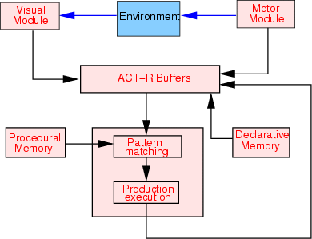
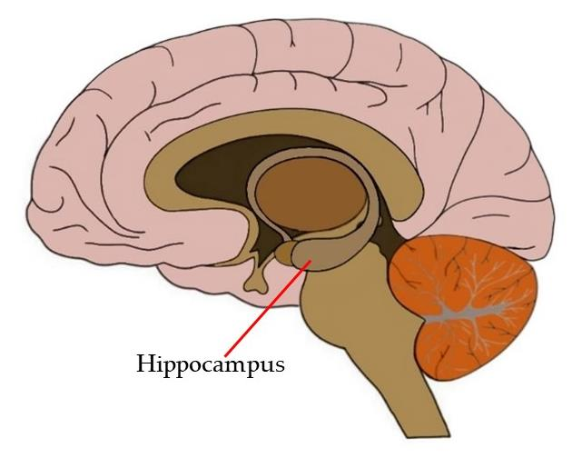
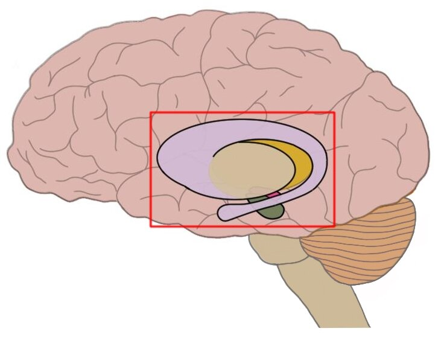
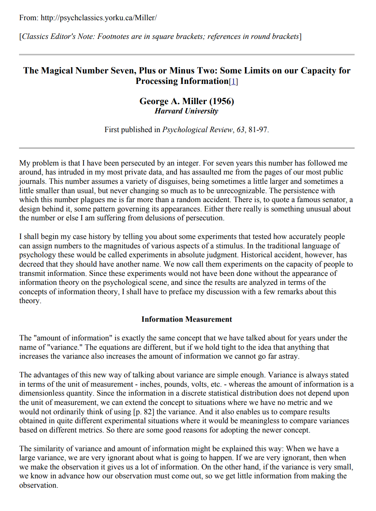
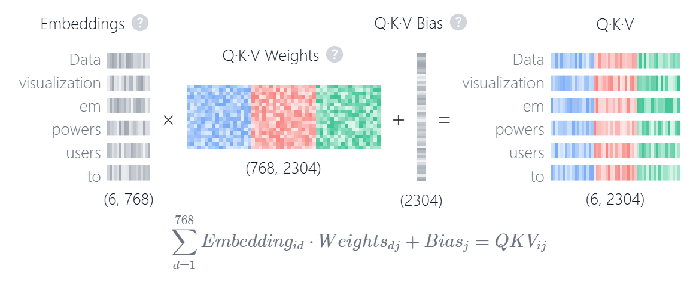
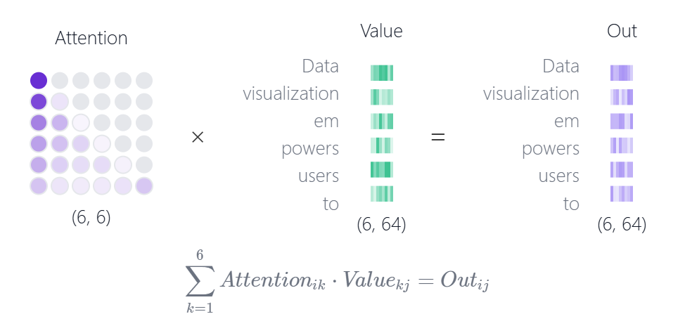

# Chapter 2: Cognitive Architectures, Memory, and Cognitive Load

[فارسی](../fa/02-architecture-memory-load.md) | **English**

[← Chapter 1](01-foundations.md) · [Table of contents](README.md) · [PDF edition (Persian)](../../releases/computational-cognitive-science-booklet-fa.pdf)

---

## Cognitive Architecture

### Why Do We Need a Cognitive Architecture?

Before examining cognitive architectures in detail, a simple example can show why sensors, rules, and a correct output are not enough. If we want an artificial-intelligence model to approach a skill that humans perform effortlessly in everyday life, we must identify the components involved in the cognitive process: perception, memory, commonsense knowledge, prediction of consequences, decision-making, action, and feedback.

This is precisely why a cognitive architecture is needed. A cognitive architecture is not merely a list of capabilities. It must specify where information enters, where it is retained, how it is combined with prior knowledge, how a decision is formed, and how the result of an action returns to the system.

### The Robotic Vacuum-Cleaner Example

Consider a robotic vacuum cleaner. A simple robot may have a few sensors and rules:

- If it reaches dust, collect it.
- If it detects an obstacle, change direction.
- If it reaches a small object, push it aside.

These rules are sufficient in many simple situations. The problem changes, however, if the robot encounters a cup filled with liquid. A person would not ordinarily push the cup without thought, because people understand several causal relations and consequences: the cup may be full; pushing it may spill the liquid; spilled liquid will wet the floor; a wet floor is undesirable; therefore the cup should not be treated as an ordinary obstacle.

The issue is not merely object recognition. The robot needs something resembling commonsense knowledge, consequence prediction, risk assessment, and action selection. Without these skills, a system may perform well according to simple engineering metrics while behaving inappropriately in detailed, human environments.

#### Solution 1: Avoid High-Risk Objects

One simple approach is for the robot to ignore or move away from high-risk objects. This reduces potential damage but does not fully solve the problem. If the robot abandons every suspicious object, some parts of the environment may never be cleaned. There is therefore a *trade-off* between reducing risk and leaving the task incomplete.

#### Solution 2: Define a Risk Function

Another approach is to define a risk function for moving each object. The model can ask: What is the object? Is it a container? Is it breakable? Does it contain liquid? How likely is a spill, and what would its consequences be?

This approach may be useful in engineering, but a system that depends on continually adding new *if–else* conditions becomes brittle and expensive. Every novel situation may require another rule.

#### Solution 3: Learn from Experience and Feedback

A third approach is to let the robot learn from experience and *feedback*. Children do not begin with every physical and social rule stated explicitly. They act, observe consequences, and learn from positive or negative feedback. If a cup falls and water spills, the experience can affect later behavior.

From the perspective of computational cognitive science, the important question is whether this learning goes beyond memorizing individual examples and approaches an understanding of causal relations that generalizes to novel situations.

#### Two Paths for Improving a Model

This example suggests two broad paths for improving artificial-intelligence models:

1. Make the model larger and provide more rules or data.
2. Add a cognitive skill or module to the model.

The first path can be useful in practice, but it may amount only to accumulating superficial rules. The second asks which cognitive ability is missing: causality, memory, attention, consequence prediction, risk assessment, or learning from feedback? This is where cognitive science connects to the design of artificial-intelligence models.

### Core Modules in a Cognitive Architecture

The robotic-vacuum example provides the basic components of a simple cognitive architecture. The robot does not have only an input and an output; several levels of processing are needed between them. The environment must first be seen or sensed. The current state is then placed in temporary memory, relevant knowledge is retrieved from long-term memory, an appropriate rule or skill is selected, and finally a motor command is produced.

A cognitive architecture is an integrated organization of these processes. When several separate cognitive theories are available, the architecture specifies how they interact within one system: where information enters, which module processes it, what remains in memory, what is retrieved, and how an action is produced.

#### Perception and the Visual Module

The visual or perceptual module converts environmental input into a representation the system can use. In the robot example, it must detect a cup, infer that it probably contains water, and establish that the cup lies in the robot’s path.

In an approximate mapping to the brain, visual processing is associated with visual regions, particularly the occipital lobe. Real visual processing is not confined to one isolated location; broader pathways participate in recognizing objects, locations, motion, and meaning. At the present architectural level, however, the visual module can be treated as the system’s perceptual input.

#### Memory and Working Buffers

Information from the environment must be retained temporarily. Cognitive architectures commonly use the concept of a **buffer**: a limited space that makes the system’s current state available to other modules. A buffer can be compared with short-term or working memory, although it has a more precise technical meaning in architectures such as *ACT-R*.

After the cup is observed, for example, the buffer might contain “a cup is in the path” and “liquid is visible inside the cup.” This information does not yet create a decision; it prepares the current environmental state for knowledge retrieval and action selection.

#### Decision-Making and Action Selection

Once the current state is in a buffer, the system must decide which action is appropriate. This decision combines several sources: the current state, declarative knowledge about objects and consequences, and procedural rules or skills.

If the system knows that a cup is breakable, that water may spill, and that a wet floor is undesirable, a procedural rule can become active: if a cup full of water is in the path, do not treat it as an ordinary obstacle. This is where the difference between a merely reactive model and a more cognitive model becomes visible.

#### The Motor Module

The motor module converts a conceptual decision into physical action. “Change direction” must become commands such as slowing down, turning, moving an arm, gently picking up the cup, or returning to the previous path.

In a brain mapping, motor control is associated with parts of the frontal lobe and motor circuits. It is important to distinguish the *frontal lobe* as a broad region from the *prefrontal cortex*, which is more strongly associated with planning, reasoning, executive control, and decision-making.

### Mapping Cognitive Architecture onto the Brain

An important condition for a cognitive architecture is that its components should be at least approximately mappable onto the brain. If an architecture contains a visual module, a motor module, declarative memory, and procedural memory, it should be possible to explain how these components relate to brain networks or regions.

This mapping must not be simplistic. The brain operates through interacting networks, and many functions do not have perfectly sharp boundaries. Nevertheless, an approximate mapping matters for the cognitive validity of a model:

| **Architectural component** | **Approximate brain mapping** |
|:--|:--|
| Visual module | Visual regions, particularly the occipital lobe |
| Motor module | Motor regions in the frontal lobe and related circuits |
| Decision-making and cognitive control | Prefrontal regions |
| Declarative memory | Hippocampus and medial temporal-lobe structures |
| Procedural memory | Basal ganglia and related cortical–subcortical circuits |

This table is an educational map, not a claim that the components are completely separate. Each function depends on broader networks and interactions among multiple regions.

### *ACT-R*

**ACT-R** (*Adaptive Control of Thought—Rational*) is an influential cognitive architecture primarily associated with the work of John R. Anderson and colleagues. Its historical roots lie in the *ACT* theories of the 1970s, while ACT-R itself was developed in later versions and remains in use for cognitive modeling.

The central idea of ACT-R is that human cognition can be modeled through several major components: modules, buffers, declarative memory, procedural memory, and a pattern-matching mechanism. Declarative knowledge is generally represented as *chunks*, while procedural knowledge is represented as *production rules*. Buffer contents reflect the system’s momentary state, and a *pattern matcher* finds a rule compatible with that state.

For the robotic vacuum cleaner, a simplified path is:

$$
\begin{aligned}
\text{Environment}
&\rightarrow
\text{Visual Module}
\rightarrow
\text{Buffer}\\
&\rightarrow
\text{Memory Retrieval}
\rightarrow
\text{Production}
\rightarrow
\text{Motor Module}.
\end{aligned}
$$

*Figure 2-1 — A schematic view of ACT-R: the environment interacts through visual and motor modules with buffers, declarative memory, procedural memory, pattern matching, and production execution.*

#### Declarative Memory

Declarative memory in ACT-R holds explicit, reportable knowledge. When the robot’s buffer contains “cup” and “water,” declarative memory may retrieve facts such as:

- A cup may be breakable.
- Water is a liquid.
- Contact with the cup may spill the water.
- Spilled water makes the floor wet.

This form of knowledge also matters for explainability. If the system changes direction, it can report that a cup full of water was in its path and that striking it might have spilled the water. This connects with *interpretability* in artificial intelligence because the model’s decision is tied to expressible knowledge.

#### Procedural Memory

Procedural memory in ACT-R contains *productions*, or if–then rules. These resemble skills that specify the appropriate action in a particular situation:

> If a cup full of water is in the path, change direction.

Or:

> If a breakable obstacle is in the path, slow down and move it gently.

Many human skills become fast and relatively inexpensive after extensive practice. Procedural memory concerns precisely this “knowing how,” rather than merely “knowing that.”

#### *Pattern Matching*

During *pattern matching*, the current buffer state and retrieved information are compared with rules in procedural memory. If the current state satisfies the conditions of a production, that rule becomes a candidate for execution.

For example:

- Buffer: a cup full of water is in the path.
- Declarative memory: the cup is breakable and the water may spill.
- Procedural memory: if a high-risk obstacle is in the path, do not treat it as an ordinary obstacle.
- Result: a rule for changing direction or moving the object gently is activated.

In ACT-R, cognition advances through a sequence of production activations and executions. The process is therefore not merely a final output, but a chain of states and transitions between states.

#### *Production Execution*

After a rule is selected, the production is executed. Its output must be able to change buffer states and ultimately become a motor command. For the robot, “change direction” must be converted into commands such as slowing down, turning its wheels, or activating its arm.

The result of production execution must also return to short-term memory or a buffer. The system needs to know which decision it made and which action it began. This feedback preserves the action sequence, keeps the next action compatible with the previous one, and prevents the system’s behavior from becoming disconnected.

### Validating a Cognitive Architecture

A cognitive architecture is not validated by comparing outputs alone. A person and a model may both arrive at the correct response through entirely different routes. In cognitive science, the route itself matters.

A specific *task* can be given to both humans and the model. In humans, techniques such as *fMRI*, *EEG*, reaction-time measurement, and *eye tracking* provide information about the sequence and timing of activity. In the model, researchers can observe which module becomes active at each stage.

If the model first activates the visual module, places the state in a buffer, engages declarative and procedural memory, and finally produces a motor action, researchers should ask whether human data exhibit a comparable flow. The closer the component sequence, timing, and error pattern are to human evidence, the greater the architecture’s cognitive validity.

## Memory in Humans and Models

### Sensory, Short-Term, and Working Memory

Memory in a cognitive architecture is not simply a storage location. A model intended to possess cognitive skills must specify which information it retains temporarily, what knowledge it stores over the long term, and how information moves between these levels.

As a first approximation, memory can be divided into short-term and long-term memory. Short-term memory resembles a limited buffer or *cache*. New information enters this space first and may disappear quickly.

Someone who briefly hears a room number may use it that day but need to ask again a month later. The temporary presence of information in the mind does not imply its stable entry into long-term memory.

Modern accounts distinguish **short-term memory** from **working memory**. Short-term memory emphasizes temporary retention, whereas working memory includes both retention and the active processing of current information. The terms are sometimes used closely, but they are not theoretically identical.

### Long-Term Memory

Information consolidated through practice, repetition, use, or significant experience can enter long-term memory. Long-term memory is not a uniform store. Two central categories here are declarative and procedural memory.

#### Declarative Memory

**Declarative memory** concerns knowledge that can be stated explicitly: facts, concepts, events, and reportable information. Examples include knowing that water makes a floor wet, that a cup may be breakable, the address of a location, or a scientific definition.

Declarative memory is especially associated with the hippocampus and medial temporal-lobe structures, although knowledge is stored and retrieved through broader networks. It is therefore misleading to say that all declarative memory is “stored in the hippocampus.” More precisely, the hippocampus and surrounding regions play a key role in forming and retrieving many declarative memories.

As an educational comparison, language models such as ChatGPT appear strong at retrieving and combining linguistic knowledge and learned facts, and can therefore be compared in this limited respect to declarative memory. The analogy is incomplete—a language model does not possess human memory—but it clarifies the distinction between “knowing” and “doing.”

*Figure 2-2 — The hippocampus and surrounding structures play a key role in the consolidation and retrieval of declarative memories; the image connects explicit memory with its approximate brain mapping.*

#### Procedural Memory

**Procedural memory** concerns skills, habits, and ways of performing actions, such as walking, driving, cooking, braking a vehicle, or controlling a tool or robotic arm.

Procedural memory is about “knowing how.” A person may not remember what they ate the previous evening and yet still be able to cook. This relative dissociation shows that knowing a fact and executing a skill are not the same.

Procedural memory is associated with the basal ganglia—particularly circuits involving the *striatum*—as well as motor and habit-learning circuits. An autonomous vehicle can be compared, in a limited educational sense, to procedural memory because it executes part of the skill of driving. It also uses declarative knowledge, perception, and decision-making, so the analogy should not be taken literally.

*Figure 2-3 — The basal ganglia contribute to skill learning, habit, and procedural memory; this mapping helps clarify the brain-level distinction between “knowing” and “doing.”*

> **Note — A qualification concerning *chain of thought***
>
> *Chain of thought* should not be treated as a direct equivalent of procedural memory. It primarily reveals or guides reasoning steps and is closer to explicit reasoning and knowledge retrieval. It may assist in carrying out a step-by-step method, but it is not a complete model of human procedural memory.

### Transferring Information from Short-Term to Long-Term Memory

Information generally enters long-term memory through practice, repetition, and use. Several conditions can make this transfer much faster or stronger.

#### Strong Emotion

Information or experiences accompanied by strong emotion are more likely to persist. A car accident, the birth of a child, extremely happy news, or a frightening experience may remain in memory together with many details: time, place, season, weather, or even peripheral scenes.

#### Surprise and Unexpectedness

Something surprising is more readily remembered. In education, an unexpected experience, practical experiment, or unusual example can therefore strengthen learning. Surprise must support understanding, however; being strange by itself is not sufficient.

#### Distinctiveness and Salience

Information that stands apart from its ordinary context has a greater chance of persisting. A person with highly distinctive appearance or behavior may be easier to remember. In instruction, emphasizing a central point can likewise improve retention.

#### Marking and Building Associations

Techniques such as marking, constructing examples, mental imagery, visualization, and discovering relationships among concepts help connect new information with existing mental structures. These links strengthen retrieval routes and increase the likelihood of transfer to long-term memory.

From an educational perspective, this is itself a major research question: How can learning be designed so important information enters long-term memory more quickly, deeply, and durably?

### Disorders and Cognitive Evidence

A division of memory has theoretical value only if it can explain human evidence, including disorders. If short-term, long-term, declarative, and procedural memory are distinct, it should be possible to show conditions in which one is affected more strongly while another remains relatively intact.

#### Stress and Memory Retrieval

Stress can disrupt retrieval of declarative information. A person may know something but be unable to explain or recall it under pressure. This can be connected to impaired retrieval of facts or explicit explanations.

If stress affects speaking itself, fluency, breathing control, or skill execution, procedural aspects may also be involved. Stress should therefore not be confined to one kind of memory; its effects depend on the task and on which levels of the system are engaged.

#### Parkinson’s Disease and Procedural Memory

In Parkinson’s disease, particularly in its early stages, motor and procedural impairments are prominent. Tremor, slowness of movement, difficulty initiating action, and changes in walking may initially appear to be problems of the legs, back, or muscles, although a major part of the problem lies in neural circuits for motor control and procedural learning.

This example is consistent with the role of the basal ganglia in movement, habit, and procedural learning. Parkinson’s disease is not merely a simple disorder of procedural memory and may involve other cognitive dimensions over time. It should be understood as evidence for interaction among motor, procedural, and cognitive systems, rather than the complete isolation of one module.

### Memory in Language Models

Cognitive concepts of memory provide a useful framework for thinking about language models. The mapping is metaphorical and should not be mistaken for a direct equivalence between a language model and the human brain.

#### Parameters as Long-Term Memory

A model’s trained weights and parameters can be compared with long-term memory. Knowledge absorbed from data during training is distributed across these parameters. When the model answers a question, it activates and combines part of this learned knowledge.

#### *Prompt* and *Context Window* as Working Memory

The *prompt* and *context window* can be compared with the model’s working memory or current buffer. Information in the input is available during the current interaction. If the text becomes long, noisy, or contradictory, the model may struggle to retain and use important information correctly—a problem examined below through cognitive load and working-memory limitations.

#### *RAG* as External Memory

*Retrieval-augmented generation* (*RAG*) can be understood as a form of external memory. Rather than relying entirely on its parameters, a model retrieves relevant information from an external source and answers on that basis. This mechanism is particularly important when the required knowledge is highly specialized, recent, extensive, or must be cited precisely.

## Cognitive Load Theory and Working Memory

Memory has so far been introduced as a major module in cognitive architecture. The focus now shifts from “types of memory” to the practical limitations of working memory. The central question is: How do humans and models deteriorate when information is excessive, dispersed, or distracting?

### *Cognitive Load Theory*

**Cognitive load theory** is based on the idea that human working memory is limited. Learning, problem solving, and reasoning become difficult when the amount of information that must be simultaneously retained and processed exceeds its effective capacity.

This theory is particularly important in education because poor content design can create unnecessary load. If slides, exercises, menus, user interfaces, or explanations present too much unstructured information at once, part of the learner’s cognitive capacity is spent managing the disorder rather than understanding the central concept.

Classical educational literature often distinguishes the intrinsic difficulty of the material, extraneous load caused by its presentation, and the effort devoted to constructing useful conceptual schemas. Our emphasis is on the broader point: working memory is limited, and educational and computational design must take that limitation seriously.

### The Limited Capacity of Working Memory

Working memory is not only a temporary store; it is also the site of active processing. Retaining a telephone number for a few seconds while entering it into a phone uses working memory. Errors become more likely if someone speaks to us at the same time, if the digits are long, or if they form no familiar pattern.

Working-memory capacity can be studied by briefly displaying images and asking about their number or type, playing several sounds and measuring recognition, presenting digit strings of different lengths, or asking participants to classify several tastes. Performance declines as the number or complexity of the items increases.

The same idea can be translated into language-model experiments. Instead of showing a person images or digits, researchers can create prompts containing long, dispersed, multi-step, or noisy information and test whether the model can still retain and use what matters.

### The Number 7 ± 2

George Miller’s 1956 article *The Magical Number Seven, Plus or Minus Two* is a classical landmark in discussions of short-term-memory capacity. It is commonly interpreted as suggesting that humans can retain approximately $7 \pm 2$ units in short-term memory.

This number is not a fixed law for every person and situation. Later research shows that effective capacity depends on the material, word length, familiarity, measurement method, age, practice, and organizational strategies. The central message here is not the number seven itself, but that working memory is limited and that the relevant unit in many situations is a *chunk*.

*Figure 2-4 — The opening page of Miller’s classic article on limits in information-processing capacity, an important historical point for discussions of short-term memory and chunks.*

> **Note — A qualification concerning Miller’s number**
>
> The expression $7 \pm 2$ is a useful classical teaching device, but working-memory capacity cannot always be represented by one fixed number. Many contemporary accounts treat effective capacity as lower and more dependent on information type and individual strategy.

### *Chunking*

*Chunking* reduces working-memory load by combining many separate components into larger, meaningful units. Working memory then retains a few organized units rather than many disconnected elements.

#### Defining a *Chunk*

A **chunk** is a group of smaller pieces of information that forms one meaningful unit for an individual. For example:

$$
1 \quad 3 \quad 6 \quad 9
$$

Seen separately, these are four digits. If a person recognizes them as the Persian calendar year *1369* or part of another familiar pattern, however, the entire sequence may become one chunk. The effective size of working memory therefore depends not only on the raw number of signs but on how the mind organizes them.

#### The Role of Prior Knowledge in *Chunking*

Chunking depends on long-term memory. We compress new information using prior knowledge, familiar patterns, meaning, mental imagery, and established associations. A person who connects a digit string with a birthday, license plate, athletic weight, or mathematical pattern retains it more easily than someone memorizing isolated digits.

Expertise can therefore alter effective working-memory capacity. A chess expert may perceive a board position as a few meaningful configurations, while a novice sees the same board as a collection of separate pieces.

#### Individual Differences

Differences in working memory are not limited to raw capacity. People also differ in the type and quality of their chunks. One person constructs a visual chunk, another a linguistic one; someone uses a story or association, while another discovers a numerical or spatial pattern.

A good theory must explain why two people perform differently with apparently identical data. The difference may arise from chunk size or type, the ability to connect new information to long-term memory, or strategies for mental organization.

### Applications of *Chunking*

Chunking is not merely a laboratory concept. It is used in instructional design, slide and interface design, menus, games, telephone numbers, and the organization of complex information. Many unstructured items saturate working memory rapidly. Presenting the same information in meaningful groups, smaller stages, or predictable structures makes processing easier.

### *Multi-Hop Reasoning* as a Working-Memory Test

In **multi-hop reasoning**, the final answer cannot be obtained in one simple step. A person or model must retain several facts, understand their relations, form an intermediate conclusion, and use it in the next step.

For example:

- Humans are mortal.
- Socrates is human.
- Therefore Socrates is mortal.
- If mortal beings ordinarily live only to a particular age, a further conclusion depends on this chain.

Similarly, a kinship question such as “Who is the father of my mother’s brother’s spouse?” requires several successive relations. Each step must remain active until the next. This makes multi-hop reasoning a useful measure of cognitive load in humans and models.

### Working-Memory Limitations in Language Models

Difficult prompts can serve as language-model counterparts of working-memory experiments. The aims are to show that:

1. Models are limited in their use of the current context.
2. Performance declines as information load increases.
3. Noise, dispersed evidence, and topic changes can disrupt relevant retrieval.
4. Human-inspired strategies such as chunking, summarization, problem decomposition, and memory management can then be evaluated.

Recent work has explored these ideas under the heading of computational cognitive load in language models, including multi-hop reasoning experiments that manipulate noise or task order.

#### *Context Saturation*

*Context saturation* occurs when important evidence is dispersed through a large volume of irrelevant or weakly related information. The problem is not simply context-window length; the model must locate the central evidence amid substantial noise.

An experiment can present a multi-step problem, insert irrelevant text or distracting facts among the relevant evidence, and measure performance. A falling success rate as noise increases suggests that the model’s context has become cognitively saturated.

#### *Attentional Residue*

*Attentional residue* is the remaining effect of a previous task or topic on the current one. In practical interactions with language models, a model may mix a new question with earlier context or continue answering within the previous problem’s framework. Clearing the conversation, rewriting the prompt, or separating tasks can help.

An experiment can first give the model irrelevant material or a distracting task, then present the main problem and test whether it can disengage from the remaining effect of the earlier material.

#### Two Different Kinds of Pressure

Both phenomena involve interference, but their arrangements differ:

- In *context saturation*, relevant information is distributed among noise.
- In *attentional residue*, an earlier task or noise overshadows the next task.

In either case, declining performance indicates limitations in context, attention, and working-memory management.

### Designing Experiments to Measure Model Cognitive Load

Simply lengthening a prompt is not sufficient. Experiments should control confounds and make the source of failure interpretable. Possible manipulations include:

- Increasing prompt length
- Adding large quantities of irrelevant information
- Dispersing relevant evidence across distant passages
- Inserting noise between important facts
- Referring to earlier parts of a conversation
- Creating interference between previous and current topics
- Supplying code or an instruction and changing the request later in the prompt

Each design must specify what it measures: retrieval of relevant information, preservation of intermediate conclusions, resistance to noise, or the ability to shift attention from an earlier task to a new one.

### The Evolution of Artificial-Intelligence Tests

This discussion continues the evolution of AI evaluation. Early approaches emphasized tests such as the *Turing test*. Machine learning later focused on metrics such as accuracy, precision, and recall on a test set. As models improved, **out-of-distribution generalization** became important.

Cognitive testing is now another major direction. Instead of asking only for a benchmark score, we ask whether a model has human-like working-memory limits, whether its errors correlate with human errors, whether it shows systematic weaknesses in reasoning, memory, planning, and abstraction, and whether cognitive theories can inspire remedies.

### Cognitive Strategies

Once a working-memory limitation has been identified, the next stage is intervention. Humans use chunking, problem decomposition, retrieval cues, summarization, and prior knowledge to reduce cognitive load. Similar ideas can be used in language models: divide a problem into subproblems, summarize evidence, construct external memory, or design prompts that organize information progressively.

#### *Divide and Conquer*

*Divide and conquer* breaks a large problem into smaller ones. It is useful when the result of each part can be retained in a compact form for the next stage. If a model need not keep every raw detail in its context simultaneously, working-memory pressure decreases.

The general algorithmic relation is:

$$
T(n)=aT(n/b)+f(n)
$$

Here, $a$ is the number of subproblems, $n/b$ their size, and $f(n)$ the cost of decomposition and recombination. The educational point is that appropriate decomposition can greatly reduce cost—for some problems, from structures of order $O(n^2)$ toward $O(n\log n)$. This is not a universal law; it depends on the problem and algorithm.

Cleaning a house provides a simple analogy. Treating the entire house as one task places every detail on working memory at once. Dividing it into rooms, each room into cupboards and drawers, and each drawer into smaller categories keeps only one component active. When a component is complete, the system need retain only a summary of its result, not every individual movement.

#### *Subgoals* and Hierarchical Memory Management

In long tasks, each *subgoal* can act as a higher-level chunk. A model solves one subgoal, retains its important output, and moves to the next. This is important for long-horizon agents, which must decide what to keep from a previous stage and which details can be discarded.

The *HiAgent* paper explicitly connects this idea to working-memory management in language-model agents. A simple strategy places every action–observation pair in the model’s context. Although complete, this fills long tasks with repetitive, low-value detail. The proposed solution is to create subgoals, track actions belonging to the current subgoal, and replace its implementation details with a concise observation after completion.

Working memory then contains a structure resembling:

$$
\left(g_1,s_1\right),\left(g_2,s_2\right),\ldots,
\left(g_k,\text{details of the current subgoal}\right)
$$

where $g_i$ is a subgoal and $s_i$ summarizes the state after it is completed. Details of an earlier subgoal can be retrieved later if necessary; they simply do not remain active by default.

#### The *Blocks World* Example

In *Blocks World*, blocks are arranged on a table or one another, and the goal is a specified final arrangement—for example, placing the blue block on the orange block. The problem can be decomposed:

1. Clear the blue block.
2. Clear the orange block.
3. Place the blue block on the orange block.

Subgoals are not new to robotic planning. The cognitive point is to interpret a subgoal as a unit of memory. Once “the orange block is clear” has been achieved, every action that produced that state need not remain active. The compressed result is sufficient for continued planning.

#### The *Gripper* Example

In *Gripper*, a robot transports objects between rooms. Reported *HiAgent* results found clearer gains from hierarchical chunking in tasks such as *Blocksworld*. In *Gripper*, it did not improve success and slightly reduced the progress measure, although it used less context. The educational interpretation is that chunking is most useful when a problem has genuine hierarchical structure and dependencies among subgoals. For highly independent, granular actions, additional decomposition may add only management overhead.

#### Limitations of *Chunking*

Chunking is not a complete solution. If a problem is not naturally decomposable, or if it is divided incorrectly, chunks can hide important information. In language models, constructing chunks often also requires external design, prompting, or a memory module; a model does not always know what to summarize and what to preserve.

This reveals an important difference between humans and models. People often invent strategies: they categorize a topic, ignore low-value details, and determine what should remain in memory. In many current agents, designers still have to specify the subgoals, what to chunk, what to forget, and what to retrieve. The cognitive strategy inspires the model, but its implementation requires precise computational design.

## Transformers, Attention, and Working Memory

### Memory in a *Transformer*

To connect working memory with modern architectures, we can ask what in a *Transformer* corresponds approximately to long-term and short-term memory. The analogy is useful for analysis but is neither complete nor biological.

The model’s long-term memory lies in its weights and parameters. Knowledge acquired from text, speech, images, or other data during training is encoded in those parameters. For example, the domains associated with the word *data* and the relations learned among words, syntactic structures, and concepts are products of training.

Short-term or working memory, by contrast, concerns processing the current input: the prompt, sentence, document, conversation, or sequence available at inference time. The architectural component most closely related to this processing is *attention*, where the model determines which other tokens each token should consult when constructing its current representation.

> **Note — An analogy, not an identity**
>
> Calling parameters “long-term memory” and attention “working memory” does not assert an exact neural mapping. A language model has no brain, and human memory is not simply a weight matrix. The analogy separates learned knowledge from the processing of the current context.

### *Contextual Embeddings*

A model begins with an initial representation for each *token*, derived from learned embedding tables or input layers. A Transformer does not preserve one fixed meaning for every word; it changes the representation according to the current context. The resulting context-dependent representation is a **contextual embedding**.

The Persian word *shir*, for example, can mean a lion, milk, or a water valve. A single fixed vector cannot adequately capture all three. After self-attention layers, its representation in “the lion lives in the forest” should differ from its representation in “the milk was poured into a glass.”

The same applies to *data*. Depending on its context, the word may be associated with databases, machine learning, visualization, statistics, privacy, or experimental signals. A contextual embedding constructs the token’s operational meaning in the particular text instead of relying only on an average, fixed meaning.

#### Coreference Resolution

**Coreference resolution** identifies different expressions that refer to the same entity. In “Ali went to school. He picked up his book,” a model should recognize that “he” and “his” refer to Ali. Their representations should connect with information about Ali rather than being processed as isolated pronouns.

This is a clear example of working memory in language processing. The model must retain an entity from an earlier sentence, encounter the pronoun later, and link the two.

#### Word-Sense Disambiguation

**Word-sense disambiguation** identifies the intended meaning of an ambiguous word in its current context. For Persian *shir*, cues such as “forest,” “mane,” “glass,” “calcium,” “water,” or “open” determine the meaning. The model must locate these contextual cues and shift the word representation toward the appropriate sense.

A contextual embedding is therefore more than a technical NLP term. It is the point at which a model uses its long-term statistical and semantic knowledge to process the current situation.

### *Query*, *Key*, and *Value*

In self-attention, learned weight matrices transform each token representation into three vectors:

- **Query**: What information is this token seeking?
- **Key**: What identifying signal does this token offer?
- **Value**: What information should this token transmit if attended to?

If an initial token vector has dimensions such as $1 \times 768$, multiplication by learned matrices produces $Q$, $K$, and $V$. A token’s query is compared with other tokens’ keys. Greater similarity or compatibility produces a larger attention weight. In the basic form, dot products followed by *softmax* generate the weights:

$$
\operatorname{Attention}(Q,K,V)=
\operatorname{softmax}\left(\frac{QK^{T}}{\sqrt{d_k}}\right)V
$$

where $d_k$ is the dimensionality of the key vectors. Multiplication by $V$ makes each token’s new representation a combination of information from the tokens most relevant to it.

The following figure depicts this linear transformation: learned weights turn input embeddings into $Q$, $K$, and $V$. Attention is thus not a vague notion, but a set of matrix operations over current representations.

*Figure 2-5 — Query, Key, and Value vectors are constructed from input embeddings through learned weights and biases.*

### *Self-Attention* from a Working-Memory Perspective

Self-attention can be treated educationally as part of a model’s working-memory mechanism because it operates on the current input. Before attention, the model has representations derived mainly from long-term knowledge and token positions. After attention, every token has a representation that depends on the current text.

In a sentence containing several occurrences of an ambiguous word, attention must gather the contextual cues surrounding each occurrence. In a multi-step problem, it must connect distant pieces of evidence. Weakness in retrieving relevant evidence or ignoring irrelevant information can therefore be investigated partly through the management of attention and context.

In autoregressive, decoder-only Transformers, each token can attend only to preceding tokens because generation must not access the future. In encoder-only architectures such as the BERT family, attention is usually bidirectional and a token can use both earlier and later tokens. The type of Transformer therefore affects the form of its computational working memory.

*Figure 2-6 — Multiplying the attention matrix by Value vectors: attention weights determine how much information each token receives from the others in its output representation.*

### Is Increasing *Context* Length Enough?

One simple response to working-memory limitations is to enlarge the context window. This is useful in many applications but does not solve the problem by itself. Even a human with greater raw memory will not necessarily reason better without organizational strategies. The issue is not merely whether information fits; the model must retrieve what is relevant, discard what is not, and preserve the reasoning path.

A long prompt filled with noise, repetition, or unrelated topics may create even more processing load. The better goal is not unlimited memory, but **attention and retrieval management**.

### Reducing or Eliminating Attention to Low-Importance Information

One architectural idea is to remove or zero connections with low attention scores so the model can focus on more important material. Although intuitively attractive, this is not straightforward.

First, attention weights are relative. A token may receive little weight relative to a second token but high weight relative to a third. A small weight in one relation does not by itself show that the token or information path is unimportant.

Second, dependencies can form chains. If $A$ relates to $B$ and $B$ to $C$, then $A$ may depend on $C$ through $B$ even when direct attention from $A$ to $C$ is small. Naively deleting small weights can destroy these indirect paths.

Attention reduction therefore requires careful design: local windows, sparse patterns, targeted retrieval, summarization, or higher layers that recombine important information.

### *Local Attention*

With *local attention*, each token attends only to a nearby window rather than every token in the sequence. This matters computationally because full self-attention has quadratic cost in sequence length. For a sequence of length $n$, all-to-all comparison is approximately $O(n^2)$.

Localizing attention reduces computation and memory use, and the model need not examine every possible relationship simultaneously. Conceptually, it resembles divide and conquer: process smaller regions locally, then use later layers or complementary mechanisms to combine their information.

Local attention can lose long-range dependencies. If an answer depends on one sentence at the beginning of a document and another at the end, a simple local window may never connect them. Practical systems therefore often use sliding windows, global tokens, sparse patterns, or hierarchical layers to carry information across regions.

The environment is not deleted; attention is applied locally and progressively. Likewise, local attention does not remove the text. It limits the field of attention at each step and requires later integration.

#### Combining Local Windows

After important elements are found in each local window, the system must combine them across windows. One simple approach uses summary representations, averages, or aggregation tokens. A more precise approach adds a higher layer that compares the local representations again. Without integration, the model has only several disconnected local views rather than a coherent representation of the entire text.

### *Multi-Head Attention* and *Mixture of Experts*

*Multi-head attention* and *mixture of experts* are not themselves direct solutions to working-memory limitations, although both can improve the use of model capacity.

In multi-head attention, the model has several separate sets of $Q$, $K$, and $V$. Each head can emphasize a different aspect of the input: syntactic relations, semantic relations, entity references, position, or sentence structure. Their outputs are then combined. This resembles viewing the input from several angles rather than simply enlarging working memory.

In a mixture-of-experts architecture, different model components or “experts” are activated for different examples or tokens. Its primary purpose is to increase effective capacity or specialize processing without activating every parameter each time. It can indirectly help manage information, but working memory still depends on attention design, memory, summarization, and reasoning strategies.

### Summary

This chapter distinguished two approaches to reducing working-memory limitations in models. The first was cognitive and algorithmic: chunking, subgoals, summarization, and problem decomposition. The second was architectural: examining how attention constructs contextual representations in Transformers and how techniques such as local attention can reduce computational and memory pressure.

Both approaches share a central insight: effective memory is not determined by raw storage alone. Organization, selection, retrieval, and compression are what matter.

---

[← Chapter 1](01-foundations.md) · [Table of contents](README.md) · [Next chapter: Prediction, Bias, and Attention →](03-prediction-bias-attention.md)
