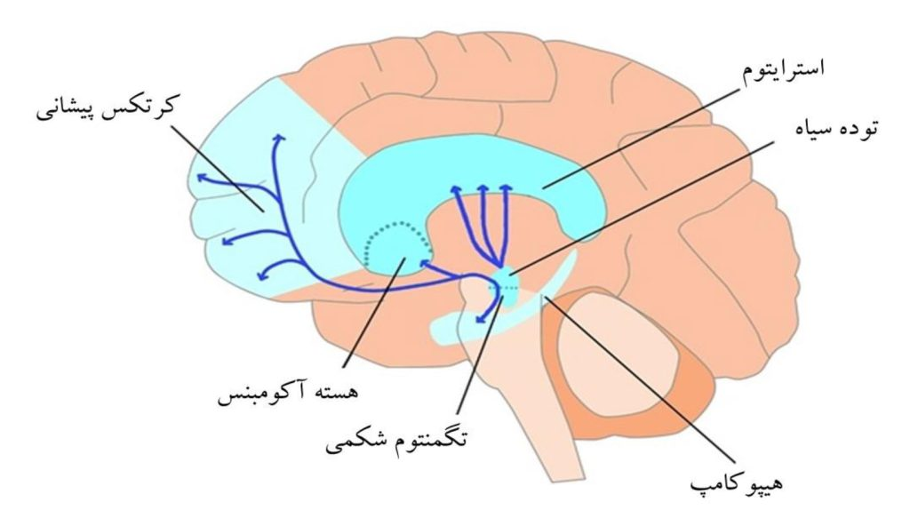

# Chapter 5: Reward, Reinforcement Learning, and Decision-Making

[فارسی](../fa/05-reward-rl-decision-making.md) | **English**

[← Chapter 4](04-language-speech-auditory-models.md) · [Table of contents](README.md) · [PDF edition (Persian)](../../releases/computational-cognitive-science-booklet-fa.pdf)

---

## The Reward System and Reinforcement Learning

After auditory models, the discussion turns to the brain’s reward system and its relation to *reinforcement learning*. An agent occupies a *state*, performs an *action*, and moves to another state; this change is a *transition*.

Each transition may bring reward or punishment—positive, negative, large, small, or neutral. These signals act as *reinforcers*: they teach the agent which behaviors to repeat and which to reduce.

In the cognitive architecture described earlier, sensory stimuli enter through visual or auditory modules. Selective attention chooses part of the environment; current information enters short-term memory; relevant long-term knowledge is retrieved; current and prior information are combined; an action is selected and executed through the motor module.

After the action, the agent moves from time $t$ to $t+1$ and receives reward or punishment. A *utility module* can evaluate whether the action was good, bad, or no different from expectation. Its purpose is to update the prior model after each experience.

### Reward in the Brain

Human reward is commonly experienced as satisfaction, pleasure, or success. Eating, completing a task, receiving an important message, or encountering something previously associated with a good experience can be rewarding.

These experiences may involve dopamine release. The important point is that dopamine responds to a meaningful state change—something important or learned—not simply to every pleasant thing. A light switching off during the day may be unremarkable, while receiving an expected message can be rewarding because of learned associations.

An enjoyable event does not always produce a large dopamine response. Once it becomes entirely predictable, its surprise and therefore its dopaminergic response may decline.

### Dopamine and the *VTA*

Dopamine travels through dopaminergic pathways. In reward discussions, an important source is the *ventral tegmental area* (VTA).

In this framework, the VTA is associated with reward-prediction error: what reward was expected, what was actually received, and how different were they? When actual reward exceeds expectation, VTA activity is associated with dopamine release. Dopamine is therefore not merely a sign of pleasure; it is especially related to positive surprise and reward-prediction error.

### Dopaminergic Pathways

Four major dopaminergic pathways are often distinguished. This chapter focuses on two:

$$
\text{VTA}\rightarrow
\begin{cases}
\text{Mesolimbic Pathway}\\
\text{Mesocortical Pathway}
\end{cases}
$$

*Figure 5-1 — Dopaminergic pathways associated with the VTA, including connections with the nucleus accumbens, striatum, prefrontal cortex, hippocampus, and substantia nigra.*

#### *Mesolimbic Pathway*

The mesolimbic pathway runs from the VTA toward the limbic system. It is associated with satisfaction, conditioning, behavioral reinforcement, addiction, and the desire to repeat an action.

If drinking tea after work is pleasant, the mesolimbic system can become conditioned to this pattern, increasing the desire for tea after work. In simple terms, it tells the brain: this behavior was good; do it again.

The pathway reaches limbic regions, particularly the nucleus accumbens, and helps strengthen or weaken the value assigned to stimuli and actions in long-term memory. Positive reward-prediction error can cause a related stimulus or action to be stored with greater value.

#### *Mesocortical Pathway*

The mesocortical pathway also begins in the VTA but projects toward the prefrontal cortex. The prefrontal cortex is associated with decision-making, analysis, consequence evaluation, behavioral control, effort valuation, and long-term outcomes.

Seeing cake may activate the mesolimbic impulse to eat it, while the mesocortical system considers whether that is sensible, whether the person is hungry, whether they are dieting, and what the long-term consequences are. In this metaphor, mesolimbic is more like an accelerator and mesocortical more like an analyst or brake.

### Disorders Related to the Reward System

These examples are not medical diagnoses. They illustrate how reward, dopamine, and prediction error can help describe behavioral changes.

#### Aging

With age, the reward system may encounter less surprise. Many stimuli are familiar and predictable, so reward-prediction error approaches zero, dopamine release may decline, updating of the mental model decreases, and motivation for novelty or *exploration* is reduced.

New experiences—travel, activities, or situations absent from a person’s earlier life—may provide useful novelty for an older adult.

#### Depression

Depression can be described in the same language: the reward system does not activate effectively, previously pleasurable activities lose their appeal, and nothing seems worth doing.

In this account, a person may remain certain and avoid new actions. Without new experience, reward-prediction error remains near zero. This differs from healthy learning, in which a person explores the environment to refine a mental model; here, avoiding action produces near-zero error in an unhealthy way.

#### Addiction

Addiction illustrates misuse of the reward system. At first, an addictive stimulus can produce positive reward-prediction error:

$$
\text{RPE} > 0
$$

The experience is stronger or different from expectation. With repetition, the system learns and the experience becomes ordinary:

$$
\text{RPE} \rightarrow 0
$$

The person may increase the dose to recreate a positive error and dopamine response. The brain adapts again, and the error declines. Repeated adaptation may reduce dopamine sensitivity, so ordinary life also becomes less pleasurable.

Not everyone enters this cycle. Exposure, awareness, environment, individual differences, genetics, and the strength of mesocortical control all matter. A stronger control and consequence-evaluation system may help resist immediate reward.

The *Marshmallow Test* illustrates self-control: a child can wait for a larger later reward or take a smaller immediate one. It is used here to explain patience and sensitivity to long-term consequences, not as a complete account of addiction.

### The Reward System and *Predictive Coding*

Predictive coding compares prior knowledge with observed reality. Learning depends not merely on reality but on the error between prediction and reality.

The reward system works similarly. Before acting, an agent expects a reward; after acting, it receives an actual reward. The difference is what must be learned.

### *Reward Prediction Error*

The central concept is **reward-prediction error**:

$$
\text{Reward Prediction Error} =
\text{Actual Reward} - \text{Predicted Reward}
$$

or:

$$
\text{RPE} = R_{\text{actual}} - R_{\text{predicted}}
$$

If actual reward exceeds prediction:

$$
\text{RPE} > 0
$$

the result is better than expected, the system is surprised, and the action or stimulus is reinforced. If actual reward equals prediction:

$$
\text{RPE} = 0
$$

there is little new to learn. If actual reward is lower:

$$
\text{RPE} < 0
$$

the system should reduce the value of that action or stimulus.

### *Free Energy Principle* and Reducing *Surprise*

The *Free Energy Principle* frames the goal as reducing uncertainty and prediction error, not merely maximizing reward. The cognitive system experiences the environment to improve its mental model and reduce the discrepancy between prediction and reality.

The target is reward-prediction error near zero:

$$
\text{RPE} \rightarrow 0
$$

The model is updated, and little surprise remains.

## Computational Models of Reinforcement Learning

From a computational perspective, the human reward system resembles *reinforcement learning*. An agent acts in an environment, transitions between states, receives rewards, and learns which future behaviors are useful.

### The *Reinforcement Learning* Problem

Reinforcement learning means learning through interaction. Unlike supervised learning, the agent does not begin with the correct label for every decision. It acts, observes consequences, and increases the probability of rewarding behavior while reducing unrewarding behavior.

This is especially important in online environments, where the agent lacks a complete model and must acquire experience step by step. At each step, it observes a state, chooses an action, transitions, and receives reward or punishment.

In a stochastic environment, the same state–action pair need not lead to one fixed outcome:

$$
S \xrightarrow{A} S'
$$

$S'$ may have several possible values, with different probabilities. Since the transition model is initially unknown, the agent learns it through experience and feedback.

### Difference from Supervised and Unsupervised Learning

Supervised learning provides labels and learns a relation between input and label. Reinforcement learning provides no ready label; the agent acts, receives feedback, and learns from the consequence.

Unsupervised learning also lacks direct labels, but generally extracts structure from data—for example, clusters or representations. Reinforcement learning is distinguished by active interaction with an environment and reward after action.

### *Temporal Difference Learning*

Suppose an agent is in state $S$, takes action $A$, and moves to $S'$. Its previous value estimate is $V_t$. A new experience supplies a sample of value, and the system updates its old estimate using learning rate $\alpha$:

$$
0 \leq \alpha \leq 1
$$

If $\alpha=1$, only new experience matters; if $\alpha=0$, no learning occurs. The update is:

$$
V_{t+1}=V_t+\alpha(\text{Sample}-V_t)
$$

The difference is reward-prediction error:

$$
\text{Sample}-V_t=\text{RPE}
$$

so:

$$
V_{t+1}=V_t+\alpha\times\text{RPE}
$$

This is *temporal-difference learning*: it compares estimates across time $t$ and $t+1$, updating the old value according to prediction error.

The process aims for:

$$
\text{Sample}=V_t
$$

and therefore:

$$
\text{RPE}=0.
$$

It is the same reduction of surprise encountered in the Free Energy Principle.

### *Discount Factor*

An agent may have prior experience for some states and none for others, in which case initial values are often zero. Suppose it can go left or right. A purely greedy agent sees an immediate reward of 1 on the left and 0 on the right, but the right may lead to a future reward of 10. The agent must therefore consider more than immediate reward.

The *discount factor* $\gamma$ controls the importance of the future:

$$
0 \leq \gamma \leq 1
$$

If $\gamma=0$, only immediate reward matters. If $\gamma=1$, future rewards are fully retained. For $0<\gamma<1$, distant rewards have progressively less influence:

$$
r_t+\gamma r_{t+1}+\gamma^2r_{t+2}+\gamma^3r_{t+3}+\cdots
$$

Discounting can be related loosely to biological mechanisms. Higher serotonin, for example, has been discussed as potentially supporting less impulsive, less purely greedy decisions and greater consideration of the future. Behavior is not controlled by one substance, however; many factors can affect something analogous to a discount factor.

### *Value Function*

In temporal-difference learning, the goal is to update the value of a state:

$$
V(s)
$$

The full discounted update is:

$$
V_{t+1}(s)=(1-\alpha)V_t(s)+\alpha\left[r+\gamma V_t(s')\right]
$$

Here $V_t(s)$ is the old value of $s$, $r$ the received reward, $s'$ the next state, $V_t(s')$ its value, $\alpha$ the learning rate, and $\gamma$ the discount factor. The first term preserves prior knowledge; the second adds the new experience.

Consider:

$$
A\xrightarrow{a_1,\,r=-3}B
$$

$$
B\xrightarrow{a_1,\,r=4}A
$$

$$
A\xrightarrow{a_2,\,r=-4}A
$$

Let $\alpha=0.1$, $\gamma=1$, and initially $V(A)=V(B)=0$. The first transition gives:

$$
V(A)=0.9V(A)+0.1[-3+V(B)]=-0.3
$$

The second gives:

$$
V(B)=0.9V(B)+0.1[4+V(A)]=0.37
$$

The third updates $V(A)$ again:

$$
V(A)=0.9(-0.3)+0.1[-4-0.3]
$$

At every step, the value of the state from which the agent moved is updated.

### *Q Function*

Knowing state values is not enough; an agent must choose an action. $Q(s,a)$ denotes the value of taking action $a$ in state $s$:

$$
V(s)=\max_aQ(s,a)
$$

In a stochastic world, taking an action may lead to several possible next states. The transition probability is $T(s,a,s')$, the probability of reaching $s'$ from $s$ with action $a$:

$$
T(s,a,s')
$$

The action value is:

$$
Q(s,a)=\sum_{s'}T(s,a,s')\left[R(s,a,s')+\gamma V(s')\right]
$$

The agent considers immediate reward and discounted future value across possible transitions.

### *Q-Learning*

Q-learning updates action values directly:

$$
Q_{t+1}(s,a)=(1-\alpha)Q_t(s,a)+\alpha\left[r+\gamma\max_{a'}Q_t(s',a')\right]
$$

Here $s$ is the current state, $a$ the action taken, $r$ the received reward, $s'$ the next state, and $a'$ possible actions in the next state. The maximum term selects the best known future action.

Unlike basic temporal-difference learning, Q-learning learns the value of actions in states, bringing it closer to actual decision-making.

For the earlier episode:

$$
A\xrightarrow{a_1,\,r=-3}B,\qquad B\xrightarrow{a_1,\,r=4}A,\qquad A\xrightarrow{a_2,\,r=-4}A
$$

With $\alpha=0.1$, $\gamma=1$, and all Q-values initially zero:

$$
Q(A,1)=0.9Q(A,1)+0.1[-3+\max_{a'}Q(B,a')]=-0.3
$$

The second transition gives:

$$
Q(B,1)=0.9Q(B,1)+0.1[4+\max_{a'}Q(A,a')]=0.4
$$

The third gives:

$$
Q(A,2)=0.9Q(A,2)+0.1[-4+\max_{a'}Q(A,a')]=-0.4
$$

The process continues; each experience updates the Q-value belonging to that state–action pair.

### Stochastic Environments and Uncertainty

In a deterministic environment, an action in a state always produces one outcome. In a stochastic environment, it can produce several. Turning a steering wheel left normally moves a car left, but uncertainty may cause deviation, stopping, or another result.

The agent must learn to handle uncertain transitions through experience, feedback, and gradual correction of its model of likely consequences.

### *Exploration* and *Exploitation*

If the agent always uses:

$$
V(s)=\max_aQ(s,a)
$$

it selects the best known action. This is fully greedy or exploitative. Real decision-making also tests unfamiliar options. We do not always shop only at the place with the best previous experience; we sometimes try somewhere new in case it is better.

*Exploitation* repeats the best known experience. *Exploration* gives less-tested actions a chance because their value remains unknown. Real decisions balance the two.

### *Passive RL* and *Active RL*

If a score includes only learned value:

$$
\text{Score}(s,a)=Q(s,a)
$$

the agent favors exploitation. Uncertainty can be added:

$$
\text{Score}(s,a)=Q(s,a)+\beta U(s,a)
$$

Here $Q(s,a)$ is learned reward, $U(s,a)$ uncertainty, and $\beta$ the importance assigned to uncertainty. A rarely tested action may be selected despite a modest Q-value because its uncertainty makes it worth exploring. This resembles *Upper Confidence Bound* (UCB) methods, which add an optimistic upper bound to less-tested options.

In passive RL, the agent relies mainly on known experience, chooses familiar options, and exploits. In active RL, it also considers uncertainty, tests less-explored options, and balances exploration with exploitation.

It is intuitively possible to compare active behavior with a young person who seeks experiences and passive behavior with an older person who relies more on prior experience. This is only an explanatory analogy, not a precise biological claim.

---

[← Chapter 4](04-language-speech-auditory-models.md) · [Table of contents](README.md) · [Next chapter: Spiking Neural Networks and Neuromorphic Computing →](06-spiking-neural-networks.md)
