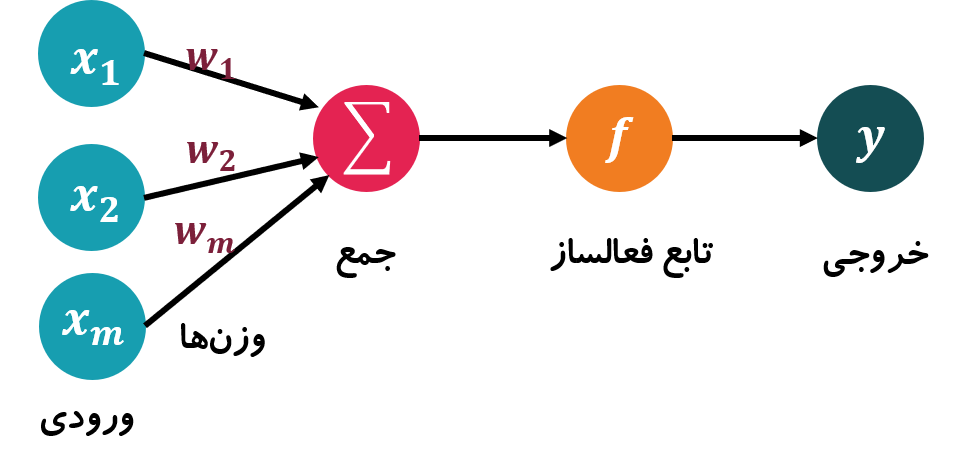
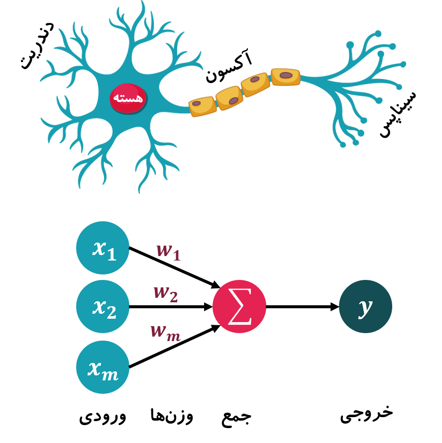
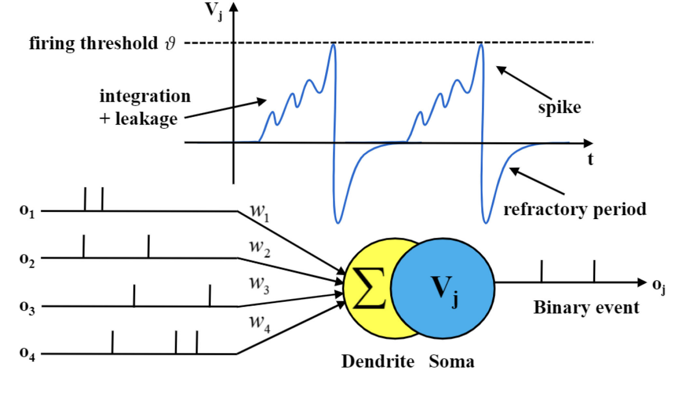
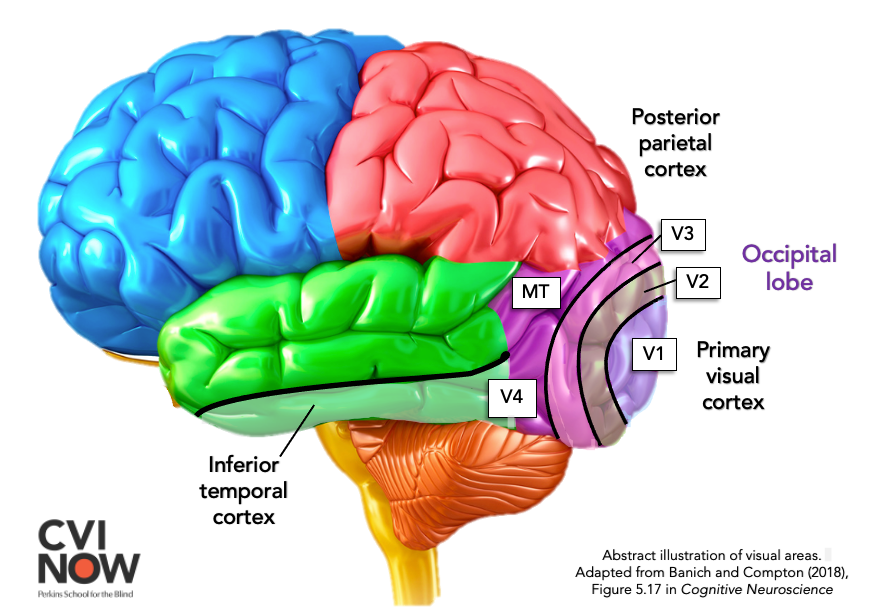
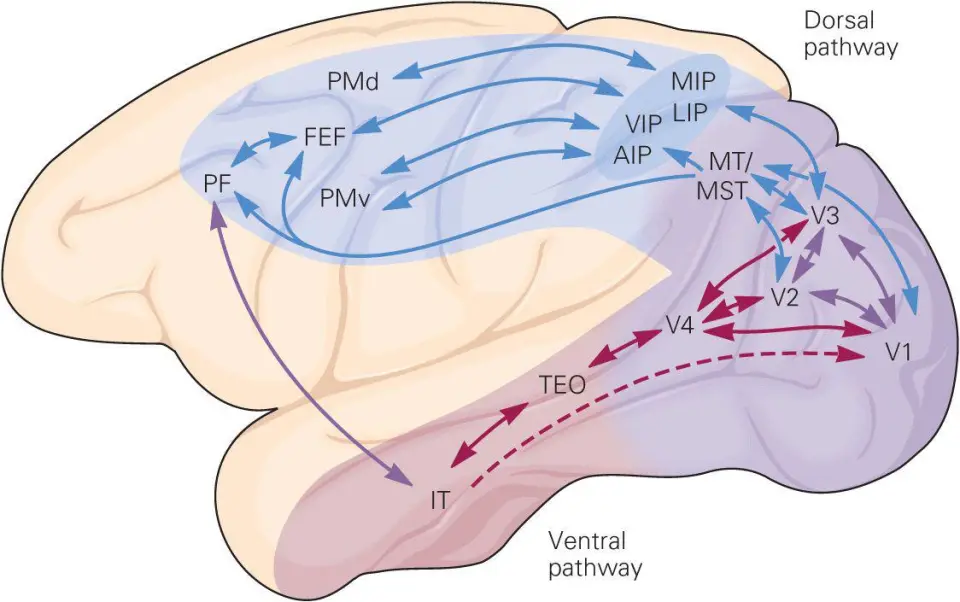
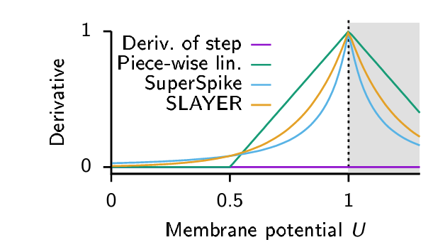

# Chapter 6: Spiking Neural Networks and Neuromorphic Computing

[فارسی](../fa/06-spiking-neural-networks.md) | **English**

[← Chapter 5](05-reward-rl-decision-making.md) · [Table of contents](README.md) · [PDF edition (Persian)](../../releases/computational-cognitive-science-booklet-fa.pdf)

---

## Fundamentals of Spiking Neural Networks

After reward systems and reward-prediction error, the discussion turns to *spiking neural networks* (SNNs). The goal is first to understand their architecture and then to see how reward systems can be modeled through them.

### Why Spiking Neural Networks?

In ordinary artificial neural networks (ANNs), inputs are often continuous numbers such as embeddings or vectors. They are multiplied by weights, summed, combined with a bias, passed through an activation function, and used to produce an output or prediction. The prediction is compared with ground truth, and backpropagation corrects the weights.

This picture is not fully biologically realistic. The brain does not operate on continuous values exactly like conventional ANN inputs, nor does it use classical global backpropagation. Learning is more local: each neuron largely responds to its inputs and state rather than waiting for the final output and a global gradient.

SNNs approach this biological picture through discrete temporal events. A spike either occurs or does not occur. They are therefore useful for modeling systems that take time, events, and energy consumption seriously.

### Difference Between *ANN* and *SNN*

ANN neurons receive and produce continuous values. In an SNN, inputs and outputs are spikes. A spike can be represented by 1 and its absence by 0. The input is a temporal sequence:

$$
S=[0,1,0,1,1,0,\ldots]
$$

Each spike is multiplied by a synaptic weight:

$$
S_i\times W_i
$$

If the weighted sum raises the neuron’s voltage above threshold, the postsynaptic neuron also spikes.

*Figure 6-1 — A classical ANN neuron: weighted continuous inputs are summed, passed through an activation function, and converted into a numerical output.*

*Figure 6-2 — An SNN neuron: weighted inputs become membrane potential and the output appears as a spike event.*

### The Biological Neuron

A simplified biological neuron contains dendrites, a cell body, an axon, and synapses.

#### Dendrites

Dendrites receive input. Signals from other neurons arrive there through synapses.

#### *Soma*

The *soma*, or cell body, is the neuron’s processing region. Inputs are integrated there and the neuron’s decision to spike or not is determined.

#### Axon

The axon carries the neuron’s output to other neurons. A spike travels along it toward synapses.

#### Synapse

A synapse connects one neuron’s axon to another’s dendrite. The sender is the *presynaptic neuron* and the receiver the *postsynaptic neuron*.

### Spikes and Time-Based Computation

Time is part of the computation in an SNN. While an ANN may process one numerical vector, an SNN receives a temporal sequence. Which spike arrived first, which arrived later, and the interval between them all matter.

The output is therefore not simply one number; the spike pattern over time must be interpreted. A spike can activate part of a decision immediately without every neuron being active at every moment.

### The *LIF* Model

Several spiking-neuron models exist, including *Leaky Integrate-and-Fire* (LIF), Izhikevich, and Hodgkin–Huxley. LIF is emphasized here because it is simple while capturing important biological behavior:

$$
V(t+1)=\lambda V(t)+I(t)
$$

where $V(t)$ is the previous voltage, $\lambda$ the leak factor, and $I(t)$ the input current. Current is commonly generated by input spikes and synaptic weights:

$$
I(t)=\sum_iW_iS_i(t)
$$

When voltage crosses threshold:

$$
V(t+1)\geq V_{\text{threshold}}
$$

the neuron spikes.

*Figure 6-3 — The LIF model: weighted input spikes accumulate in dendrites and soma, membrane voltage leaks over time, and a spike is produced after threshold crossing.*

#### *Integration*

Integration sums the effects of inputs. Incoming spikes are multiplied by synaptic weights and accumulate in the neuron’s voltage.

#### *Fire*

When accumulated voltage crosses threshold, the neuron fires and its output is a spike event.

#### *Leak*

Without sufficient input, voltage gradually falls. This leak prevents an input’s effect from remaining indefinitely.

#### *Refractory Period*

After firing, a neuron enters a short *refractory period* in which it is inactive or cannot easily fire again, reflecting biological neurons.

### Energy Use and Event-Driven Processing

An SNN can remain on call while using little energy because no expensive calculation is performed when there is no input spike. A neuron activates only when an event occurs and threshold is crossed.

ANN layers normally perform multiplications and additions at every step, even without a meaningful input change. SNNs instead let important events activate computation. This suits always-on wake-word detectors, hearing aids, low-power listening systems, drones, reactive robots, and systems requiring fast local responses.

## Learning in Spiking Networks

When neural pathways are repeatedly activated, their synaptic connections strengthen. Learning can therefore be linked to synaptic-weight change:

$$
\Delta W
$$

A path used repeatedly receives greater weight. A familiar analogy is a shortcut across grass: repeated walking erases the grass and creates a stronger path, even without an explicit instruction. Neural pathways similarly strengthen through repeated activation.

### *Hebbian Learning*

The basic unsupervised rule is Hebb’s principle:

$$
\text{Fire together, wire together}
$$

Neurons that repeatedly activate together strengthen their connection. “Together” need not mean exactly simultaneous: if the presynaptic neuron spikes and the postsynaptic neuron follows, their synaptic weight increases.

This suggests an informational or causal relationship. Both neurons may respond to a common topic, or presynaptic activation may contribute to postsynaptic firing.

### *STDP*

*Spike-Timing-Dependent Plasticity* (STDP) makes Hebbian learning more precise: the order and timing of spikes matter.

If a presynaptic spike precedes and helps cause a postsynaptic spike, the synapse strengthens. If the postsynaptic neuron fired first, that presynaptic neuron was probably not its cause, so the connection weakens.

#### *LTP*

*Long-Term Potentiation* (LTP) occurs when the presynaptic neuron fires first:

$$
t_{\text{pre}}<t_{\text{post}}
$$

The timing is causally plausible and the synapse strengthens:

$$
\Delta W>0
$$

#### *LTD*

*Long-Term Depression* (LTD) occurs when the presynaptic neuron fires afterward:

$$
t_{\text{pre}}>t_{\text{post}}
$$

The synapse weakens:

$$
\Delta W<0
$$

#### The Role of Timing Difference

The size of the time difference matters. Define:

$$
\Delta t=t_{\text{post}}-t_{\text{pre}}
$$

If $\Delta t>0$, presynaptic firing precedes postsynaptic firing and corresponds to LTP. If $\Delta t<0$, postsynaptic firing comes first and corresponds to LTD.

Small $|\Delta t|$ means stronger temporal association and larger weight change. A typical potentiation rule is:

$$
\Delta W=A_+e^{-\Delta t/\tau_+}
$$

and depression:

$$
\Delta W=-A_-e^{\Delta t/\tau_-}
$$

where $A_+$ and $A_-$ are amplitudes, $\tau_+$ and $\tau_-$ time constants, and $\Delta t$ the spike-time difference.

STDP requires both neurons to spike. If only the presynaptic neuron fires and the postsynaptic neuron does not, there is no meaningful pairwise timing difference.

### *Reward-Modulated STDP*

Reward-modulated STDP combines reward-prediction error with spike timing:

$$
\text{Reward Prediction Error}=R_{\text{actual}}-R_{\text{predicted}}
$$

and:

$$
\Delta W_{\text{STDP}}
$$

The general update is:

$$
\Delta W=\eta\times\delta\times E(t)
$$

where $\eta$ is the learning rate, $\delta$ reward-prediction error, $E(t)$ the STDP effect or *eligibility trace*, and $\Delta W$ synaptic change.

STDP identifies synapses that were temporally involved in a behavior; reward determines whether their traces should be strengthened or weakened. A good outcome reinforces a relevant synapse, while a worse-than-expected outcome can weaken it.

This also addresses credit assignment. When a postsynaptic neuron spikes, several presynaptic inputs may have contributed. STDP preserves traces of neurons that fired shortly beforehand, and later reward determines whether those traces are reinforced or depressed.

### From a Basic *SNN* to a *Deep SNN*

The LIF neuron and STDP provide a foundation. A *deep SNN* places several layers of spiking neurons in sequence. The output spike sequence of each layer becomes the next layer’s input, where synaptic weights, current, voltage, and firing are computed again.

In a LIF neuron, input currents accumulate and membrane voltage rises. When it crosses threshold:

$$
V>\theta
$$

the neuron fires, resets, and enters a refractory period. Its binary output is:

$$
S=
\begin{cases}
1 & V>\theta\\
0 & V\leq\theta
\end{cases}
$$

For one input $x$ and synaptic weight $w$:

$$
I=xw
$$

With multiple inputs:

$$
V=x_1w_1+x_2w_2+x_3w_3+\cdots
$$

The output is one if voltage crosses threshold and zero otherwise. A deep SNN resembles a multilayer deep network, but each layer’s input and output are binary spike events.

### Biological Inspiration from a Multilayer Brain

The multilayer idea is inspired by vision. Regions such as V1, V2, V3, V4, MT/V5, and IT process visual information. Early layers extract edges, lines, colors, and orientations; later layers construct more abstract representations, from shapes to faces and identities.

Deeper networks can therefore build more complex representations. Brain processing is not a single linear path: early outputs branch into multiple routes, some layers are shared, and later pathways specialize. This resembles *multi-task learning*.

The ventral stream is associated mainly with what an object is, while the dorsal stream is associated with where it is, motion, and interaction. Damage to one pathway may leave recognition intact but impair interaction, or vice versa.

The same multilayer idea applies to touch. S1, the primary somatosensory cortex, processes more basic touch, pain, and temperature information; S2, the secondary somatosensory cortex, constructs more integrated and abstract representations.

*Figure 6-4 — A visual-processing hierarchy from early regions such as V1 to higher regions such as V4, MT/V5, and inferior temporal cortex.*

*Figure 6-5 — Visual processing divided into dorsal Where/How and ventral What streams, illustrating biological inspiration for multilayer networks.*

### Energy Use and the Motivation for *Deep SNNs*

The brain uses roughly 20 watts despite its complexity, whereas conventional deep models on GPUs can consume much more. Two properties help explain the brain’s efficiency.

First, spikes are event-driven and binary:

$$
0\quad\text{or}\quad 1
$$

Second, computation is local. Neurons largely decide from local information, unlike conventional deep networks whose error is computed globally and returned through backpropagation. Local processing also helps reduce energy.

The question is whether deep SNNs can retain the abilities of deep networks while approaching the brain’s event-driven execution and energy efficiency.

### Limitations of *STDP* in Deep Networks

STDP can work well in small or shallow unsupervised networks that learn repeated input patterns. Reward-modulated STDP combines timing with reward to decide whether synaptic traces strengthen or weaken.

With many layers, however, STDP alone becomes insufficient. Convergence is harder, accuracy can decline, local weight adjustment is difficult, and precise fine-tuning is needed. Deep supervised SNNs therefore often require methods resembling backpropagation.

### *Surrogate Gradient*

In supervised learning, the network compares its output with a label and corrects its weights. The SNN’s problem is its step-function output:

$$
S=
\begin{cases}
1 & V>\theta\\
0 & V\leq\theta
\end{cases}
$$

The step function has derivative zero almost everywhere, so the gradient needed for backpropagation cannot pass through the spike. How can an SNN train by backpropagation if its spike function is nondifferentiable?

#### The Differentiability Problem

The standard solution is a *surrogate gradient*. During the forward pass, the network remains genuinely spiking and outputs zero or one. During the backward pass, a smooth differentiable function replaces the step for gradient calculation.

#### The Surrogate Function

A surrogate function may resemble a sigmoid or another smooth curve. It does not change the neuron’s forward behavior; it only supplies a derivative for backpropagation.

*Figure 6-6 — Examples of surrogate derivatives for the firing function; approximations such as SuperSpike and SLAYER provide usable gradients around threshold.*

Thus:

- The real spike function is used in the forward pass.
- A differentiable surrogate supplies the gradient in the backward pass.

#### Difference from an Ordinary *Activation Function*

In an ordinary neural network, the activation function operates in the forward pass. In an SNN with surrogate gradients, the surrogate is used only for backpropagation. Forward inputs and outputs remain binary spikes, so the surrogate is not the same as an ordinary activation function.

### *Feedforward* in a *Deep SNN*

During feedforward computation, spikes move from one layer to the next. If $S$ is the previous layer’s output and $W$ its synaptic weight:

$$
I=SW
$$

With temporal memory:

$$
I[t+1]=\alpha I[t]+S[t]W
$$

where $I[t]$ is previous current, $\alpha$ its decay, $S[t]$ the input spike, and $W$ the synaptic weight. Voltage updates as:

$$
V[t+1]=\beta V[t]+I[t+1]
$$

If voltage crosses threshold:

$$
S[t+1]=
\begin{cases}
1 & V[t+1]>\theta\\
0 & V[t+1]\leq\theta
\end{cases}
$$

the neuron spikes and is reset. A spike therefore both travels forward, weighted into the next layer, and changes the state of the neuron that emitted it.

#### The Role of *Reset*

When a neuron fires, it sends a signal to the next layer and resets its own voltage (and sometimes its current). The internal state of the neuron is therefore essential to SNN computation.

### *Backpropagation* with a *Surrogate Gradient*

At the network’s end, output is compared with the target. With mean squared error:

$$
E=\frac{1}{2}(T-O)^2
$$

Weights update as:

$$
W_{\text{new}}=W_{\text{old}}-\eta\frac{\partial E}{\partial W}
$$

The chain rule gives:

$$
\frac{\partial E}{\partial W}=
\frac{\partial E}{\partial O}\cdot
\frac{\partial O}{\partial Net}\cdot
\frac{\partial Net}{\partial W}
$$

If

$$
Net=XW
$$

then:

$$
\frac{\partial Net}{\partial W}=X
$$

and for squared error:

$$
\frac{\partial E}{\partial O}=O-T
$$

The central surrogate term is:

$$
\frac{\partial O}{\partial Net}
$$

The real step derivative is zero, so this derivative comes from the surrogate function.

#### Numerical Example

Suppose:

$$
X=2,\qquad W=0.4,\qquad \theta=1,\qquad T=1,\qquad V_0=0
$$

First:

$$
Net=XW=2\times0.4=0.8
$$

Because

$$
0.8<1
$$

the neuron does not spike:

$$
O=0
$$

The target is $T=1$, so the output is wrong and the weight should increase. The output derivative is:

$$
\frac{\partial E}{\partial O}=O-T=0-1=-1
$$

Assume the surrogate derivative at $Net=0.8$ is approximately $0.25$, and:

$$
\frac{\partial Net}{\partial W}=X=2
$$

Then:

$$
\frac{\partial E}{\partial W}=(-1)(0.25)(2)=-0.5
$$

With $\eta=0.1$:

$$
W_{\text{new}}=0.4-0.1(-0.5)=0.45
$$

The weight increases from 0.4 to 0.45, making a future threshold crossing more likely.

### Locality, Global Training, and the Practical Value of *SNNs*

Surrogate-gradient training partly reduces SNN locality because error is computed globally and backpropagated. The important qualification is that surrogate gradients are used only during training.

After training, the network remains spiking: inputs and outputs are zero or one, it can run on neuromorphic hardware, and inference requires neither surrogate gradients nor backpropagation. The weights have already been fine-tuned.

The practical value of SNNs is clearest at inference in robots, drones, embedded systems, neuromorphic hardware, and low-power real-time processing. The training method matters less than the fact that execution uses event-driven spikes.

### *STDP* versus *Surrogate Gradient*

STDP is better suited to small or shallow networks, unsupervised and online learning, and biologically inspired implementation. Surrogate gradients are better suited to deep supervised SNNs, where output error must be compared with a target and weights across multiple layers must be adjusted.

---

[← Chapter 5](05-reward-rl-decision-making.md) · [Table of contents](README.md) · [Next chapter: Modern Spiking Models →](07-modern-spiking-models.md)
