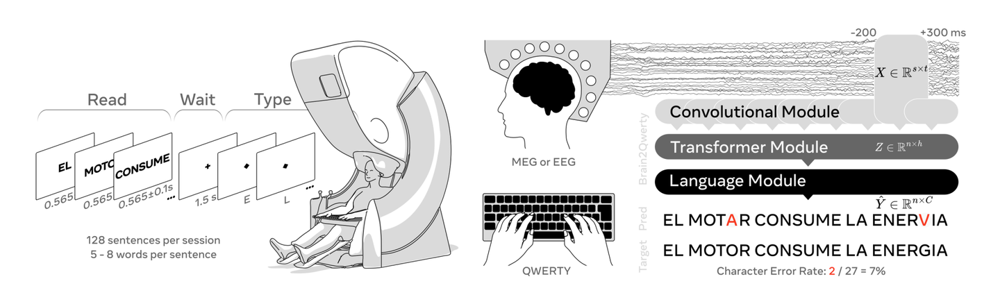
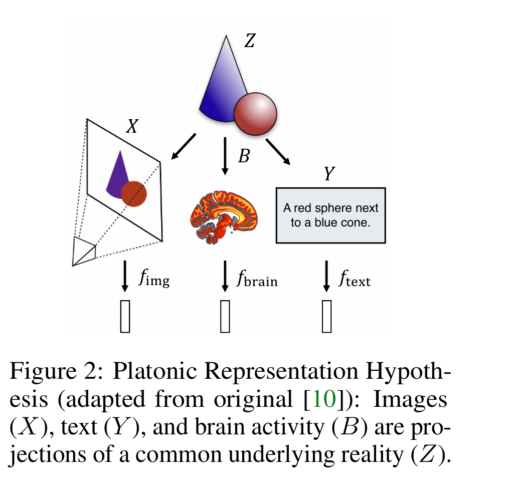
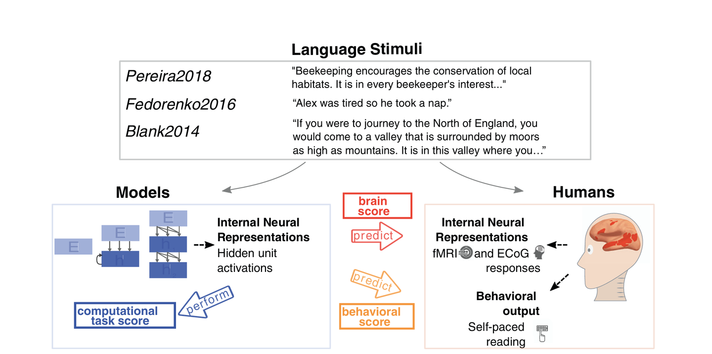
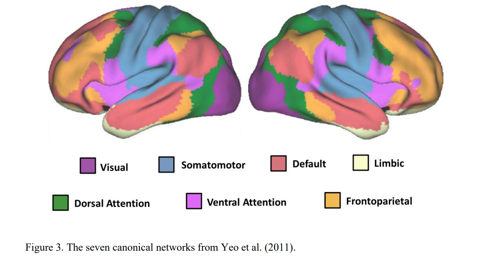
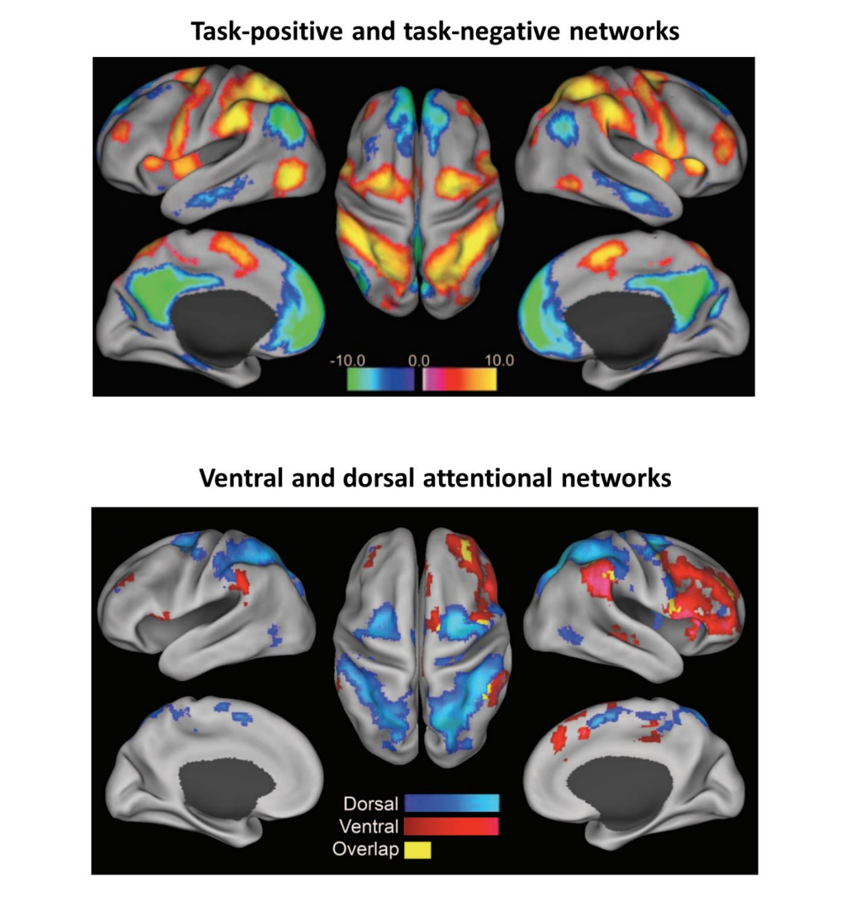
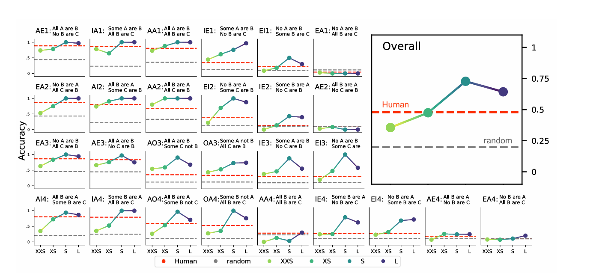
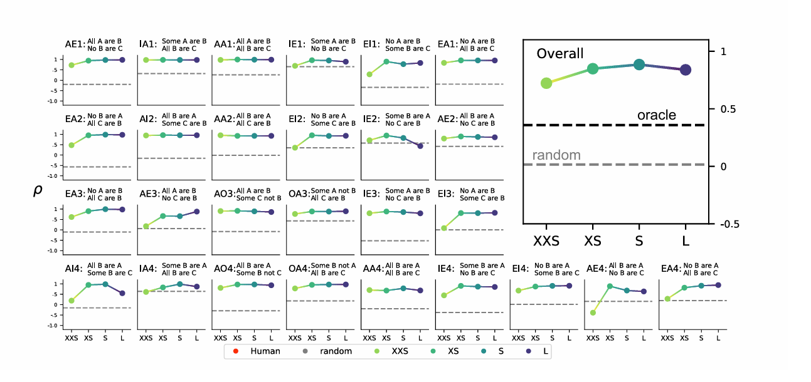

# Chapter 8: Brain Alignment, Neural Coding, and Reasoning

[فارسی](../fa/08-brain-alignment-reasoning.md) | **English**

[← Chapter 7](07-modern-spiking-models.md) · [Table of contents](README.md) · [PDF edition (Persian)](../../releases/computational-cognitive-science-booklet-fa.pdf)

---

## Neural Coding and Decoding

### *Neural Encoding* and *Neural Decoding*

Neural encoding asks how an external stimulus, action, or mental state becomes neural activity. Neural decoding reverses the direction: given brain activity, what stimulus, intention, or representation can be inferred?

$$
\text{Stimulus}\rightarrow\text{Neural Activity}\qquad\text{(encoding)}
$$

$$
\text{Neural Activity}\rightarrow\text{Stimulus or Intention}\qquad\text{(decoding)}
$$

### Major Theories of *Neural Coding*

#### *Grandmother Cell*

The grandmother-cell hypothesis proposes that a highly specific neuron represents a particular object or concept, such as one familiar person. It is an intuitive but extreme form of localist coding. A single-cell representation would be vulnerable to noise, damage, and the enormous number of concepts the brain can represent.

#### *Population Coding*

Population coding represents a stimulus through the joint activity of many neurons. Each neuron may respond broadly, but the activity pattern across the population identifies the stimulus:

$$
\mathbf{r}=[r_1,r_2,\ldots,r_n]
$$

The population pattern is more robust and can represent many values through combinations.

#### *Sparse Coding*

Sparse coding activates only a small fraction of a large population at a time. It can be energy-efficient and reduce interference between representations, although excessive sparsity may make learning and generalization difficult.

### Combining Coding Theories in Modern Models

Contemporary neural systems can combine local, population, and sparse properties. Early layers may use population-like feature coding, deeper layers may become more selective, and event-based models may represent information sparsely in time:

$$
\text{Input}\rightarrow\text{Population Features}\rightarrow\text{Sparse Features}\rightarrow\text{Abstract Representation}
$$

No single coding theory must explain every region or every layer.

### *Symbolic AI* and Coding Theories

Symbolic AI represents entities through explicit symbols and rules. Neural coding is distributed and activity-based. A modern system may combine them: neural populations encode perceptual evidence, while symbolic or language-level structures express relations and rules. The important question is how a representation supports generalization, compositionality, and robust behavior.

### *Brain-to-Text*

Brain-to-text systems decode neural activity into characters, words, or keyboard actions. They are not simply reading thoughts; they learn a mapping for a particular task, person, recording method, and vocabulary.

#### Training Stage

During training, a participant performs or imagines an action while brain activity and the target output are recorded. The training set contains pairs:

$$
(\text{Brain Signal},\text{Target Text})
$$

The signal is preprocessed, aligned with the target, and passed through a neural model. A CNN can extract local spatial or temporal features, a Transformer can model long-range structure, and a language model can make the decoded sequence grammatical.

$$
\text{Brain Signal}\rightarrow\text{CNN}\rightarrow\text{Transformer}\rightarrow\text{Language Model}\rightarrow\text{Text}
$$

*Figure 8-1 — A Brain-to-QWERTY pipeline: neural activity is mapped through learned features and sequence models to reconstructed text or keyboard actions.*

#### The Role of the *CNN*

The CNN extracts local patterns from sensors, electrodes, voxels, or time–frequency maps. Its filters learn features associated with movements, imagined typing, or other task states.

#### The Role of the *Transformer*

The Transformer combines features across time and sensors. It can relate a current neural event to earlier activity and build a contextual representation of the intended sequence.

#### The Role of the *Language Model*

The language model supplies lexical and syntactic constraints. It can rank plausible continuations, correct noise, and make a sequence more coherent, but this prior can also introduce errors not present in the neural evidence.

#### Test Stage

At test time, the participant supplies new neural activity. The trained pipeline predicts a sequence, which is evaluated by character error rate, word error rate, accuracy, or task-specific measures. Generalization to another person or another recording session is difficult.

### Brain-to-Text and Comparison with *Neuralink*

Brain-to-text is a decoding task and does not require one particular hardware platform. It can use EEG, fMRI, electrocorticography, or implanted electrodes. Neuralink is a company and implant platform; it should not be treated as a synonym for the entire scientific field.

### Comparing Methods for Recording Brain Activity

#### *fMRI*

fMRI measures blood-oxygen-level-dependent (BOLD) changes with high spatial resolution but relatively slow temporal resolution. It can localize broad representations but is expensive and difficult to use in real-time communication.

#### *EEG*

EEG measures electrical activity at the scalp with high temporal resolution but lower and noisier spatial resolution. It is portable and comparatively inexpensive.

#### Brain Implants

Implanted electrodes can provide high-quality local signals with good temporal precision, but they require surgery, raise safety and longevity questions, and may record from only a limited region.

### Challenges of *Brain-to-Text*

#### *Plasticity*

The brain changes with learning, practice, injury, and feedback. A decoder trained at one time may degrade later because the neural code has shifted.

#### Generalization Across People

Brains differ anatomically and functionally. A model trained on one participant may not transfer to another without calibration or alignment.

#### *Multimodality*

Neural signals can be combined with behavior, speech, eye movements, images, and language context. Multimodal systems may improve decoding but also introduce additional confounds.

### Future Path: Wearable Sensors and *Neuromorphic* Hardware

Wearable sensors could make decoding more practical, while neuromorphic hardware could process sparse neural events efficiently. A useful future system must jointly optimize signal quality, privacy, latency, energy, and robustness.

### Spatial Preference, Hebb’s Rule, and Initialization

Neural representations are not always equally distributed across space. Nearby or connected regions may preferentially process related information. Hebbian learning and carefully designed initialization can encourage useful local structure:

$$
\Delta W\propto\text{Pre}\times\text{Post}
$$

The choice of initialization affects which patterns are learned first and whether optimization reaches a useful representation.

## *Brain Alignment* and *Brain Score*

### The Representation Problem

A model may predict labels correctly while using a representation unlike the brain’s. Behavioral accuracy alone therefore cannot establish brain alignment.

*Figure 8-2 — The Platonic Representation Hypothesis: different models and biological systems may learn partially shared abstract representations from a common task.*

### Does the Model Really Understand?

Understanding should be tested through behavior, errors, internal representations, and neural correspondence. A model that succeeds through superficial correlations may fail under counterfactual changes and need not be cognitively aligned.

### The Main Idea of *Brain Alignment*

Brain alignment compares model representations with measured neural responses to the same stimuli. If a model layer predicts patterns in a brain region better than alternative layers or models, it provides evidence of representational similarity—not proof that the model and brain use identical mechanisms.

### Designing an Alignment Experiment

Present the same stimuli to people and a model, record neural responses, extract model activations, and compare them with a mapping or similarity measure.

#### Defining Intermediate Brain Layers

The researcher selects a brain region, cortical layer, voxel set, or parcel whose response is to be predicted.

#### Selecting a *Task*

The task may involve vision, language, speech, semantic judgment, memory, or action. The stimulus and task must be controlled across participants and models.

#### Defining a *Score*

The score may be correlation, cross-validated prediction accuracy, representational similarity, or a noise-normalized measure. It should be compared against baselines and evaluated on held-out data.

### The *Brain-Score* Paper

Brain-Score is a framework for evaluating whether model representations predict neural and behavioral measurements.

#### Experiment Components

Experiments commonly include stimuli, human or animal neural recordings, behavioral responses, model activations, a mapping procedure, and a held-out evaluation set.

#### The *Mapping* Model

Because neural and model dimensions differ, a mapping is learned from model features to neural responses:

$$
\hat{Y}=XW
$$

The mapping is trained on one portion of the data and tested on another to prevent memorization.

#### Training and Testing

Cross-validation, held-out subjects, or held-out stimuli determine whether alignment generalizes. A high score means the model contains information predictive of the neural response; it does not mean every model unit has a biological counterpart.

#### The Importance of *Next-Word Prediction*

Language models trained to predict the next word can develop representations that align with language-related brain activity. This does not by itself show that the brain is a next-word predictor. It shows that the objective may encourage useful predictive structure.

*Figure 8-3 — A Brain-Score framework: stimuli drive both a biological recording and a model, whose intermediate representations are mapped and compared.*

### *Brain Parcellation*

Parcellation divides the brain into units for analysis.

#### *Voxel*

A voxel is a three-dimensional measurement element, especially in fMRI. A study may contain thousands of voxels, each with a BOLD time series.

#### *Parcel*

A parcel groups voxels considered functionally or anatomically related:

$$
\text{Many Voxels}\rightarrow\text{One Parcel}
$$

Parcels reduce dimensionality and provide more stable regions for analysis.

#### *Region of Interest*

A region of interest (ROI) is a selected area whose response is analyzed because of a hypothesis, such as language, vision, or motor processing.

#### The *BOLD* Signal

BOLD reflects blood-oxygen changes associated with neural activity. It is an indirect, slow signal:

$$
\text{Neural Activity}\rightarrow\text{Metabolic Change}\rightarrow\text{BOLD Signal}
$$

### Methods of *Parcellation*

#### Anatomical

Anatomical parcellation follows gyri, sulci, anatomical landmarks, or structural atlases.

#### *Functional Parcellation*

Functional parcellation groups regions with similar activity or connectivity, even if they are not adjacent anatomically.

#### *Localizer* and *Atlas*

A localizer task identifies activity associated with a function. An atlas provides a standardized set of regions so studies can compare participants and experiments.

### The Seven *Yeo* Networks

The Yeo parcellation describes seven broad functional networks:

*Figure 8-4 — The seven-network Yeo parcellation used as a broad functional organization of cortex.*

#### *Visual Network*

Processes visual input and visual representations.

#### *Somatomotor Network*

Supports bodily sensation and motor control.

#### *Dorsal Attention Network*

Supports goal-directed, top-down attention.

#### *Ventral Attention Network*

Detects salient or unexpected events and can redirect attention.

#### *Frontoparietal Network*

Supports cognitive control, working memory, and flexible task management.

#### *Default Mode Network*

Is associated with internally directed thought, autobiographical processing, and contextual or social cognition.

#### *Limbic Network*

Is associated with emotion, valuation, and motivational processing.

### Network Activity and *Resting-State fMRI*

Resting-state fMRI measures spontaneous BOLD fluctuations without an explicit task. Correlated fluctuations can reveal functional networks. Resting-state connectivity is statistical association, not proof of direct causal communication.

### Correlation in *Parcellation*

For parcel time series $x_i(t)$ and $x_j(t)$, functional connectivity can be represented by correlation:

$$
r_{ij}=\operatorname{corr}(x_i(t),x_j(t)).
$$

The resulting matrix summarizes network organization. It must be interpreted carefully because motion, preprocessing, and common signals can create apparent correlations.

### *Task-Positive* and *Task-Negative*

Task-positive networks increase activity during externally directed tasks, while default-mode or task-negative regions may decrease relative to rest. The distinction is relative to a baseline, not a permanent division between active and inactive brain regions.

*Figure 8-5 — A conceptual comparison of task-positive and task-negative networks during externally directed processing.*

### Returning to *Brain Alignment*

Brain alignment requires careful choice of parcels, signal preprocessing, model layers, mapping method, and cross-validation. A high score should be compared with simpler models, shuffled controls, and noise ceilings.

### Future Research Direction: Inference and Fallacies

Future alignment studies can test reasoning, inference, and everyday fallacies rather than only perception. This requires stimuli that separate superficial language patterns from genuine relational reasoning.

## Reasoning, Analogy, and Human–Model Error Alignment

### Why Is a Correct Answer Not Enough?

A model can answer correctly through memorized correlations or a shortcut. Cognitive modeling asks whether the model shows human-like difficulty, reaction patterns, confidence, and errors. A model that never makes human errors may be an excellent tool but not a faithful cognitive model.

### Learning from Human Error

Human errors reveal representations and strategies. Comparing item-level errors, not only aggregate accuracy, can show whether humans and models struggle with the same relations. Fine-tuning should target the identified cognitive weakness rather than merely increasing benchmark scores.

### *Pareidolia* and Pattern Detection

Pareidolia is perceiving a meaningful pattern in ambiguous input, such as a face in noise. It illustrates the interaction of sensory evidence and prior expectation. A strong prior can produce a meaningful interpretation despite weak evidence.

### *System 1*, *System 2*, and Critical Thinking

Fast intuitive processing can produce efficient judgments but is vulnerable to framing and availability. Slower analytical reasoning checks assumptions, evidence, and alternatives. Critical thinking does not mean rejecting intuition in every case; it means knowing when verification is necessary.

### Types of *Reasoning*

Reasoning can be deductive, inductive, abductive, analogical, causal, spatial, probabilistic, or counterfactual. Language models may perform well on one type and fail on another, so a single reasoning benchmark is insufficient.

### *Syllogism*

A syllogism derives a conclusion from premises.

#### Structure of a Syllogism

The classical forms use quantifiers such as all, no, and some, together with categorical terms.

#### *Mode A*

Universal affirmative:

$$
\text{All A are B}
$$

#### *Mode I*

Particular affirmative:

$$
\text{Some A are B}
$$

#### *Mode E*

Universal negative:

$$
\text{No A are B}
$$

#### *Mode O*

Particular negative:

$$
\text{Some A are not B}
$$

#### *Figure*

The figure describes the placement of the middle term in the premises. Different figures create different valid and invalid combinations.

#### *Valid Conclusion*

Validity depends on logical structure, not whether the premises are factually true. For example:

$$
\text{All A are B},\quad\text{All B are C}
$$

validly entails:

$$
\therefore\quad\text{All A are C}.
$$

### Using Syllogisms for *Brain Alignment*

Syllogisms provide controlled reasoning stimuli. The researcher can vary quantifiers, figures, premise content, and difficulty while measuring human and model responses. Neural recordings can then be aligned with the same reasoning items.

### Human Results in *Syllogistic Reasoning*

Humans do not solve every valid syllogism equally well. Difficulty depends on figure, quantifier, believability, working-memory load, and whether the conclusion conflicts with prior knowledge.

*Figure 8-6 — Accuracy across syllogistic forms and model scales; performance can vary by logical structure rather than only overall model size.*

### From Formal Form to Natural Language

Formal syllogisms can be expressed with ordinary words. Natural language introduces ambiguity, world knowledge, pragmatic expectations, and beliefs that may interfere with purely formal validity.

### The *Avicenna* Dataset

The Avicenna-style dataset evaluates language models on syllogistic reasoning with controlled logical forms and natural-language versions. It can test whether a model transfers a relation across content and whether performance depends on believable wording.

### Syllogism versus *Entailment*

Entailment asks whether a conclusion follows from premises under the meaning of the statements. Syllogistic validity is a narrower formal structure. Natural-language entailment can involve lexical knowledge, pragmatics, and world knowledge beyond categorical logic.

### Fallacies and Everyday Reasoning

Everyday arguments can contain ad hominem reasoning, appeal to authority, false dilemmas, confirmation bias, anchoring, and post hoc errors. A model may reproduce the persuasive surface of an argument without testing its logical structure.

### Comparing Language Models and Humans on Analogy

The strongest comparison examines response patterns rather than accuracy alone. If model and human item-level responses correlate, the model may share some representational or strategic difficulty. If their errors diverge, high average accuracy should not be interpreted as human-like reasoning.

*Figure 8-7 — Correlation between model and human response patterns across syllogistic forms; error alignment is distinct from raw accuracy.*

### Memory, Statistics, and Reasoning

Reasoning depends on working memory, long-term knowledge, attention, and learned statistical regularities. A language model combines parameterized statistical knowledge with context processing; a human combines memory, perception, bodily state, and social experience. Brain alignment should therefore compare several levels—behavior, errors, representations, and neural activity—rather than claiming that one mechanism is identical to another.

---

[← Chapter 7](07-modern-spiking-models.md) · [Table of contents](README.md)
