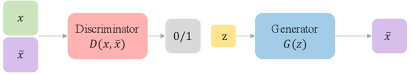
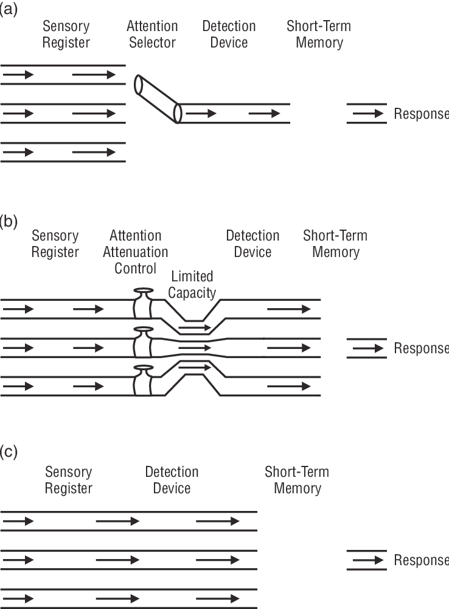

# فصل سوم: پیش‌بینی، سوگیری و توجه

**فارسی** | [English](../en/03-prediction-bias-attention.md)

[← فصل دوم](02-architecture-memory-load.md) · [فهرست فصل‌ها](README.md) · [نسخهٔ PDF](../../releases/computational-cognitive-science-booklet-fa.pdf)

---

## سوگیری شناختی

علوم شناختی محاسباتی فقط مرور نظریه‌ها نیست؛ انتخاب مسئله، انتخاب مدل و انتخاب نوع کاربرد نیز بخشی از کار علمی است. در این منبع، کیس‌استادی اصلی *Transformer*ها و مدل‌های زبانی بزرگ است. پس از معماری شناختی، نظریهٔ بار شناختی، محدودیت حافظهٔ کاری، توجه و راهکارهای کنترل بار شناختی، اکنون به ویژگی دیگری از ذهن انسان می‌رسیم: **سوگیری شناختی** (*Cognitive Bias*).

### تعریف *Cognitive Bias*

**سوگیری شناختی** (*Cognitive Bias*) یعنی انحراف نظام‌مند در فرایند تفکر، استدلال، قضاوت یا تصمیم‌گیری که باعث می‌شود فرد به نتیجه‌ای نادرست، نادقیق یا غیربهینه برسد. نکتهٔ مهم این است که سوگیری شناختی معمولاً فقط یک واکنش خام احساسی نیست. فرد اغلب برای تصمیم خود دلیل می‌آورد، اما همان دلیل‌آوردن و وزن‌دهی به شواهد تحت تأثیر سوگیری قرار گرفته است.

برای مثال، ممکن است فرد بگوید «من این خبر را قبول دارم چون با چند تجربهٔ قبلی‌ام سازگار است». ظاهر جمله عقلانی است، اما اگر فرد فقط تجربه‌های سازگار را دیده و تجربه‌های ناسازگار را حذف کرده باشد، استدلال او سوگیرانه است. بنابراین در سوگیری شناختی، مشکل معمولاً در مسیر پردازش اطلاعات رخ می‌دهد: انتخاب شواهد، وزن‌دهی به آن‌ها، تفسیرشان و تصمیم نهایی.

### نمونه‌های اصلی سوگیری

سه نمونهٔ پرکاربرد عبارت‌اند از *confirmation bias*، *anchoring bias* و *halo effect*. این نمونه‌ها مهم‌اند، چون هرکدام را می‌توان هم در انسان و هم در رفتار خروجی مدل‌های زبانی مطالعه کرد.

#### *Confirmation Bias*

**سوگیری تأییدی** (*Confirmation Bias*) یعنی فرد باور قبلی خود را معیار اصلی جست‌وجو و تفسیر اطلاعات قرار دهد. او داده‌هایی را بیشتر می‌بیند، انتخاب می‌کند یا جدی می‌گیرد که باور قبلی‌اش را تأیید کنند، و داده‌های ناسازگار را کم‌وزن‌تر یا بی‌اهمیت‌تر می‌بیند.

در زبان مدل‌سازی، می‌توان گفت فرد یک مدل ذهنی قبلی دارد و دادهٔ جدید می‌توانست وزن‌های آن مدل را به‌روزرسانی کند، اما به‌روزرسانی رخ نمی‌دهد یا بسیار ضعیف رخ می‌دهد. این سوگیری فقط در باورهای سیاسی یا اجتماعی دیده نمی‌شود؛ در خواندن مقاله، تحلیل داده، انتخاب فرضیه و حتی داوری پژوهشی هم ممکن است رخ دهد.

#### *Anchoring Bias*

**سوگیری لنگر** (*Anchoring Bias*) زمانی رخ می‌دهد که اولین داده، اولین عدد، اولین برداشت یا اولین چارچوب ارائه‌شده وزن بیش از حدی در قضاوت بعدی پیدا کند. پس از شکل‌گیری این لنگر، فرد ممکن است اطلاعات بعدی را هم حول همان نقطه تفسیر کند.

نقش «اولین‌ها» در این سوگیری مهم است: اولین دیدار، اولین برداشت از یک فرد، نخستین خبری که دربارهٔ یک موضوع می‌شنویم، یا اولین عددی که در یک مذاکره مطرح می‌شود. این موارد می‌توانند نقطهٔ شروع قضاوت را تعیین کنند، حتی اگر بعداً اطلاعات کافی برای اصلاح آن وجود داشته باشد.

#### *Halo Effect*

**اثر هاله‌ای** (*Halo Effect*) یعنی یک ویژگی مثبت یا برجستهٔ فرد به ویژگی‌های دیگر او تعمیم داده شود. اگر کسی ظاهر مرتب، جذابیت اجتماعی یا شهرت زیادی داشته باشد، ممکن است ناخودآگاه او را باهوش‌تر، منطقی‌تر، اخلاقی‌تر یا قابل اعتمادتر تصور کنیم؛ در حالی که این ویژگی‌ها از نظر منطقی لزوماً به هم وابسته نیستند.

پدیدهٔ *celebrity* را نیز می‌توان تا حدی با همین اثر توضیح داد. یک فرد ممکن است در هنر، ورزش، زیبایی یا اجرای رسانه‌ای ویژگی برجسته‌ای داشته باشد، اما مخاطب اعتبار آن ویژگی را به تحلیل سیاسی، قضاوت اخلاقی یا داوری علمی او نیز تعمیم دهد. این تعمیم سریع برای ذهن کم‌هزینه است، اما می‌تواند تصمیم را از شواهد واقعی جدا کند.

### آیا سوگیری همیشه بد است؟

سوگیری‌های شناختی همیشه به معنای نقص کامل ذهن نیستند. بسیاری از آن‌ها احتمالاً به دلیل کارکردهای تطبیقی در روند تکامل باقی مانده‌اند: تصمیم‌گیری سریع، کاهش مصرف انرژی، واکنش فوری به خطر، و استفاده از نشانه‌های کم برای رسیدن به قضاوت قابل قبول.

بنابراین مسئله این نیست که ذهن باید در همهٔ موقعیت‌ها مثل یک الگوریتم کامل و بی‌نقص عمل کند. در زندگی روزمره، تصمیم سریع و تقریبی گاهی بهتر از تصمیم کامل اما دیرهنگام است. مشکل وقتی آغاز می‌شود که همان راهبرد سریع در تصمیم‌های مهم، پیچیده یا پرهزینه به کار رود؛ جایی که خطای کوچک می‌تواند پیامد بزرگ داشته باشد.

### تبیین سوگیری با نظریهٔ بار شناختی

**نظریهٔ بار شناختی** (*Cognitive Load Theory*) می‌گوید حافظهٔ کاری انسان محدود است. اگر ذهن می‌توانست همهٔ اطلاعات محیط، همهٔ شاخه‌های ممکن تصمیم و کل فضای حالت را هم‌زمان نگه دارد و ارزیابی کند، تصمیم‌گیری می‌توانست بهینه‌تر باشد. اما در واقعیت، چنین ظرفیتی وجود ندارد.

به همین دلیل ذهن ناچار است انتخاب کند: به بعضی داده‌ها توجه کند، بعضی را حذف کند، برخی را در قالب *chunk* فشرده کند و برای برخی نشانه‌ها وزن بیشتری بگذارد. این انتخاب‌ها همیشه خطا نیستند، اما وقتی انتخاب یا وزن‌دهی نامتناسب شود، سوگیری ایجاد می‌شود.

#### تصمیم‌گیری *Greedy*

این مسئله را می‌توان با تعبیر *greedy* توضیح داد. ذهن به جای جست‌وجوی کامل همهٔ مسیرها، یک مسیر یا چند نشانهٔ در دسترس را انتخاب می‌کند و بر اساس همان تصمیم می‌گیرد. این تصمیم ممکن است *feasible* باشد، اما الزاماً *optimal* نیست.

برای مثال، در *confirmation bias* سیاست انتخاب می‌تواند چنین باشد: «به باور قبلی وزن زیاد بده و شواهد ناسازگار را کم‌وزن کن». در *anchoring bias* سیاست انتخاب چنین است: «به اولین داده یا اولین برداشت وزن زیاد بده». در هر دو حالت، محدودیت حافظهٔ کاری باعث می‌شود ذهن همهٔ داده‌ها را با وزن برابر بررسی نکند.

#### تعمیم از حافظهٔ بلندمدت

ما دربارهٔ گروه‌هایی از افراد یا موقعیت‌ها، میانگینی از ویژگی‌ها در حافظهٔ بلندمدت داریم. وقتی با فرد یا موقعیت تازه‌ای روبه‌رو می‌شویم، به جای پردازش همهٔ ویژگی‌های جدید، آن میانگین قبلی را سریع فعال می‌کنیم و به مورد تازه تعمیم می‌دهیم.

این کار می‌تواند مفید باشد، چون با حداقل اطلاعات، بیشترین حدس ممکن را می‌سازد. اما اگر میانگین قبلی نامعتبر باشد، یا تفاوت‌های فرد جدید نادیده گرفته شود، همین راهبرد به کلیشه، قضاوت نادرست یا تصمیم سوگیرانه تبدیل می‌شود.

#### کاهش سوگیری با کنترل بار شناختی

اگر بخشی از سوگیری از محدودیت حافظهٔ کاری بیاید، راهکارهای کنترل بار شناختی می‌توانند احتمال سوگیری را کم کنند:

- ساختارمند کردن اطلاعات؛

- *chunking* و گروه‌بندی معنادار؛

- استفاده از چک‌لیست؛

- شکستن مسئلهٔ پیچیده به مسئله‌های کوچک‌تر؛

- *divide and conquer*؛

- مدیریت توجه؛

- پرهیز از تصمیم‌گیری در حالت دادهٔ نامنظم و پراکنده.

این راهکارها سوگیری را تضمینی حذف نمی‌کنند، اما در تصمیم‌های مهم باعث می‌شوند ذهن فقط به اولین نشانهٔ در دسترس تکیه نکند.

### تبیین سوگیری با نظریهٔ دوفرایندی

**نظریهٔ دوفرایندی** (*Dual Process Theory*) یکی از چارچوب‌های مشهور برای توضیح قضاوت و تصمیم‌گیری است. در روایت آموزشی رایج، این نظریه میان دو سبک پردازش تمایز می‌گذارد: *System 1* و *System 2*. کتاب *Thinking, Fast and Slow* دنیل کانمن این تمایز را برای مخاطب عمومی بسیار مشهور کرد.

> **یادداشت — دقت دربارهٔ دو سیستم**
>
> *System 1* و *System 2* را نباید دو جعبهٔ جدا و دقیق در مغز دانست. این‌ها نام‌هایی آموزشی برای دو سبک پردازش‌اند: یکی سریع‌تر و شهودی‌تر، دیگری کندتر و تحلیلی‌تر. همچنین همهٔ سوگیری‌ها فقط از *System 1* نمی‌آیند؛ پردازش تحلیلی نیز اگر با فرض‌های غلط یا دادهٔ سوگیرانه شروع شود، می‌تواند نتیجهٔ نادرست بسازد.

#### *System 1*

*System 1* سریع، شهودی، کم‌هزینه و مناسب واکنش فوری است. بسیاری از توانایی‌های روزمرهٔ انسان به همین سبک پردازش وابسته‌اند: تشخیص چهره، تشخیص فرد از نشانه‌های ناقص، فهم سریع موقعیت، جهت‌یابی، حدس زدن حالت عاطفی دیگران و واکنش فوری در خطر.

به همین دلیل، *System 1* ذاتاً بد نیست. اگر برای هر تصمیم کوچک مجبور بودیم تحلیل کامل انجام دهیم، زندگی روزمره کند و پرهزینه می‌شد. مشکل وقتی رخ می‌دهد که مسئله پیچیده، اطلاعات ناقص، پیامد مهم، یا نیازمند تحلیل دقیق باشد، اما ذهن همچنان با پاسخ سریع و شهودی تصمیم بگیرد.

#### *System 2*

*System 2* کندتر، تحلیلی‌تر، منطقی‌تر و پرهزینه‌تر است. این سبک پردازش با reasoning مرحله‌به‌مرحله، بررسی مفروضات، جمع‌آوری شواهد، نقد پاسخ اولیه و تعریف معیارهای تصمیم ارتباط دارد.

از منظر این نظریه، سوگیری شناختی اغلب زمانی تشدید می‌شود که پاسخ سریع *System 1* بدون ورود *System 2* نهایی شود. راهکار کاهش سوگیری این است که در تصمیم‌های مهم مکث کنیم، اولین پاسخ را قطعی ندانیم، هنگام خستگی یا عصبانیت تصمیم نهایی نگیریم، شواهد بیشتری جمع کنیم، معیارها را صریح کنیم و پاسخ اولیه را نقد کنیم.

#### فعال‌سازی رفتار شبیه *System 2* در مدل‌های زبانی

در *Transformer* یا *LLM* چیزی به معنای انسانی *System 1* و *System 2* وجود ندارد. با این حال، خروجی مدل گاهی شبیه پاسخ سریع و شهودی است و گاهی شبیه استدلال تحلیلی. سؤال عملی این است: چگونه می‌توان مدل را به سمت خروجی تحلیلی‌تر و کمتر شتاب‌زده برد؟

یکی از راه‌ها *prompt engineering* است. می‌توان از مدل خواست مسئله را مرحله‌به‌مرحله حل کند، مفروضات را پیش از پاسخ نهایی بررسی کند، معیارهای پاسخ را مشخص کند، پاسخ اولیه را نقد کند و سپس اصلاح کند. *Few-shot prompting* نیز اگر فقط شامل مثال‌های ساده نباشد و موارد مرزی و دشوار را نشان دهد، مدل را از تکیه بر الگوی سطحی دورتر می‌کند.

*Self-critique* نیز همین نقش را دارد. ابتدا مدل پاسخ اولیه می‌دهد؛ سپس در مرحلهٔ بعد از آن خواسته می‌شود پاسخ خود را نقد کند، خطاها یا ضعف‌ها را پیدا کند و نسخهٔ اصلاح‌شده بسازد. پاسخ اولیه در این تشبیه شبیه *System 1* است و نقد و اصلاح، رفتاری شبیه *System 2* ایجاد می‌کند.

### *Chain of Thought*، *Tree of Thought* و *Self-Critique*

*Chain of Thought* یعنی مدل به جای دادن پاسخ نهایی فوری، مسئله را در چند گام حل کند. این روش در بسیاری از مسائل استدلالی می‌تواند کمک کند، چون مدل را وادار می‌کند رابطه‌های میانی را آشکارتر و منظم‌تر کند. البته در کاربردهای واقعی لازم نیست همیشه همهٔ زنجیرهٔ استدلال خام به کاربر نمایش داده شود؛ مهم این است که فرایند پاسخ‌دهی مدل فقط یک حدس فوری نباشد.

*Tree of Thought* یک گام فراتر می‌رود. در این روش، مدل فقط یک مسیر استدلالی را دنبال نمی‌کند، بلکه چند شاخهٔ ممکن را می‌سازد، آن‌ها را ارزیابی می‌کند و سپس مسیر بهتر را ادامه می‌دهد. این ایده از نظر شناختی شبیه کاهش اتکای ذهن به اولین مسیر فعال‌شده است: اگر چند مسیر بررسی شوند، احتمال اینکه پاسخ فقط اسیر لنگر اولیه یا چارچوب اول شود کمتر می‌شود.

در کنار این‌ها، *self-critique* و مرحلهٔ بازبینی پاسخ برای کاهش خطا و سوگیری مهم‌اند. مجموعهٔ این روش‌ها با هدف مشترک به کار می‌روند: مدل از پاسخ سریع، سطحی و حساس به framing فاصله بگیرد و خروجی دقیق‌تر، تحلیلی‌تر و کمتر سوگیرانه تولید کند.

## *Predictive Coding* و مدل بیزی ذهن

پس از بررسی سوگیری شناختی از مسیر نظریهٔ بار شناختی و نظریهٔ دوفرایندی، می‌توان مسیر سوم را دقیق‌تر بررسی کرد: *Predictive Coding*. پرسش اصلی این است که تا چه حد می‌توان این نظریه را به *Transformer*ها، مدل‌های زبانی و شبکه‌های عصبی فعلی نگاشت.

### مغز به‌عنوان سیستم پیش‌بین

تصویر ساده و قدیمی از ادراک این است که محیط بیرونی داده تولید می‌کند، قشرهای حسی آن را از پایین به بالا پردازش می‌کنند، و در نهایت ادراک یا تصمیم ساخته می‌شود. **کدگذاری پیش‌بینانه** (*Predictive Coding*) این تصویر را کامل‌تر می‌کند: مغز فقط گیرندهٔ منفعل داده نیست؛ مغز دائماً بر اساس دانش قبلی، انتظار و پیش‌بینی می‌سازد.

در این نظریه، مغز شبیه یک *Generative Model* عمل می‌کند. از بالا به پایین، بر اساس دانش قبلی پیش‌بینی می‌کند که در محیط چه اتفاقی در حال رخ دادن است. از پایین به بالا، ورودی‌های حسی از قشرهای اولیه دریافت می‌شوند. در هر لحظه اختلاف میان پیش‌بینی و ورودی حسی محاسبه می‌شود.

پس در هر لحظه دو جریان اطلاعاتی داریم:

- **جریان بالا‌به‌پایین** (*Top-down*): پیش‌بینی بر اساس دانش قبلی؛

- **جریان پایین‌به‌بالا** (*Bottom-up*): ورودی حسی از محیط.

اگر پیش‌بینی و ورودی حسی با هم اختلاف داشته باشند، *prediction error* ایجاد می‌شود. اگر اختلافی وجود نداشته باشد، سیستم در حالت تعادل باقی می‌ماند و نیازی به تغییر مدل ذهنی نیست.

### *Prediction Error*

**خطای پیش‌بینی** (*Prediction Error*) اختلاف میان چیزی است که سیستم پیش‌بینی کرده و چیزی که از ورودی دریافت شده است. در صورت ساده:
$$
\text{Prediction Error}=\text{Input}-\text{Prediction}
$$

اگر ورودی حسی را با $r$ یا $\mu_i$ و پیش‌بینی یا دانش قبلی را با $\mu_p$ نمایش دهیم، داریم:
$$
\text{Error}=r-\mu_p
$$
یا:
$$
\text{Error}=\mu_i-\mu_p
$$

اگر این خطا صفر باشد، ورودی جدید با پیش‌بینی قبلی سازگار است و چیزی برای اصلاح وجود ندارد. اگر خطا وجود داشته باشد، سیستم باید یا باور قبلی را تغییر دهد یا ورودی جدیدی بگیرد تا ابهام کمتر شود.

### *Prior*، *Likelihood* و *Posterior*

برای دقیق‌تر کردن بحث، می‌توان دانش قبلی را به‌صورت یک توزیع در نظر گرفت؛ مثلاً یک توزیع نرمال زنگوله‌ای. این توزیع دو ویژگی مهم دارد:

- میانگین $\mu$؛

- واریانس $\sigma^2$.

وقتی می‌گوییم یک مدل ذهنی قوی است، یعنی میانگین آن مشخص و برجسته است، واریانس آن کم است، و عدم قطعیت کمی دارد. در مقابل، وقتی مدل ذهنی ضعیف است، واریانس زیاد است، قطعیت پایین است و فرد کمتر به آن دانش قبلی تکیه می‌کند.

فرمول کلی بیز در این چارچوب چنین نوشته می‌شود:
$$
\text{Posterior} \propto \text{Likelihood} \times \text{Prior}
$$
*Prior* دانش قبلی ماست. *Likelihood* شواهد جدیدی است که از محیط می‌گیریم. *Posterior* باور به‌روزشده پس از ترکیب دانش قبلی و شواهد جدید است.

در یک بیان ساده‌تر، می‌توان کل سازوکار را به زنجیرهٔ *prior*، پیش‌بینی، مقایسه با ورودی حسی، خطای پیش‌بینی، به‌روزرسانی و *posterior* خلاصه کرد. این خلاصه برای نگاشت بعدی به مدل‌های زبانی مفید است، چون نشان می‌دهد مسئله فقط تولید پاسخ نیست؛ مسئله وزن دادن به پیش‌فرض و شواهد تازه است.

#### مثال کارآگاه

برای توضیح *prior* و *likelihood*، مثال کارآگاه مطرح شد. فرض کنید کارآگاه پیش از ورود به صحنهٔ جرم اطلاعاتی دربارهٔ مظنون‌ها دارد: یکی از مظنون‌ها پیرمردی است که ظاهراً چند هفته در بیمارستان بوده و مظنون دیگر کودکی است که شواهد قبلی بیشتر به سمت او اشاره می‌کنند. در این حالت، *prior* کارآگاه به‌شدت به سمت کودک است.

اما در صحنهٔ جرم، کارآگاه ردپای بزرگی پیدا می‌کند؛ مثلاً سایز ۴۳. این شواهد جدید، یعنی *likelihood*، بیشتر با پیرمرد سازگار است تا کودک. اگر *prior* کارآگاه خیلی قوی باشد، ممکن است بگوید کودک کفش شخص دیگری را پوشیده است. یعنی با اینکه شواهد جدید علیه باور قبلی است، کارآگاه تلاش می‌کند همان باور قبلی را حفظ کند. این مثال نشان می‌دهد فقط احتمال‌ها کافی نیستند؛ وزن یا اطمینان هر بخش نیز مهم است.

### *Precision*

*Precision* یعنی میزان اطمینان یا وزنی که به یک منبع اطلاعاتی می‌دهیم. در این بحث دو نوع *precision* داریم:

- **اطمینان به دانش قبلی** (*Precision Prior*)؛

- **اطمینان به ورودی یا شواهد جدید** (*Precision Input*).

اگر *precision prior* زیاد باشد، فرد به دانش قبلی خود بسیار اعتماد دارد. اگر *precision input* زیاد باشد، فرد به ورودی جدید یا شواهد فعلی اعتماد زیادی دارد.

#### *Precision Prior*

*Precision prior* زمانی زیاد می‌شود که دانش قبلی بر اساس شواهد زیاد شکل گرفته باشد، در طول زمان طولانی تأیید شده باشد، با تجربه‌های متعدد سازگار باشد، یا در حوزه‌ای باشد که فرد در آن تخصص دارد.

مثال، تابش نور خورشید از بالا بود. از کودکی بارها تجربه کرده‌ایم که نور خورشید از بالا می‌تابد، بنابراین *precision* این *prior* بسیار بالاست و یک مشاهدهٔ تصادفی یا حرف یک نفر به‌راحتی آن را تغییر نمی‌دهد.

*Precision prior* وقتی کم است که اطلاعات قبلی کم باشد، داده‌ها پراکنده باشند، فرد تجربه یا تخصص کافی نداشته باشد، یا برای اولین‌بار با موضوعی مواجه شده باشد. در این حالت، چون *prior* ضعیف است، فرد ممکن است بیش از حد به اولین ورودی‌ها تکیه کند. این خود می‌تواند منبعی برای سوگیری شناختی باشد.

#### مثال رسانه و تخصص

یک مثال مرتبط به رسانه‌ها مربوط است. گاهی گفته می‌شود فرد نباید هر رسانه‌ای را دنبال کند، چون اگر *precision prior* او پایین باشد، اطلاعات رسانه می‌تواند به‌راحتی روی قضاوت او اثر بگذارد و باعث سوگیری شود. اما اگر فرد در یک حوزه متخصص باشد، می‌تواند رسانه‌ها و دیدگاه‌های مختلف را بررسی کند، چون *prior* او قوی‌تر است و به‌سادگی دچار انحراف نمی‌شود.

#### *Precision Input*

*Precision input* زمانی زیاد است که فرد به شواهد فعلی اعتماد زیادی داشته باشد؛ مثلاً خودش چیزی را با دقت دیده باشد، منبع اطلاعات قابل اعتماد باشد، شواهد مختلف یکدیگر را تأیید کنند، فرد از نظر جسمی و ذهنی در وضعیت خوبی باشد، یا وقت کافی برای مشاهده و دقت داشته باشد. وقتی کسی می‌گوید «نه، من مطمئنم که خودم دیدم»، یعنی *precision input* او بالاست.

*Precision input* زمانی کم است که فرد خسته باشد، عجله داشته باشد، در وضعیت جسمی یا ذهنی مناسبی نباشد، مشاهده مبهم باشد، یا منبع اطلاعات قابل اعتماد نباشد. مثلاً اگر فرد خیلی خسته باشد و چیزی ببیند، ممکن است خودش بگوید «شاید اشتباه دیدم». در این حالت، *precision input* پایین است.

#### ترکیب ورودی و باور قبلی

وقتی هم *prior* و هم *input* داریم، هرکدام با *precision* خود در باور نهایی اثر می‌گذارند. فرمول میانگین *posterior* به‌صورت زیر نوشته شد:
$$
\mu_{\mathrm{post}}=
\frac{\pi_p \mu_p+\pi_i \mu_i}{\pi_p+\pi_i}
$$
در این فرمول:

- $\mu_{\mathrm{post}}$: میانگین باور به‌روزشده؛

- $\mu_p$: میانگین *prior*؛

- $\mu_i$: میانگین *input*؛

- $\pi_p$: *precision prior*؛

- $\pi_i$: *precision input*.

این فرمول شبیه میانگین‌گیری وزنی است. هر منبع اطلاعاتی به‌اندازهٔ *precision* خود در خروجی نهایی اثر می‌گذارد.

#### بازنویسی فرمول با خطای پیش‌بینی

فرمول بالا بازنویسی شد تا ارتباط آن با *prediction error* روشن‌تر شود:
$$
\mu_{\mathrm{post}}=
\mu_p+\frac{\pi_i}{\pi_p+\pi_i}(\mu_i-\mu_p)
$$
در اینجا:
$$
(\mu_i-\mu_p)
$$
همان *prediction error* است و عبارت:
$$
\frac{\pi_i}{\pi_p+\pi_i}
$$
وزن خطاست. پس باور جدید برابر است با:
$$
\text{Prior}+\text{Weight}\times \text{Prediction Error}
$$

### چه زمانی باور به‌روزرسانی نمی‌شود؟

طبق فرمول، *prior* زمانی به‌روزرسانی نمی‌شود که $\mu_{\mathrm{post}}=\mu_p$ باشد. این اتفاق در چند حالت رخ می‌دهد.

#### حالت اول: خطای پیش‌بینی صفر باشد

اگر:
$$
\mu_i-\mu_p=0
$$
ورودی جدید با پیش‌بینی قبلی کاملاً سازگار است. در این حالت خطایی وجود ندارد، پس چیزی برای اصلاح کردن نیست و سیستم در تعادل می‌ماند. مثال این بود که فرد به لپ‌تاپ نگاه می‌کند و چیزی خلاف انتظار رخ نمی‌دهد؛ پس مغز نیازی به اصلاح مدل ذهنی ندارد.

#### حالت دوم: *Precision Input* صفر یا بسیار کم باشد

اگر:
$$
\pi_i \approx 0
$$
فرد به ورودی جدید تقریباً هیچ اعتمادی ندارد. در این حالت حتی اگر ورودی جدید با *prior* ناسازگار باشد، اثر چندانی روی باور نهایی ندارد.

#### حالت سوم: *Precision Prior* بسیار بیشتر باشد

اگر:
$$
\pi_p \gg \pi_i
$$
آنگاه:
$$
\frac{\pi_i}{\pi_p+\pi_i}\approx 0
$$
در نتیجه:
$$
\mu_{\mathrm{post}}\approx \mu_p
$$
یعنی باور قبلی تقریباً بدون تغییر باقی می‌ماند. این همان حالتی است که در *confirmation bias* دیده می‌شود: فرد آن‌قدر به مدل ذهنی قبلی خود اعتماد دارد که شواهد جدید را نادیده می‌گیرد.

### کاهش *Confirmation Bias* با چارچوب بیزی

وقتی *prediction error* وجود دارد، سیستم باید به نوعی خطا را کم کند. دو راه کلی وجود دارد. راه اول تغییر دادن *prior* است؛ یعنی فرد باور یا مدل ذهنی قبلی خود را به‌روزرسانی کند. برای مثال، اگر قبلاً فکر می‌کرد محیط امن است اما شواهدی خلاف آن ببیند، ممکن است مدل ذهنی خود را تغییر دهد و بگوید شاید اینجا خطرناک باشد.

راه دوم تغییر دادن *input* است؛ یعنی فرد ورودی جدیدی بگیرد تا ابهام رفع شود: سر خود را برگرداند، نور را روشن کند، دوباره نگاه کند، از زاویهٔ دیگری بررسی کند یا دادهٔ جدید جمع کند. در مثال جسمی روی زمین، فرد ممکن است نور را روشن کند تا بفهمد آن جسم چیست. در این حالت، *input* تغییر می‌کند تا *prediction error* کاهش یابد.

اگر ورودی جدیدی در دسترس نباشد یا نتوانیم *input* را تغییر دهیم، معمولاً *prior* غالب می‌شود. در مثال کارآگاه، اگر شواهد جدید کافی پیدا نشود، کارآگاه بر اساس همان اطلاعات قبلی قضاوت می‌کند.

برای کاهش سوگیری تأییدی، باید کاری کنیم اثر بیش از حد *prior* کم شود. طبق فرمول، دو راه اصلی وجود دارد:

1.  کاهش *precision prior*؛ یعنی مدل کمتر به پیش‌فرض‌های قبلی خود تکیه کند.

2.  افزایش *precision input*؛ یعنی ورودی جدید دقیق، واضح و قابل اعتماد باشد.

اگر:
$$
\pi_i \gg \pi_p
$$
آنگاه:
$$
\frac{\pi_i}{\pi_p+\pi_i}\approx 1
$$
پس:
$$
\mu_{\mathrm{post}}=\mu_p+(\mu_i-\mu_p)
$$
و در نتیجه:
$$
\mu_{\mathrm{post}}=\mu_i
$$
یعنی باور نهایی تقریباً کاملاً بر اساس *input* شکل می‌گیرد، نه *prior*. در این حالت، سوگیری تأییدی کاهش می‌یابد، چون مدل مجبور می‌شود به شواهد جدید توجه کند.

### ارتباط *Predictive Coding* با مدل‌های زبانی

در ادامه، بحث به *LLM*ها و *Transformer*ها وصل شد. اگر بخواهیم در یک مدل زبانی سوگیری تأییدی را کم کنیم، باید کاری کنیم مدل کمتر بر *prior* داخلی خود، یعنی وزن‌ها و پارامترهای آموخته‌شده، تکیه کند و بیشتر به *input* فعلی توجه کند.

در این چارچوب، تکنیک‌های *prompting* را می‌توان به‌عنوان روش‌هایی برای افزایش *precision input* یا کاهش اثر *precision prior* تحلیل کرد.

#### *RAG*

*Retrieval-Augmented Generation* یا *RAG* یعنی به مدل اطلاعات بیرونی و بازیابی‌شده داده شود. این اطلاعات نقش *input* با *precision* بالا را دارد. اگر مدل مجبور شود بر اساس *RAG* پاسخ دهد، اثر *prior* عمومی مدل کمتر می‌شود و پاسخ بیشتر بر اساس دادهٔ ورودی تولید می‌شود.

#### *Few-shot Prompting*

در *few-shot prompting*، چند نمونهٔ مشخص به مدل داده می‌شود. این نمونه‌ها سیگنال ورودی را واضح‌تر می‌کنند و واریانس آن را کاهش می‌دهند. در نتیجه *precision input* بالا می‌رود و مدل کمتر به پیش‌فرض‌های عمومی خود تکیه می‌کند.

#### *Negative Prompting*

در *negative prompting* می‌توان به مدل گفت از برخی فرض‌ها، سوگیری‌ها یا جهت‌گیری‌ها اجتناب کند. برای مثال: «فرضیات خودت را نادیده بگیر»، «از سوگیری فرهنگی پرهیز کن»، یا «فقط بر اساس شواهد ارائه‌شده پاسخ بده». این کار به‌نوعی *precision prior* را کاهش می‌دهد یا دست‌کم اثر برخی *prior*های ناخواسته را محدود می‌کند.

#### *Role Playing*

در *role playing*، به مدل یک نقش مشخص داده می‌شود؛ مثلاً «تو یک قاضی بی‌طرف هستی». این کار مدل را از فضای عمومی پاسخ‌دهی وارد یک فضای تخصصی‌تر و کنترل‌شده‌تر می‌کند. در نتیجه، *prior* عمومی مدل ضعیف‌تر می‌شود و مدل بیشتر مطابق نقش تعیین‌شده رفتار می‌کند.

### تفاوت *Predictive Coding* با شبکه‌های عصبی رایج

در بخش پایانی، تفاوت *predictive coding* با شبکه‌های عصبی فعلی بررسی شد. شبکه‌های عصبی رایج معمولاً به این صورت توضیح داده می‌شوند:

1.  ورودی دریافت می‌کنند.

2.  محاسبات *feedforward* انجام می‌دهند.

3.  خروجی تولید می‌کنند.

4.  خطا با *loss function* محاسبه می‌شود.

5.  خطا با *backpropagation* به عقب منتقل می‌شود.

6.  وزن‌ها با *gradient descent* به‌روزرسانی می‌شوند.

اگر شبکه‌ای با لایهٔ ورودی، لایهٔ پنهان و لایهٔ خروجی داشته باشیم، هر نورون ورودی با وزن‌هایی به نورون‌های بعدی وصل است. محاسبه‌ای از این نوع انجام می‌شود:
$$
h=a_1w_1+a_2w_2+b
$$
سپس خروجی تولید می‌شود و با مقدار هدف مقایسه می‌شود. برای مثال، با خطای میانگین مربعات:
$$
\text{Loss}=(y-\hat{y})^2
$$
بعد با *backpropagation* محاسبه می‌شود هر وزن چقدر باید تغییر کند تا خطا کم شود.

#### خطای محلی در مغز، خطای سراسری در شبکه

در شبکه‌های عصبی فعلی، خطا معمولاً در انتهای شبکه محاسبه می‌شود؛ یعنی پس از اینکه ورودی از کل شبکه عبور کرد و خروجی تولید شد. این خطا سپس به عقب منتقل می‌شود و وزن‌ها اصلاح می‌شوند. بنابراین خطا در این شبکه‌ها عمدتاً *global* یا *end-to-end* است.

اما در *predictive coding*، هر بخش از مغز یا هر سطح از پردازش می‌تواند به‌صورت محلی اختلاف بین پیش‌بینی و ورودی خود را محاسبه کند. لازم نیست همه‌چیز تا انتهای یک سلسله‌مراتب برود و سپس از بالا دستور اصلاح صادر شود. به‌صورت شهودی، انگار همهٔ بخش‌ها خودشان را مسئول خطا می‌دانند، نه اینکه منتظر بمانند خطا فقط در انتهای شبکه مشخص شود.

#### جهت جریان اطلاعات

در شبکه‌های عصبی فعلی، جریان اصلی اطلاعات معمولاً از پایین به بالا یا از ورودی به خروجی است:
$$
\text{Input}\rightarrow \text{Hidden Layers}\rightarrow \text{Output}
$$
اما در مغز طبق *predictive coding*، علاوه بر جریان *bottom-up*، جریان *top-down* هم وجود دارد. مغز دائماً از سطوح بالاتر پیش‌بینی تولید می‌کند و آن را با ورودی‌های حسی پایین‌تر مقایسه می‌کند.

پس تفاوت دوم این است: در شبکهٔ عصبی، جریان اطلاعات عمدتاً *bottom-up* است، اما در مغز هم *bottom-up* داریم و هم *top-down*. در شبکهٔ عصبی، پیش‌بینی معمولاً پس از دریافت ورودی و عبور از شبکه تولید می‌شود؛ اما در مغز، پیش‌بینی از قبل و به‌صورت مداوم در حال تولید است و سپس با ورودی مقایسه می‌شود.

#### آیا وزن‌های شبکه همان *Prior* هستند؟

یک پرسش مهم این است که آیا وزن‌هایی که شبکهٔ عصبی تاکنون یاد گرفته، می‌تواند *prior* آن محسوب شود؟ پاسخ کلی مثبت است: پارامترها و وزن‌های مدل، دانش قبلی یا *prior* مدل محسوب می‌شوند و مدل هنگام پاسخ‌دهی بر اساس همین وزن‌ها عمل می‌کند. اما تفاوت اینجاست که شبکه‌های عصبی فعلی معمولاً مانند مغز، در هر لحظه و به‌صورت محلی *prediction error* را محاسبه و اصلاح نمی‌کنند.

### مقایسهٔ مفهومی با *GAN*

ممکن است پرسیده شود آیا در *GAN* چیزی شبیه جریان *top-down* یا *predictive coding* وجود دارد، چون *GAN* یک بخش تولیدکننده و یک بخش مقایسه‌کننده یا تشخیص‌دهنده دارد. این ایده قابل تأمل است، چون در *GAN* یک بخش *generative* وجود دارد و ممکن است در نگاه اول شبیه بخش *top-down* در *predictive coding* به نظر برسد.

با این حال، این نگاشت دقیق و قطعی نیست و نیاز به بررسی بیشتر دارد. احتمالاً نمی‌توان به‌سادگی خروجی بخش *adversarial* یا *generator* را معادل جریان *top-down* در مغز دانست.

*شکل ۳ـ۱ — نمای سادهٔ GAN: مولد از متغیر نهفته نمونهٔ ساختگی می‌سازد و تمایزدهنده نمونهٔ واقعی و ساختگی را ارزیابی می‌کند. شباهت ظاهری آن با کدگذاری پیش‌بینانه در وجود تولید و ارزیابی است، اما نگاشت دقیق شناختی میان این دو ساده نیست.*

## توجه انتخابی

در معماری *ACT*، انسان با محیط بیرونی در تعامل است. اطلاعات محیط از راه ماژول‌های حسی مانند بینایی و شنوایی دریافت می‌شود و بخشی از آن وارد حافظهٔ کوتاه‌مدت می‌شود. حافظهٔ کوتاه‌مدت با حافظهٔ بلندمدت در تعامل است: از آن اطلاعات را *retrieve* می‌کند و در مقابل، تجربه‌هایی که بارها در حافظهٔ کوتاه‌مدت پردازش و به حافظهٔ بلندمدت ارجاع داده شوند، به‌تدریج در حافظهٔ بلندمدت تثبیت می‌شوند. این همان فرایند *learning* است. هر دو حافظه نیز ممکن است در گذر زمان دچار *forgetting* شوند.

در زبان بیزی، حافظهٔ بلندمدت را می‌توان شبیه *prior knowledge* دانست. ورودی‌های فعلی محیط که از راه حافظهٔ کوتاه‌مدت وارد پردازش می‌شوند، شبیه *likelihood* هستند. ترکیب این دو یک *posterior* می‌سازد و این باور به‌روزشده می‌تواند در طول زمان دانش قبلی را تغییر دهد:
$$
\begin{aligned}
\text{Long-Term Memory} &\approx \text{Prior Knowledge},\\
\text{Short-Term Input} &\approx \text{Likelihood},\\
\text{Updated Belief} &\approx \text{Posterior}.
\end{aligned}
$$

همچنین بحث حافظهٔ کاری و *Cognitive Load* یادآوری شد. حافظهٔ کاری محل پردازش‌های فعال ذهنی است، اما ظرفیت محدودی دارد. به همین دلیل، راهکارهایی مانند *chunking* اهمیت پیدا می‌کنند؛ مثلاً یک شمارهٔ تلفن را به چند قطعهٔ کوچک‌تر تقسیم می‌کنیم تا فشار کمتری به حافظهٔ کاری وارد شود.

از اینجا بحث اصلی آغاز می‌شود: ما در محیطی بسیار بزرگ و پر از اطلاعات زندگی می‌کنیم. حس‌های مختلف دائماً از محیط داده می‌گیرند و این داده‌ها ابتدا در سطح حافظهٔ حسی قرار می‌گیرند. حافظهٔ حسی ظرفیت زیادی دارد، اما اطلاعات در آن تنها برای زمانی بسیار کوتاه باقی می‌ماند. وقتی وارد یک محیط می‌شویم، هم‌زمان صداها، چهره‌ها، اشیا، بوها و حس‌های بدنی مختلفی را دریافت می‌کنیم؛ با این حال همهٔ این اطلاعات وارد حافظهٔ کوتاه‌مدت نمی‌شود. هم ظرفیت حافظه محدود است و هم توان پردازش.

*Selective Attention* یعنی انتخاب بخشی از اطلاعات محیط از میان حجم بزرگی از ورودی‌ها، به‌گونه‌ای که همان بخش بتواند از حافظهٔ حسی عبور کند، وارد حافظهٔ کوتاه‌مدت شود و در پردازش آگاهانه نقش بگیرد.

### جایگاه توجه انتخابی در معماری شناختی

مسیر کلی پردازش در این بحث چنین است: محیط اطلاعات زیادی تولید می‌کند؛ سیستم‌های حسی این اطلاعات را دریافت می‌کنند؛ همهٔ این اطلاعات در سطح حافظهٔ حسی ثبت می‌شود؛ سپس فقط بخشی از آن‌ها انتخاب می‌شود و وارد حافظهٔ کوتاه‌مدت می‌شود. در حافظهٔ کوتاه‌مدت، پردازش معنایی و تصمیم‌گیری انجام می‌شود و در نهایت یک *Action* یا عمل تولید می‌شود.

بنابراین مسئلهٔ اصلی توجه انتخابی این است که از میان حجم زیادی از اطلاعات محیط، چه چیزی انتخاب می‌شود و چگونه وارد حافظهٔ کوتاه‌مدت می‌شود.

### تفاوت توجه شناختی با *Attention* در مدل‌های زبانی

وقتی در مدل‌هایی مانند *ChatGPT* دربارهٔ *attention* صحبت می‌کنیم، معمولاً منظور توجه مدل به بخش‌های مختلف *prompt* است. اما توجه انتخابی در این فصل به مرحله‌ای قبل‌تر مربوط می‌شود.

در یک چت‌بات معمولی، کاربر خودش محیط سیستم را مشخص کرده است؛ *prompt* همان محیطی است که مدل باید بر اساس آن پاسخ دهد. بنابراین سیستم لازم نیست از کل محیط فیزیکی چیزی را انتخاب کند. اما در سامانه‌هایی مانند دستیارهای صوتی، از جمله *Siri* یا *Alexa*، مسئله متفاوت است. این سامانه‌ها در محیط واقعی قرار دارند و دائماً صداهای اطراف را می‌شنوند. آن‌ها باید از میان همهٔ صداها، بخش مرتبط را انتخاب کنند.

برای نمونه، وقتی کاربر عبارت‌هایی مانند *Hey Siri* یا *Alexa* را می‌گوید، سامانه باید از میان صداهای محیط تشخیص دهد که کلمهٔ فعال‌ساز گفته شده است. پس بحث *Selective Attention* بیشتر به سیستم‌هایی مربوط است که واقعاً با محیط بیرونی در تعامل‌اند و باید از میان داده‌های محیطی، بخش مربوط به خود را انتخاب کنند.

### مسئلهٔ گلوگاه توجه

برای فهم توجه انتخابی، مثال رایج مهمانی مطرح شد. در یک مهمانی افراد مختلفی اطراف ما هستند و هر کدام در حال صحبت‌اند؛ اما ما معمولاً فقط می‌توانیم روی حرف یک نفر تمرکز کنیم. اگر دوستمان روبه‌روی ما نشسته باشد و شماره تلفنی را بگوید، می‌توانیم آن شماره را وارد حافظهٔ کوتاه‌مدت کنیم، آن را *chunk* کنیم و بعداً از آن استفاده کنیم. اما اگر هم‌زمان چند نفر دیگر هم شماره تلفن بگویند، معمولاً نمی‌توانیم همهٔ آن‌ها را هم‌زمان پردازش کنیم.

این تجربه نشان می‌دهد در مسیر پردازش اطلاعات یک *bottleneck* یا گلوگاه وجود دارد. اطلاعات زیادی در محیط حاضر است، اما فقط بخشی از آن می‌تواند از این گلوگاه عبور کند و وارد پردازش آگاهانه شود.

### *Broadbent’s Filter Theory*

نخستین نظریه‌ای که در این بخش دربارهٔ توجه انتخابی مطرح شد، *Filter Theory* از *Broadbent* بود. این نظریه در سال ۱۹۵۸ مطرح شد و به آن *Early Selection* نیز گفته می‌شود.

#### *Early Selection*

طبق نظریهٔ *Early Selection*، انتخاب خیلی زود اتفاق می‌افتد؛ یعنی پیش از آنکه معنا را درک کنیم. ابتدا اطلاعات بر اساس ویژگی‌های فیزیکی یا آکوستیکی فیلتر می‌شوند. در مثال مهمانی، ممکن است صدای دوستمان انتخاب شود چون نزدیک‌تر است، بلندتر صحبت می‌کند، صدایش برای ما آشناست، جهت صدا مشخص است، یا می‌دانیم با او در حال گفت‌وگو هستیم.

پس از انتخاب یک ورودی، تازه پردازش معنایی انجام می‌شود. یعنی ابتدا مشخص می‌کنیم به کدام صدا گوش بدهیم و سپس معنای حرف او را می‌فهمیم. مسیر پردازش در این نگاه چنین است:

1.  دریافت ورودی‌های متعدد از محیط؛

2.  انتخاب یک ورودی بر اساس ویژگی‌های فیزیکی یا آکوستیکی؛

3.  حذف یا نادیده گرفتن ورودی‌های دیگر؛

4.  پردازش معنایی ورودی انتخاب‌شده؛

5.  ورود آن به حافظهٔ کوتاه‌مدت؛

6.  تصمیم‌گیری و انجام عمل.

در این مدل، فیلتر قبل از درک معنا قرار دارد.

#### محدودیت‌های انتخاب زودهنگام

نظریهٔ *Early Selection* بخشی از تجربهٔ ما را توضیح می‌دهد؛ مثلاً اینکه چرا وقتی با یک نفر صحبت می‌کنیم، معمولاً حرف بقیه را نمی‌فهمیم. اما با یک تجربهٔ مهم مشکل دارد: گاهی در مهمانی مشغول صحبت با یک نفر هستیم، اما اگر کسی در گوشه‌ای از اتاق اسم ما را صدا بزند، متوجه می‌شویم؛ حتی اگر صدا آرام باشد.

اگر طبق این نظریه ورودی‌های دیگر حذف شده باشند، روشن نیست چگونه توانسته‌ایم اسم خود را از میان آن‌ها تشخیص دهیم. همین مسئله زمینه را برای نظریهٔ دیگری فراهم کرد.

### *Late Selection*

*Late Selection* پس از نظریهٔ برادبنت مطرح شد؛ از جمله در کار *Deutsch & Deutsch* در سال ۱۹۶۳. در این نگاه، فیلتر بعد از پردازش معنایی قرار دارد.

#### انتخاب پس از پردازش معنایی

طبق *Late Selection*، ذهن ابتدا ورودی‌های مختلف را تا سطح معنا پردازش می‌کند و سپس تصمیم می‌گیرد کدام ورودی مهم‌تر است و باید وارد حافظهٔ کوتاه‌مدت شود. در مثال مهمانی، اگر کسی اسم ما را بگوید، چون معنای آن برای ما مهم است، آن ورودی از فیلتر عبور می‌کند.

مسیر پردازش در این مدل چنین است:

1.  دریافت ورودی‌های متعدد از محیط؛

2.  پردازش معنایی همه یا بخش زیادی از ورودی‌ها؛

3.  انتخاب ورودی مهم‌تر بر اساس معنا؛

4.  ورود ورودی انتخاب‌شده به حافظهٔ کوتاه‌مدت؛

5.  تصمیم‌گیری و عمل.

در این مدل، فیلتر بعد از درک معنا قرار دارد.

#### محدودیت‌های انتخاب دیرهنگام

*Late Selection* می‌تواند توضیح دهد چرا وقتی کسی اسم ما را صدا می‌زند، آن را تشخیص می‌دهیم. اما مشکل اصلی آن این است که اگر ذهن بخواهد همهٔ ورودی‌های محیط را تا سطح معنایی پردازش کند، بار پردازشی بسیار سنگینی ایجاد می‌شود.

در هر لحظه با حجم بزرگی از اطلاعات روبه‌رو هستیم. اگر قرار باشد همهٔ این اطلاعات از نظر معنایی تحلیل شوند، مغز باید پردازش بسیار زیادی انجام دهد. این با تجربهٔ واقعی ما نیز سازگار نیست، زیرا ما همیشه معنای همهٔ صداها و اتفاق‌های اطراف را نمی‌فهمیم و بسیاری از آن‌ها اصلاً وارد آگاهی ما نمی‌شوند. بنابراین *Late Selection* نیز به‌تنهایی کافی نیست.

### *Perceptual Load Theory*

برای جمع کردن دو دیدگاه قبل، *Perceptual Load Theory* مطرح شد. این نظریه در میانهٔ دههٔ ۱۹۹۰ مطرح شد و می‌گوید هر دو حالت *Early Selection* و *Late Selection* در ذهن انسان وجود دارند. مغز انسان پویاست و فقط از یک سازوکار ثابت استفاده نمی‌کند. بسته به شرایط، ممکن است انتخاب زودهنگام یا انتخاب دیرهنگام غالب شود.

عامل اصلی این تغییر، *Perceptual Load* یا بار ادراکی است: میزان فشاری که یک کار از نظر ادراکی و توجهی به ذهن وارد می‌کند. اگر کاری سخت، جدید، خطرناک یا پیچیده باشد، بار ادراکی بالایی دارد. اگر کاری ساده، تکراری یا آشنا باشد، بار ادراکی پایینی دارد.

#### بار ادراکی بالا

طبق *Perceptual Load Theory*، وقتی بار ادراکی زیاد است، ذهن از *Early Selection* استفاده می‌کند. یعنی زود انتخاب می‌کند و بیشتر ورودی‌های دیگر را کنار می‌گذارد، چون ظرفیت پردازشی کافی برای تحلیل همهٔ ورودی‌ها وجود ندارد.

برای نمونه، رانندگی در شب، در جادهٔ جدید، در شرایط خطرناک، در ترافیک پیچیده، یا در وضعیت آب‌وهوایی بد بار ادراکی بالایی دارد. در چنین شرایطی، بیشتر ظرفیت توجه صرف رانندگی می‌شود. ممکن است کسی در ماشین حرف بزند، اما بعداً بگوییم: «اصلاً متوجه نشدم چه گفتی.»

#### بار ادراکی پایین

وقتی بار ادراکی کم است، ذهن ظرفیت اضافه دارد و می‌تواند ورودی‌های بیشتری را تا سطح معنا پردازش کند. در این حالت *Late Selection* امکان‌پذیرتر می‌شود. برای مثال، رانندگی در یک مسیر آشنا و ساده بار ادراکی کمتری دارد؛ در چنین حالتی می‌توانیم رانندگی کنیم، موسیقی گوش بدهیم و تا حدی با دیگران صحبت کنیم.

بنابراین بحث *Early Selection* و *Late Selection* را نباید به شکل «یکی درست است و دیگری غلط» دید. هر دو می‌توانند درست باشند، اما در شرایط متفاوت. در بار ادراکی بالا، انتخاب زودهنگام غالب می‌شود؛ در بار ادراکی پایین، انتخاب دیرهنگام امکان بیشتری پیدا می‌کند. سیستم توجه انسان انعطاف‌پذیر است و بسته به وضعیت محیط و دشواری کار، بین این دو حالت جابه‌جا می‌شود.

### *Treisman’s Attenuation Theory*

نظریهٔ دیگری که در فضای بحث انتخاب زودهنگام و دیرهنگام مطرح شد، نظریهٔ *Treisman* است. این نظریه با عنوان *Attenuation Theory* شناخته می‌شود و می‌توان آن را نظریهٔ «تضعیف» نامید.

ایدهٔ اصلی این نظریه آن است که فیلتر توجه را نباید کاملاً صفر و یکی در نظر بگیریم. در نظریهٔ *Broadbent*، فیلتر تا حدی شبیه یک دروازهٔ صفر و یکی بود: یک پیام عبور می‌کند و بقیه حذف می‌شوند. اما *Treisman* می‌گوید اطلاعات حذف نمی‌شوند، بلکه تضعیف یا تقویت می‌شوند.

#### فیلتر تضعیفی

طبق نظریهٔ *Treisman*، همهٔ ورودی‌ها تا حدی از فیلتر عبور می‌کنند، اما با شدت‌های متفاوت. در مهمانی، صدای دوستمان ممکن است با شدت زیاد عبور کند، صدای افراد دیگر با شدت کم عبور کند، و صدای کسی که اسم ما را می‌گوید، با وجود ضعیف بودن، به دلیل اهمیتش فعال شود.

پس فیلتر در این نظریه به‌جای حذف کامل اطلاعات، آن‌ها را وزن‌دهی می‌کند. برخی ورودی‌ها تقویت و برخی تضعیف می‌شوند.

#### آستانه و محرک‌های مهم

مفهوم مهم دیگر در نظریهٔ *Treisman*، *Threshold* یا آستانه است. برخی کلمات یا محرک‌ها آستانهٔ پایین‌تری دارند؛ یعنی برای فعال شدن به انرژی یا شدت زیادی نیاز ندارند. اسم خودمان معمولاً چنین وضعی دارد، چون آن را سال‌ها شنیده‌ایم و برای ما آشنا و مهم است. حتی اگر کسی اسممان را آرام یا مبهم بگوید، ممکن است آن را تشخیص دهیم.

در این نظریه، اطلاعات حذف نمی‌شود؛ بخشی از اطلاعات تضعیف و بخشی تقویت می‌شود. محرک‌هایی که آستانهٔ پایین دارند، راحت‌تر فعال می‌شوند و پس از عبور از آستانه، پردازش معنایی انجام می‌شود.

این ایده را می‌توان به سیستم‌های هوشمند نیز ربط داد. دستیارهای صوتی معمولاً یک *wake word* دارند؛ مانند *Hey Siri* یا *Alexa*. سامانه باید در میان همهٔ صداهای محیط، این عبارت خاص را تشخیص دهد. این عبارت برای سیستم مانند محرکی با آستانهٔ پایین طراحی شده است: سیستم دائماً همهٔ مکالمات را به‌صورت عمیق تحلیل نمی‌کند، اما نسبت به *wake word* حساس است. وقتی آن را تشخیص داد، فعال می‌شود و وارد پردازش جدی‌تر می‌شود. این تشخیص می‌تواند بر اساس ویژگی‌های آکوستیکی، الگوی صوتی، یا در سامانه‌های پیچیده‌تر همراه با پردازش معنایی انجام شود.

### پردازش سری، موازی و جابه‌جایی توجه

در بحث توجه انتخابی، یک نکتهٔ مهم این است که نمی‌توانیم همهٔ کارهای پیچیده را هم‌زمان به‌صورت موازی انجام دهیم. مثلاً اگر از ما بخواهند هم‌زمان دو محاسبهٔ دشوار مانند $37 \times 17$ و $81 \times 9$ را انجام دهیم، نمی‌توانیم واقعاً هر دو را هم‌زمان و موازی حل کنیم. ممکن است خیلی سریع بین آن‌ها جابه‌جا شویم، اما این بیشتر شبیه *task switching* است، نه پردازش موازی واقعی.

کارهای ساده ممکن است به‌ظاهر هم‌زمان انجام شوند، اما کارهایی که به تحلیل، محاسبه، تصمیم‌گیری یا درک معنایی سطح بالا نیاز دارند، معمولاً باید به‌صورت سری پردازش شوند: ابتدا یک ورودی پردازش می‌شود و سپس ورودی بعدی. به همین دلیل، سیستم توجه نیازمند سازوکاری است که مشخص کند در هر لحظه کدام ورودی باید از گلوگاه توجه عبور کند.

جمع‌بندی این است که توجه انتخابی توضیح می‌دهد چگونه از میان حجم عظیم اطلاعات محیط، فقط بخشی انتخاب می‌شود و وارد حافظهٔ کوتاه‌مدت و پردازش آگاهانه می‌شود. چهار نظریهٔ اصلی مطرح شد: *Broadbent’s Filter Theory* یا *Early Selection* که انتخاب را پیش از درک معنا می‌داند؛ *Late Selection* که انتخاب را پس از پردازش معنایی قرار می‌دهد؛ *Perceptual Load Theory* که هر دو حالت را وابسته به بار ادراکی می‌داند؛ و *Treisman’s Attenuation Theory* که فیلتر توجه را صفر و یکی نمی‌بیند، بلکه آن را سازوکاری برای تضعیف، تقویت و عبور محرک‌های دارای آستانهٔ پایین می‌داند.

شکل زیر سه تصویر رایج از گلوگاه توجه را کنار هم می‌گذارد: فیلتر زودهنگام، تضعیف چند ورودی، و انتخاب دیرهنگام. قرار دادن این سه مدل در کنار هم کمک می‌کند تفاوت اصلی آن‌ها را در محل و شدت فیلتر ببینیم.

*شکل ۳ـ۲ — مقایسهٔ سه مدل توجه انتخابی: فیلتر زودهنگام، کنترل تضعیفی تریزمن و انتخاب دیرهنگام پس از پردازش بیشتر ورودی‌ها.*

---

[← فصل دوم](02-architecture-memory-load.md) · [فهرست فصل‌ها](README.md) · [فصل بعد: زبان، گفتار و مدل‌های شنیداری →](04-language-speech-auditory-models.md)
