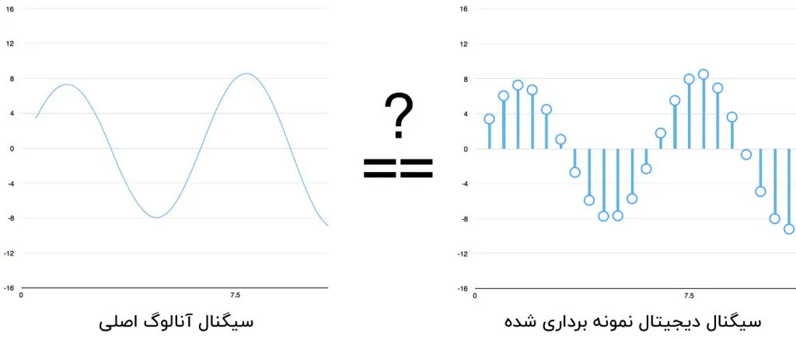
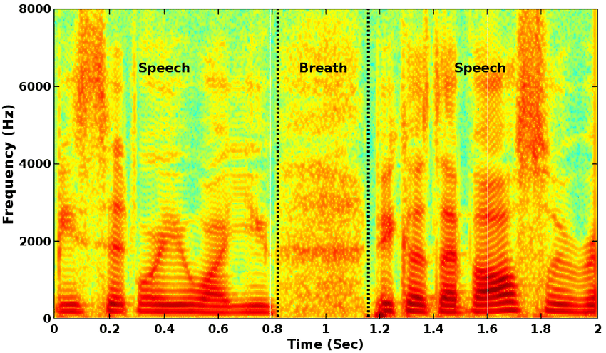
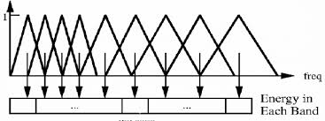
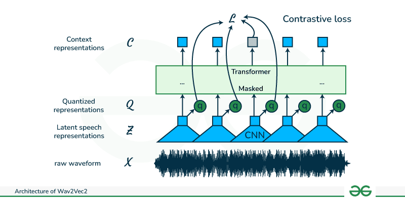
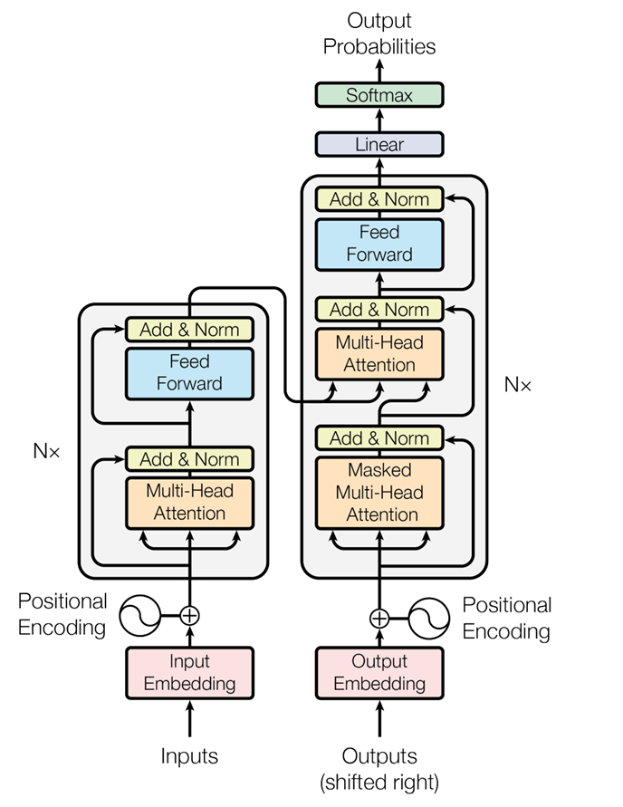

# فصل چهارم: زبان، گفتار و مدل‌های شنیداری

**فارسی** | [English](../en/04-language-speech-auditory-models.md)

[← فصل سوم](03-prediction-bias-attention.md) · [فهرست فصل‌ها](README.md) · [نسخهٔ PDF](../../releases/computational-cognitive-science-booklet-fa.pdf)

---

## نظریه‌های کلاسیک پردازش گفتار

### تشخیص کلمهٔ گفتاری

برای آشنایی با شکل نظریه‌های شناختی، می‌توان از پردازش گفتار شروع کرد. مسئله این است: انسان چگونه از جریان پیوستهٔ صدا به کلمه می‌رسد؟ ورودی شنیداری معمولاً نویزی، ناقص و وابسته به زمینه است. با این حال، انسان در بیشتر موقعیت‌های روزمره خیلی سریع کلمات را تشخیص می‌دهد و حتی گاهی پیش از کامل‌شدن کلمه، حدس نسبتاً دقیقی دربارهٔ آن دارد.

این مسئله برای علوم شناختی مهم است، چون فقط یک مسئلهٔ مهندسی گفتار نیست. تشخیص کلمه نشان می‌دهد ذهن چگونه میان ورودی حسی، حافظهٔ واژگانی، انتظار قبلی و زمینهٔ معنایی تعامل برقرار می‌کند. دو نظریهٔ کلاسیک در این زمینه *Cohort Model* و *TRACE Model* هستند.

### *Cohort Model*

**مدل کوهورت** (*Cohort Model*) از نظریه‌های کلاسیک تشخیص واژهٔ گفتاری است. ایدهٔ اصلی آن این است که با شنیدن بخش آغازین یک کلمه، مجموعه‌ای از کلمات ممکن در ذهن فعال می‌شوند. این مجموعهٔ اولیه را می‌توان گروه نامزدها یا *cohort* دانست. با رسیدن هر بخش صوتی جدید، نامزدهایی که دیگر با ورودی سازگار نیستند حذف می‌شوند تا در نهایت یک گزینه باقی بماند یا گزینهٔ غالب انتخاب شود.

برای مثال، اگر در رستوران صدایی با «بـ» شروع شود، کلماتی مانند «برنج» یا «بریانی» می‌توانند فعال شوند. اگر صدای بعدی «ر» باشد، مجموعهٔ نامزدها محدودتر می‌شود. این فرایند از نظر شهودی شبیه *autocomplete* است: چند حرف اول، فهرستی از پیشنهادها را فعال می‌کند و هرچه اطلاعات بیشتری وارد شود، فهرست محدودتر می‌شود.

#### فعال‌سازی نامزدهای واژگانی

در این مدل، ذهن منتظر پایان کامل کلمه نمی‌ماند. همان بخش‌های آغازین ورودی می‌توانند واژه‌های سازگار را فعال کنند. بنابراین تشخیص واژه فرایندی زمان‌مند است، نه عملی که فقط در انتهای کلمه رخ دهد. هرچه ورودی صوتی جلوتر می‌رود، رقابت میان نامزدها تغییر می‌کند و برخی گزینه‌ها کنار گذاشته می‌شوند.

این نکته به فهم خطاهای شنیداری نیز کمک می‌کند. اگر ورودی نویزی باشد، یا اگر چند کلمه آغاز مشابهی داشته باشند، ممکن است واژه‌ای نادرست برای مدت کوتاهی فعال شود یا حتی به‌عنوان پاسخ نهایی انتخاب شود. نظریهٔ خوب باید بتواند چنین خطاهایی را توضیح دهد.

#### پردازش پایین‌به‌بالا

در نسخهٔ ساده‌شدهٔ *Cohort Model*، جریان اصلی اطلاعات **پایین‌به‌بالا** (*Bottom-Up*) است:
$$
\text{صدا} \rightarrow \text{کلمات ممکن} \rightarrow \text{انتخاب کلمه}
$$
یعنی ورودی شنیداری تعیین می‌کند کدام کلمات فعال شوند و کدام کلمات حذف شوند. این نگاه برای توضیح نقش مهم آغاز کلمه و ترتیب زمانی صداها مفید است.

#### محدودیت‌های مدل

محدودیت مدل کوهورت این است که انسان همیشه مانند *autocomplete* ساده عمل نمی‌کند. در زندگی واقعی، زمینهٔ مکالمه، انتظار قبلی، موقعیت، دانش واژگانی و معنای جمله روی شنیدن اثر می‌گذارند. اگر بخشی از صدا حذف شود یا واضح نباشد، ذهن انسان گاهی با اتکا به زمینه آن را کامل می‌کند.

پس مدل کوهورت بخش مهمی از پدیده را توضیح می‌دهد، اما برای توضیح نقش زمینه و انتظار کافی نیست. همین جاست که نظریهٔ بعدی، یعنی *TRACE*، اهمیت پیدا می‌کند.

### *TRACE Model*

**مدل TRACE** (*TRACE Model*) یک مدل تعاملی‌تر برای ادراک گفتار است. این مدل در سنت مدل‌های اتصال‌گرا و *interactive activation* قرار می‌گیرد و می‌کوشد نشان دهد سطوح مختلف پردازش، مانند ویژگی‌های صوتی، واج‌ها و کلمات، چگونه هم‌زمان روی یکدیگر اثر می‌گذارند.

در *TRACE*، شنیدن فقط حرکت از صدا به کلمه نیست. کلمات فعال‌شده و انتظار ذهنی نیز می‌توانند روی تفسیر صدا اثر بگذارند. بنابراین اگر ورودی ناقص یا مبهم باشد، زمینه می‌تواند به تفسیر درست کمک کند.

#### تعامل دادهٔ صوتی و زمینه

فرض کنید در رستوران هستیم و صدایی نزدیک به «برنج» می‌شنویم، اما بخشی از آن به‌دلیل نویز محیط واضح نیست. در چنین موقعیتی، ذهن فقط به سیگنال صوتی خام تکیه نمی‌کند؛ دانستن اینکه در رستوران هستیم و موضوع گفت‌وگو احتمالاً غذاست، روی انتخاب نهایی اثر می‌گذارد. این همان نقشی است که زمینه یا *context* در مدل تعاملی پیدا می‌کند.

#### پردازش بالا‌به‌پایین

تفاوت اصلی *TRACE* با مدل پایین‌به‌بالای ساده این است که در آن جریان **بالا‌به‌پایین** (*Top-Down*) نیز وجود دارد:
$$
\text{انتظار و زمینه} \rightarrow \text{تفسیر صدا}
$$
البته این به معنی حذف نقش ورودی صوتی نیست. مدل تعاملی می‌گوید ورودی حسی و انتظار ذهنی هم‌زمان در تفسیر گفتار نقش دارند. این نگاه برای توضیح پدیده‌هایی مناسب‌تر است که در آن‌ها انسان با وجود ورودی ناقص، کلمهٔ درست را تشخیص می‌دهد.

#### مقایسه با *Cohort*

مقایسهٔ سادهٔ دو مدل چنین است:

- در *Cohort Model*، آنچه می‌شنویم گزینه‌ها را فعال و محدود می‌کند.

- در *TRACE Model*، آنچه می‌شنویم و آنچه انتظار داریم بشنویم، هر دو در انتخاب نهایی نقش دارند.

پس *TRACE* را نباید صرفاً رد کامل *Cohort* دانست. مدل کوهورت ایدهٔ مهم فعال‌شدن زودهنگام نامزدهای واژگانی را برجسته می‌کند؛ *TRACE* این تصویر را با افزودن تعامل میان سطوح پردازش و نقش زمینه کامل‌تر می‌کند.

### اعتبارسنجی نظریه‌های شناختی

از این دو مثال می‌توان یک نکتهٔ کلی گرفت: نظریهٔ شناختی باید بتواند هم رفتار عادی و هم خطا را توضیح دهد. اگر فردی به‌جای «برنج» واژهٔ دیگری بشنود، نظریه باید روشن کند این خطا از کجا آمده است: شباهت صوتی، نویز، زمینه، انتظار قبلی، رقابت واژگانی یا ترکیبی از این عوامل.

اعتبارسنجی چنین نظریه‌هایی نیازمند آزمایش‌های متنوع است. باید افراد مختلف، شرایط شنیداری مختلف، واژه‌های مختلف و زمینه‌های مختلف بررسی شوند. همچنین یک نظریهٔ معتبر باید فقط پس از دیدن داده توضیح نسازد، بلکه پیش‌بینی‌هایی تولید کند که بتوان آن‌ها را در آزمایش‌های بعدی سنجید.

این شیوهٔ فکر کردن برای کل بحث مهم است. هرجا با یک مدل هوش مصنوعی روبه‌رو می‌شویم، باید بپرسیم: آیا مدل فقط خروجی درست می‌دهد، یا می‌توان فرایند و خطاهایش را نیز با یک نظریهٔ شناختی توضیح داد؟

## از توجه انتخابی تا دستیار صوتی

برای ادامهٔ بحث، توجه انتخابی را می‌توان از دو حالت اصلی شروع کرد. از منظر شناختی، دو حالت اصلی مطرح شده بود: *Early Selection* و *Late Selection*. در *Early Selection*، وقتی بار ادراکی زیاد است، سیستم در همان مراحل اولیهٔ پردازش بخشی از ورودی را انتخاب می‌کند و بقیه را کنار می‌گذارد. در *Late Selection*، وقتی بار ادراکی کم‌تر است، پردازش عمیق‌تری انجام می‌شود و انتخاب می‌تواند در سطح بالاتر، مثلاً پس از درک معنا، رخ دهد.

پرسش اصلی این بخش این است: اگر یک ماشین بخواهد به گفتار توجه کند، چگونه این کار را انجام می‌دهد؟ هدف، نگاشت مفاهیم شناختی توجه انتخابی به مدل‌های محاسباتی پردازش گفتار و به‌ویژه *ASR* یا تشخیص خودکار گفتار است. تمرکز روی سامانه‌هایی مانند دستیارهای صوتی، از جمله *Siri* و *Alexa* است؛ سامانه‌هایی که معمولاً در محیط به‌صورت *always-on* حضور دارند و باید از میان صداهای محیط، بخش مرتبط را انتخاب کنند.

### نگاشت نظریه‌های توجه به سیستم‌های گفتاری

اگر یک دستیار صوتی بخواهد همیشه همهٔ صداهای محیط را به متن تبدیل کند و سپس روی متن پردازش معنایی انجام دهد، هزینهٔ محاسباتی و مصرف انرژی بسیار زیادی خواهد داشت. به همین دلیل، این سامانه‌ها معمولاً دو مرحله دارند: مرحلهٔ سبک‌تر برای تشخیص نشانهٔ فعال‌ساز، و مرحلهٔ سنگین‌تر برای فهم دستور کاربر.

در این نگاشت، تشخیص اولیهٔ کلمهٔ فعال‌ساز به *Early Selection* نزدیک است، چون سیستم هنوز وارد فهم معنا نمی‌شود. پس از تشخیص آن، پردازش عمیق‌تر آغاز می‌شود و این مرحله به *Late Selection* نزدیک‌تر است.

### *Wake Word* در انسان و ماشین

در دستیارهای صوتی، کلمه یا عبارت فعال‌ساز را *wake word* یا *wake-up word* می‌نامند؛ مانند *Hey Siri* یا *Alexa*. سیستم باید از میان صداهای محیط تشخیص دهد که آیا این عبارت گفته شده است یا نه.

پرسش این است که *wake word* انسان‌ها چیست. پاسخ مطرح‌شده این بود که نام خود فرد می‌تواند چنین نقشی داشته باشد. اگر در محیطی شلوغ اسم ما گفته شود، ممکن است توجه ما به آن جلب شود. ابتدا یک نشانهٔ آکوستیکی یا کلمهٔ خاص توجه را فعال می‌کند و سپس پردازش عمیق‌تر آغاز می‌شود.

### مرحلهٔ انتخاب زودهنگام در دستیار صوتی

در مرحلهٔ انتخاب زودهنگام، سیستم هنوز وارد درک معنا نمی‌شود و فقط به دنبال تشخیص یک یا چند کلمهٔ خاص است. در این مرحله، سیستم همهٔ گفتار را به متن تبدیل نمی‌کند، *Natural Language Understanding* انجام نمی‌دهد، و تنها به ویژگی‌هایی توجه می‌کند که نشان دهند *wake word* گفته شده است.

پس این مرحله سبک‌تر و کم‌مصرف‌تر است. ایدهٔ اصلی این است که برای انتخاب اولیه لازم نیست همهٔ صداهای محیط از مسیر کامل فهم زبان عبور کنند؛ خود سیگنال صوتی و ویژگی‌های آکوستیکی آن می‌تواند برای تشخیص اولیه کافی باشد.

### مرحلهٔ انتخاب دیرهنگام و فهم معنا

پس از تشخیص *wake word*، سیستم فعال می‌شود و وارد پردازش عمیق‌تر می‌گردد. در این مرحله معمولاً گفتار به متن تبدیل می‌شود، متن پردازش می‌شود، *intent* تشخیص داده می‌شود، *slot filling* انجام می‌شود و سپس *task* اجرا می‌شود.

برای نمونه، اگر کاربر بگوید: «برای من بلیت تهران به مشهد ساعت ۸ صبح بخر»، سیستم باید *intent* را خرید بلیت تشخیص دهد و *slot*هایی مانند مبدأ، مقصد و ساعت را استخراج کند. در اینجا سیستم وارد سطحی از *Natural Language Understanding* یا *NLU* شده است.

### چرا گفتار معمولاً به متن تبدیل می‌شود؟

در این بخش تأکید اصلی بر این بود که همهٔ پردازش‌های گفتاری از ابتدا نیازمند تبدیل کامل گفتار به متن نیستند. برای *Early Selection* در ماشین، می‌توان از ویژگی‌های آکوستیکی خود موج استفاده کرد و مثلاً *wake word* را تشخیص داد. تبدیل گفتار به متن بیشتر در مرحلهٔ بعدی اهمیت پیدا می‌کند؛ یعنی وقتی سامانه باید معنای دستور، نیت کاربر و جزئیات لازم برای اجرای عمل را بفهمد.

با این حال، در معماری رایج، مسیر معمول چنین است:
$$
\text{Speech}\rightarrow \text{Text}\rightarrow \text{NLP Task}\rightarrow \text{Action}.
$$
برای نمونه، کاربر می‌گوید: «برای من فلان پرواز را رزرو کن.» سیستم گفتار را به متن تبدیل می‌کند، مدل *NLU* متن را تحلیل می‌کند، *intent* را مثلاً *Flight Booking* تشخیص می‌دهد، *slot*هایی مانند مبدأ، مقصد، تاریخ و ساعت را استخراج می‌کند و سپس عمل مناسب را انجام می‌دهد.

می‌توان توضیح داد که این متن میانی از نظر نظری همیشه الزامی نیست. در بعضی کارهای سبک یا محدود، می‌توان مستقیماً از بردارهای گفتار یا ویژگی‌های صوتی استفاده کرد و کاری مانند طبقه‌بندی انجام داد. اما در بسیاری از سامانه‌ها تبدیل گفتار به متن نگه داشته می‌شود، چون متن ساختار مشخص‌تری دارد، مدل‌های *NLP* معمولاً روی متن عملکرد بهتری دارند، دادهٔ آموزشی متنی بیشتر است، و اتصال متن به دیتابیس‌ها، موتورهای جست‌وجو، سرویس‌های نرم‌افزاری، *API*ها و اپلیکیشن‌ها ساده‌تر است.

حتی برای انسان نیز در بسیاری از فرمان‌ها، متن می‌تواند پردازش روشن‌تری ایجاد کند. متن فاصلهٔ بین کلمات، علائم نگارشی، جداسازی کلمات و املای مشخص‌تری دارد و می‌تواند ابهام تلفظی را کاهش دهد. برای مثال، واژه‌هایی مانند «حیات» و «حیاط» در گفتار ممکن است شبیه شنیده شوند، اما در متن و با توجه به بافت جمله، ابهام کم‌تر می‌شود.

### سه جزء اصلی سیستم گفتاری

در مثال دستیار صوتی، سه مؤلفهٔ پردازشی به‌صورت ضمنی مطرح شدند: تشخیص گفتار، فهم زبان و اجرای پاسخ یا عمل. تمرکز این بخش بر دو مؤلفهٔ اول بود: نخست تشخیص یا انتخاب نشانهٔ صوتی، و سپس فهم معنایی دستور.

#### *ASR*

*ASR* یا *Automatic Speech Recognition* به تبدیل گفتار به نمایش قابل پردازش، معمولاً متن، مربوط است. در مرحلهٔ پس از فعال شدن دستیار صوتی، گفتار کاربر باید به شکلی تبدیل شود که سامانه بتواند روی آن پردازش زبانی انجام دهد.

#### *NLU*

*NLU* یا *Natural Language Understanding* مرحله‌ای است که در آن سیستم معنای دستور را تحلیل می‌کند. در مثال خرید بلیت، تشخیص اینکه کاربر قصد خرید بلیت دارد و استخراج مبدأ، مقصد و زمان، نمونه‌ای از همین مرحله است.

#### *TTS*

*TTS* یا *Text-to-Speech* تبدیل متن به گفتار است. در دستیار صوتی، سیستم پس از فهمیدن درخواست کاربر ممکن است پاسخ دهد یا سؤال تکمیلی بپرسد. در این حالت، خروجی متنی دوباره به گفتار تبدیل می‌شود:
$$
\text{Text}\rightarrow \text{Speech}.
$$
تمرکز فعلی بحث بیشتر روی *ASR* و *NLU* است، نه *TTS*.

## مبانی پردازش سیگنال گفتار

برای فهم بهتر پردازش گفتار در ماشین، باید مسیر تولید گفتار در انسان و تبدیل سیگنال صوتی به ویژگی‌های عددی را مرور کرد. نکتهٔ اصلی این بود که ماشین در ابتدا متن یا معنا دریافت نمی‌کند، بلکه با موج صوتی خام روبه‌رو است. این موج باید به دادهٔ دیجیتال و سپس به ویژگی‌هایی تبدیل شود که برای طبقه‌بندی و پردازش قابل استفاده باشند.

### تولید گفتار در انسان

گفتار انسان از تعامل چند بخش بدن تولید می‌شود: دیافراگم، ریه، نای، حنجره، تارهای صوتی، دهان، فک، زبان، بینی و دندان‌ها. فشار روی دیافراگم باعث خروج هوا از ریه می‌شود. هوا از مجرای صوتی عبور می‌کند و در مسیر عبور، توسط حنجره، تارهای صوتی، زبان، دهان، بینی و سایر اجزا شکل می‌گیرد. خروجی نهایی، موج صوتی است.

این موج فقط حامل معنای جمله نیست. اطلاعات دیگری نیز در آن وجود دارد؛ از جمله هویت گوینده، جنسیت، لهجه، احساسات، ویژگی‌های فیزیکی مجرای صوتی و زیر یا بم بودن صدا. برای نمونه، اگر مجرای صوتی کوتاه‌تر باشد، صدا معمولاً زیرتر است و اگر بلندتر باشد، صدا بم‌تر می‌شود.

### واج، واکه و فورمنت

گفتار را می‌توان در چند سطح بررسی کرد: کلمه، هجا و واج. واج‌ها به دو دستهٔ اصلی تقسیم می‌شوند: صامت‌ها و مصوت‌ها یا واکه‌ها. در فارسی معمولاً شش واکه در نظر گرفته می‌شود: اَ، اِ، اُ، آ، ای و او. در زبان‌های دیگر، تعداد واکه‌ها می‌تواند متفاوت باشد.

محل قرارگیری زبان هنگام تولید واکه‌ها اهمیت دارد. جایگاه‌های مختلف زبان باعث تولید صداهای متفاوت می‌شوند. هدف این توضیح این است که نشان دهد خود موج صوتی، پیش از تبدیل شدن به متن، اطلاعات فیزیکی زیادی در خود دارد.

در اسپکتروگرام گفتار، معمولاً نوارهای تیره‌ای دیده می‌شود که *formant* نام دارند. *Formant*ها ناحیه‌هایی هستند که انرژی فرکانسی در آن‌ها بیشتر است و معمولاً با نام‌هایی مانند *F1*، *F2*، *F3* و *F4* مشخص می‌شوند. این ناحیه‌ها دربارهٔ کیفیت آوایی گفتار اطلاعات می‌دهند و می‌توانند برای تشخیص تفاوت‌های گفتاری مفید باشند.

در پاسخ به یک پرسش رایج، می‌توان توضیح داد که *formant*ها فقط بر اساس ترتیب دیده‌شدن نام‌گذاری نمی‌شوند، بلکه به محدوده‌های فرکانسی مشخص مربوط‌اند. اگر در محدودهٔ *F1* چیزی دیده نشود و نخستین نوار تیره در محدودهٔ *F3* باشد، آن نوار را *F3* در نظر می‌گیریم، نه اینکه صرفاً چون اولین نوار دیده‌شده است، *F1* نامیده شود.

### موج صوتی خام

ماشین در ابتدا فقط یک موج صوتی خام دریافت می‌کند. این موج معمولاً روی دو محور قابل نمایش است: محور افقی زمان را نشان می‌دهد و محور عمودی شدت یا دامنهٔ صدا را. هرچه صدا بلندتر باشد، دامنهٔ موج از محور افقی فاصلهٔ بیشتری می‌گیرد.

موج صوتی همچنین دارای فرکانس است. نوسان سریع‌تر به فرکانس بالاتر و نوسان کندتر به فرکانس پایین‌تر مربوط می‌شود. اما ماشین نمی‌تواند مستقیماً با موج آنالوگ کار کند؛ برای پردازش، به عدد و بردار نیاز دارد. بنابراین گام نخست، تبدیل موج آنالوگ به دادهٔ دیجیتال است.

### نمونه‌برداری و قانون نایکوئیست

برای دیجیتال کردن موج، از آن نمونه‌برداری می‌کنیم؛ یعنی در زمان‌های مختلف از روی موج نقطه‌هایی برمی‌داریم. هر نقطه نشان می‌دهد که در آن لحظه شدت صدا چقدر بوده است. هرچه نرخ نمونه‌برداری بیشتر باشد، موج با دقت بیشتری ثبت می‌شود. اگر نرخ نمونه‌برداری کم باشد، ممکن است تغییرات مهم موج از دست برود.

طبق قانون *Nyquist*، نرخ نمونه‌برداری باید حداقل دو برابر بیشترین فرکانس سیگنال باشد. برای مثال، اگر یک سیگنال فرکانسی برابر با ۴۰۰ هرتز داشته باشد، باید دست‌کم با نرخ ۸۰۰ نمونه در ثانیه از آن نمونه‌برداری کنیم. دلیل سادهٔ آن این است که برای ثبت حداقل قله و کف موج، باید دست‌کم دو نمونه در هر چرخه داشته باشیم.

در تلفن‌های کلاسیک، گفتار معمولاً در باند باریک حدود ۳۰۰ تا ۳۴۰۰ هرتز عبور داده می‌شود و در استانداردهایی مانند *G.711* با نرخ ۸۰۰۰ نمونه در ثانیه نمونه‌برداری می‌شود. این عدد با منطق نایکوئیست سازگار است: برای بازنمایی مؤلفه‌های صوتی تا حدود ۴۰۰۰ هرتز، نرخ نمونه‌برداری باید دست‌کم حدود ۸۰۰۰ نمونه در ثانیه باشد.

*شکل ۴ـ۱ — تبدیل سیگنال آنالوگ به سیگنال دیجیتال نمونه‌برداری‌شده؛ نقاط نمونه باید آن‌قدر متراکم باشند که شکل اصلی موج از دست نرود.*

### فریم‌بندی، پنجره‌گذاری و هم‌پوشانی

پس از نمونه‌برداری، دادهٔ صوتی به مجموعه‌ای از اعداد تبدیل می‌شود. اما پردازش کل موج به‌صورت یک‌جا مناسب نیست. همان‌طور که در پردازش متن، متن را به جمله، کلمه یا توکن تقسیم می‌کنیم، در پردازش صوت نیز سیگنال را به بخش‌های کوچک‌تر تقسیم می‌کنیم. این بخش‌ها *frame* نام دارند.

برای جدا کردن فریم‌ها از یک *window* استفاده می‌شود. پنجره روی موج حرکت می‌کند و هر بار بخشی از موج را انتخاب می‌کند. اگر پنجره ساده باشد، لبه‌های آن ناگهانی و تیز هستند. در پردازش گفتار معمولاً از *Hamming Window* استفاده می‌شود؛ در این پنجره، مرکز فریم اهمیت بیشتری دارد، لبه‌های فریم وزن کم‌تری می‌گیرند و اثر تغییرات ناگهانی در مرز فریم‌ها کاهش می‌یابد.

فریم‌ها معمولاً با هم هم‌پوشانی دارند. یعنی فریم دوم دقیقاً پس از پایان فریم اول شروع نمی‌شود، بلکه بخشی از آن با فریم اول مشترک است. دلیل این کار حفظ پیوستگی سیگنال و جلوگیری از ازدست‌رفتن تغییرات مهم در مرز فریم‌هاست. اگر تغییر مهمی دقیقاً بین دو فریم رخ دهد و فریم‌ها هم‌پوشانی نداشته باشند، ممکن است آن تغییر از دست برود.

### تبدیل فوریه و طیف فرکانسی

تا اینجا سیگنال در حوزهٔ زمان بررسی شد؛ یعنی می‌دانستیم در هر لحظه شدت صدا چقدر است. اما موج صوتی ترکیبی از فرکانس‌های مختلف است. برای تجزیهٔ موج به مؤلفه‌های فرکانسی از *Fourier Transform* استفاده می‌شود. تبدیل فوریه نشان می‌دهد موج اصلی از چه طیف‌های فرکانسی تشکیل شده است و شدت هر فرکانس چقدر است.

### اسپکتروگرام

نتیجهٔ اعمال تبدیل فوریه روی فریم‌های سیگنال صوتی، *spectrogram* است. اسپکتروگرام تصویری از تغییرات فرکانسی صدا در طول زمان است. در آن، یک محور زمان را نشان می‌دهد، محور دیگر فرکانس را، و شدت یا انرژی هر فرکانس با تیرگی یا روشنی نمایش داده می‌شود.

اسپکتروگرام کمک می‌کند بدون ورود به سطح معنا، الگوهای آکوستیکی گفتار را ببینیم. اسپکتروگرام گفتار با اسپکتروگرام تنفس یا نویز متفاوت است: گفتار انسان الگوهای فرکانسی مشخص‌تری دارد، در حالی که تنفس یا نویز ساختار متفاوتی ایجاد می‌کند. بنابراین حتی بدون تبدیل گفتار به متن، می‌توان برخی تفاوت‌ها را از روی ویژگی‌های آکوستیکی تشخیص داد؛ موضوعی که برای حذف نویز یا تشخیص گفتار از غیرگفتار مفید است.

*شکل ۴ـ۲ — نمونهٔ اسپکتروگرام گفتار: محور افقی زمان، محور عمودی فرکانس و شدت رنگ انرژی هر باند فرکانسی را نشان می‌دهد؛ بخش تنفس با گفتار الگوی متفاوتی دارد.*

تفاوت صدای زنان و مردان در اسپکتروگرام نیز قابل مشاهده است. به‌طور کلی، صدای مردان معمولاً بم‌تر و صدای زنان معمولاً زیرتر است. صدای بم بیشتر در فرکانس‌های پایین‌تر انرژی دارد و صدای زیر در فرکانس‌های بالاتر نمود بیشتری پیدا می‌کند.

برای تشخیص *wake word* نیز می‌توان از همین ایده استفاده کرد. *Wake word* می‌تواند الگوی اسپکتروگرامی خاصی داشته باشد. نام یک فرد، حتی وقتی توسط افراد مختلف ادا می‌شود، ممکن است تفاوت‌هایی داشته باشد، اما همچنان در یک دستهٔ آکوستیکی مشابه قرار گیرد. پس می‌توان با ویژگی‌هایی مانند اسپکتروگرام و *formant*ها طبقه‌بندی کرد که آیا صدای شنیده‌شده *wake word* است یا نه.

### *MFCC*

تا این مرحله، اسپکتروگرام هنوز یک تصویر است. اما بسیاری از مدل‌های محاسباتی به نمایش عددی و برداری نیاز دارند. بنابراین باید اسپکتروگرام را به مجموعه‌ای از ویژگی‌های عددی تبدیل کنیم. اینجا مفهوم *MFCC* مطرح می‌شود.

*MFCC* مخفف *Mel-Frequency Cepstral Coefficients* است و می‌توان آن را «ضرایب کپسترال فرکانس مل» نامید. هدف *MFCC* استخراج ویژگی‌هایی از سیگنال صوتی است که برای پردازش گفتار مفید باشند.

مسیر کلی چنین است:

1.  دریافت موج صوتی؛

2.  نمونه‌برداری؛

3.  فریم‌بندی؛

4.  اعمال *window*؛

5.  تبدیل فوریه و ساخت اسپکتروگرام؛

6.  عبور دادن اسپکتروگرام از *Mel Filter Bank*؛

7.  استخراج ضرایب *MFCC*.

#### *Mel Scale*

*Mel Scale* تلاشی برای نزدیک‌تر کردن نمایش فرکانسی به ادراک انسان است. گوش انسان تغییرات فرکانس‌های پایین را دقیق‌تر تشخیص می‌دهد، اما در فرکانس‌های بالا حساسیت کم‌تری به تفاوت‌های جزئی دارد. بنابراین در نمایش مل، فرکانس‌ها به شکلی بازنمایی می‌شوند که با شنیدن انسان سازگارتر باشد.

#### *Mel Filter Bank*

برای محاسبهٔ *MFCC* از *Mel Filter Bank* استفاده می‌شود. این بانک مجموعه‌ای از فیلترهای مثلثی است که روی طیف فرکانسی اعمال می‌شوند. فیلترها با هم هم‌پوشانی دارند؛ در فرکانس‌های پایین فشرده‌ترند و در فرکانس‌های بالا بازتر و کم‌تراکم‌تر می‌شوند.

دلیل این طراحی آن است که شنوایی انسان نسبت به فرکانس‌های پایین حساس‌تر است و جزئیات بیشتری را در آن محدوده درک می‌کند. بنابراین در فرکانس‌های پایین رزولوشن بیشتری نگه داشته می‌شود و در فرکانس‌های بالا رزولوشن کم‌تر می‌شود.

*شکل ۴ـ۳ — بانک فیلتر مل با فیلترهای مثلثی هم‌پوشان؛ انرژی هر باند فرکانسی به ویژگی‌هایی تبدیل می‌شود که برای محاسبهٔ MFCC استفاده می‌شوند.*

#### خروجی عددی و کاربرد در طبقه‌بندی

پس از اعمال *Mel Filter Bank* و پردازش‌های تکمیلی، اسپکتروگرام به مجموعه‌ای از ضرایب عددی تبدیل می‌شود. خروجی *MFCC* چیزی شبیه یک ماتریس یا مجموعه‌ای از بردارهاست که می‌توان روی آن‌ها پردازش انجام داد. این نوع خروجی برای مدل‌های یادگیری ماشین مناسب است.

برای روشن‌تر شدن کاربرد *MFCC* می‌توان این مثال را در نظر گرفت: فرض کنید بخواهیم از روی صدای افراد تشخیص دهیم که آیا فرد مبتلا به کووید است یا نه. برای این کار می‌توان دیتاستی شامل صدای افراد مبتلا و غیرمبتلا ساخت. نوع داده‌ها می‌تواند سرفه، تنفس یا گفتار معمولی باشد. سپس از هر نمونهٔ صوتی *MFCC* استخراج می‌شود.

پرسش بعدی این است که چگونه بفهمیم *MFCC* افراد مبتلا و غیرمبتلا واقعاً با هم فرق دارد. برای بررسی تفاوت میان *MFCC*ها می‌توان از معیارهایی مانند *similarity* و *correlation* استفاده کرد. اگر *MFCC*های دو گروه بسیار شبیه یا همبسته باشند، احتمالاً نمی‌توان آن‌ها را خوب از هم جدا کرد. اما اگر مثلاً *MFCC* سرفهٔ افراد مبتلا با *MFCC* سرفهٔ افراد غیرمبتلا همبستگی کمی داشته باشد، می‌توان گفت این ویژگی برای طبقه‌بندی مفید است و شاید بتواند به تشخیص کمک کند.

جمع‌بندی این است که مسیر پردازش صوت از موج خام تا ویژگی‌های قابل استفاده برای طبقه‌بندی چنین پیش می‌رود: دریافت موج صوتی خام، نمونه‌برداری و دیجیتال‌سازی، فریم‌بندی، پنجره‌گذاری همراه با هم‌پوشانی، تبدیل فوریه، ساخت اسپکتروگرام، بررسی *formant*ها، اعمال *Mel Filter Bank*، استخراج *MFCC* و استفاده از ویژگی‌ها برای تشخیص *wake word* یا طبقه‌بندی‌های دیگر. ایدهٔ اصلی برای *Early Selection* در ماشین این است که بدون ورود به درک معنا نیز می‌توان از ویژگی‌های آکوستیکی موج استفاده کرد.

## مدل‌های خودنظارتی گفتار

در ادامهٔ بحث مدل‌های شنیداری، دوباره تفاوت *Early Selection* و *Late Selection* را یادآوری کرد. در *Early Selection*، پردازش در سطح ویژگی‌های فیزیکی و آکوستیکی انجام می‌شود و سیستم هنوز وارد فهم معنا، تبدیل گفتار به متن یا تحلیل معنایی نمی‌شود. در *Late Selection*، سیستم وارد فاز درک معنا می‌شود؛ یعنی گفتار باید تا حدی فهمیده شود و معمولاً به متن تبدیل شود تا روی آن تسک‌های *NLP* انجام شود.

با این حال، ورودی مدل برای رسیدن به معنا همیشه الزاماً متن نیست. ورودی می‌تواند متن، اسپکتروگرام، *MFCC*، موج خام، یا بردارهای استخراج‌شده از *CNN* باشد. بنابراین ممکن است مدل مستقیماً از نمایش صوتی به یک نمایش معنایی برسد، هرچند در معماری‌های رایج، تبدیل گفتار به متن همچنان مسیر مهمی است.

### استخراج ویژگی قطعی و یادگرفتنی

برای پردازش گفتار، معمولاً یکی از نمایش‌هایی مانند *waveform*، *spectrogram* یا *MFCC* استفاده می‌شود. تولید اسپکتروگرام یا *MFCC* معمولاً یک فرایند ریاضی و *deterministic* است: مرحلهٔ آموزشی ندارد، بر اساس فرمول انجام می‌شود، و اگر ورودی ثابت باشد، خروجی نیز ثابت است. برای نمونه، با تبدیل فوریه می‌توان *waveform* را به اسپکتروگرام تبدیل کرد.

در برابر این روش‌های قطعی، می‌توان موج خام را به یک شبکهٔ عصبی داد تا خود شبکه ویژگی‌ها را یاد بگیرد:
$$
\text{Raw Waveform}\rightarrow \text{CNN}\rightarrow \text{Learned Features}.
$$
در این حالت، وزن‌های شبکه در ابتدا تصادفی‌اند، شبکه با داده آموزش می‌بیند، و فیلترها و *kernel*های *CNN* به‌تدریج یاد می‌گیرند چه ویژگی‌هایی مهم‌اند. گاهی ورودی *CNN* خود موج خام است و گاهی ابتدا موج به اسپکتروگرام تبدیل می‌شود و سپس اسپکتروگرام وارد *CNN* می‌شود. اگر داده کم باشد یا تسک سخت‌تر باشد، استفاده از پیش‌پردازش‌هایی مانند اسپکتروگرام می‌تواند مفید باشد، چون نمایش اولیهٔ بهتری از سیگنال فراهم می‌کند.

### *Self-Supervised Learning*

موضوع اصلی این بخش، مدل‌های *Self-Supervised Learning* در پردازش گفتار بود؛ به‌خصوص مدل‌هایی مانند *wav2vec* و *HuBERT*. ایدهٔ اصلی این مدل‌ها این است که دادهٔ خام زیاد است، اما دادهٔ برچسب‌دار کم‌تر است. برای مثال، صوت خام و متن خام زیاد داریم، اما صوتی که دقیقاً برچسب‌گذاری شده باشد یا رونوشت دقیق داشته باشد، کم‌تر است.

در یادگیری خودنظارتی، مدل از خود دادهٔ خام یک تسک آموزشی می‌سازد. در متن، نمونهٔ معروف آن *BERT* است: بخشی از جمله *mask* می‌شود و مدل باید با توجه به *context* حدس بزند کلمهٔ پنهان‌شده چیست. در گفتار نیز ایدهٔ مشابهی استفاده می‌شود: بخشی از فریم‌های صوتی *mask* می‌شوند و مدل باید با توجه به فریم‌های اطراف، بخش پنهان‌شده را پیش‌بینی کند.

فرایند کلی چنین است:

1.  مقدار زیادی صوت خام وارد مدل می‌شود؛

2.  بخش‌هایی از صوت *mask* می‌شوند؛

3.  مدل تلاش می‌کند بخش پنهان‌شده را از روی *context* پیش‌بینی کند؛

4.  یک *loss function* تعریف می‌شود؛

5.  اختلاف میان پیش‌بینی مدل و مقدار واقعی محاسبه می‌شود؛

6.  با *backpropagation* وزن‌های مدل اصلاح می‌شوند؛

7.  این فرایند تا کاهش *loss* و بهبود عملکرد ادامه پیدا می‌کند.

هدف نهایی این نیست که مدل فقط همان فریم پنهان‌شده را حدس بزند؛ هدف اصلی یادگیری نمایش مناسبی از گفتار است. پس از *pretraining*، مدل می‌تواند برای ورودی صوتی یک بردار یا مجموعه‌ای از بردارها تولید کند. این بردارها همان *embedding* یا *representation* گفتار هستند و بعداً می‌توان آن‌ها را برای تسک‌هایی مانند *Speech-to-Text*، طبقه‌بندی، تشخیص گوینده، *intent detection* و سایر تسک‌های گفتاری به کار برد.

### *wav2vec 2.0*

در مدل‌هایی مانند *wav2vec*، ورودی معمولاً *waveform* خام است، نه اسپکتروگرام. مسیر کلی به این صورت است:
$$
\begin{aligned}
\text{Raw Waveform} &\rightarrow \text{CNN Feature Encoder}\\
&\rightarrow \text{Transformer Encoder}\\
&\rightarrow \text{Contextual Representations}.
\end{aligned}
$$

#### ورودی خام

ورودی مدل یک دنبالهٔ عددی است که همان *waveform* سیگنال صوتی است. در بعضی معماری‌ها ممکن است ابتدا اسپکتروگرام یا *MFCC* محاسبه شود، اما در *wav2vec* معمولاً موج خام به مدل داده می‌شود.

#### *CNN Feature Encoder*

*Waveform* وارد *CNN* می‌شود و *CNN* از روی سیگنال خام ویژگی استخراج می‌کند. فیلترهای مختلف روی ورودی اعمال می‌شوند؛ هر فیلتر یک الگو یا ویژگی خاص را کشف می‌کند. در لایه‌های ابتدایی، ویژگی‌ها سطح پایین‌ترند و در لایه‌های عمیق‌تر، ویژگی‌ها انتزاعی‌تر و نزدیک‌تر به معنا می‌شوند.

در *CNN*، مقادیری که یاد گرفته می‌شوند، همان اعداد داخل فیلترها و *kernel*ها هستند. این مقادیر ابتدا تصادفی مقداردهی می‌شوند، در طول آموزش تغییر می‌کنند، با *backpropagation* به‌روزرسانی می‌شوند و در نهایت یاد می‌گیرند چه الگوهایی در دادهٔ صوتی مهم‌اند.

در شبکه‌های کانولوشنی، معمولاً هرچه جلوتر می‌رویم تعداد فیلترها بیشتر می‌شود، ویژگی‌ها انتزاعی‌تر می‌شوند و مدل عمیق‌تر می‌شود. بعد از اعمال فیلترها، معمولاً *pooling* انجام می‌شود. هدف *pooling* کاهش بُعد، کاهش پیچیدگی مدل، کمک به جلوگیری از *overfitting* و فشرده‌سازی اطلاعات مهم است. در نهایت خروجی *CNN* به بردار یا دنباله‌ای از بردارهای ویژگی تبدیل می‌شود.

#### *Transformer Encoder*

خروجی *CNN* وارد *Transformer Encoder* می‌شود. هدف *Transformer* این است که از ویژگی‌های محلی، نمایش وابسته به *context* بسازد. برای هر فریم، فقط خود آن فریم مهم نیست؛ رابطهٔ آن با فریم‌های قبل و بعد نیز اهمیت دارد. *Transformer* این کار را با *self-attention* انجام می‌دهد.

پرسش مهم این است که این *Transformer* از چه نوعی است: *Encoder*، *Decoder* یا *Encoder-Decoder*. پاسخ درست *Encoder* است، چون در این مرحله مدل قرار نیست چیزی تولید کند؛ فقط قرار است ورودی را بفهمد و *encode* کند.

#### *Masking*

بخشی از فریم‌ها *mask* می‌شوند و مدل باید آن‌ها را با توجه به *context* پیش‌بینی کند. در متن، مدل می‌تواند کلمهٔ پنهان‌شده را از میان واژگان محدود حدس بزند؛ اما در صوت، فریم‌ها در فضای پیوسته قرار دارند. واحدهای صوتی مثل کلمات مرزهای کاملاً مشخص و گسسته ندارند و هر بخش صوتی می‌تواند به بردارهای بسیار متنوعی نگاشت شود. بنابراین در صوت نیاز داریم چیزی شبیه واژگان بسازیم.

#### *Quantization* و *Codebook*

*Quantization* یعنی بردن یک نمایش پیوسته به یک نمایش گسسته و محدود. برای اینکه در صوت نیز چیزی شبیه *vocabulary* داشته باشیم، از *codebook* استفاده می‌شود. *Codebook* مانند یک دیکشنری برای واحدهای صوتی است.

در این فرایند، یک بردار صوتی داریم و یک *codebook* شامل چند بردار نماینده. بررسی می‌کنیم بردار صوتی به کدام بردار *codebook* نزدیک‌تر است و همان بردار را به‌عنوان نماینده انتخاب می‌کنیم. به این ترتیب، به‌جای کار کردن با فضای پیوسته و بی‌نهایت حالت، آن را به چند واحد گسسته محدود می‌کنیم.

برای توضیح *codebook* از مثال موقعیت مکانی استفاده کرد: ابتدا می‌گوییم «در ایرانم»، بعد دقیق‌تر «در تهرانم»، و بعد دقیق‌تر «در یک منطقهٔ خاص از تهرانم». به همین شکل، *quantization* می‌تواند چند سطح داشته باشد و *codebook* می‌تواند لایه‌لایه یا *level-based* باشد. مقادیر اولیهٔ *codebook* نیز معمولاً تصادفی‌اند و در فرایند آموزش یاد گرفته می‌شوند.

نکتهٔ مهم این است که *quantization* وارد مسیر اصلی *Transformer* نمی‌شود. خروجی *CNN* وارد *Transformer* می‌شود، *Transformer* روی *representation*های غنی و پیوسته کار می‌کند، و *contextual representation*ها *quantize* نمی‌شوند. *Quantization* بیشتر برای محاسبهٔ *loss* و هدف آموزشی استفاده می‌شود. دلیلش این است که اگر از همان ابتدا نمایش‌ها را *quantize* کنیم، بخشی از اطلاعات آکوستیکی از بین می‌رود.

#### *Contrastive Loss*

در *wav2vec*، یکی از ایده‌های اصلی استفاده از *contrastive learning* است. در این روش، مدل باید بردار زمینه‌ای مربوط به بخش پنهان‌شده را به نمونهٔ مثبت نزدیک کند و از نمونه‌های منفی دور کند:
$$
\text{Correct Quantized Vector}\rightarrow \text{نزدیک‌تر},\qquad
\text{Negative Samples}\rightarrow \text{دورتر}.
$$
تابع هزینه بر اساس همین نزدیکی و دوری محاسبه می‌شود.

اگر خروجی‌ها کاملاً پیوسته باقی بمانند، یادگیری ممکن است سخت‌تر شود. *Quantization* باعث می‌شود هدف آموزشی گسسته‌تر و مشخص‌تر شود. در نتیجه، ورودی مدل می‌تواند غنی و پیوسته بماند، اما هدف آموزشی محدودتر و پایدارتر باشد.

#### *Pretraining* و *Fine-tuning*

*Pretraining* مرحله‌ای است که در آن مدل از دادهٔ خام گفتار، ساختارهای صوتی را یاد می‌گیرد و یک *representation* خوب از *waveform* یا گفتار می‌سازد. بعد از *pretraining*، معمولاً *fine-tuning* انجام می‌شود. در *fine-tuning* دادهٔ برچسب‌دار داریم، اما معمولاً مقدار آن کم‌تر است، و کل مدل یا بخشی از مدل برای یک تسک خاص تنظیم می‌شود؛ مثلاً برای *Speech-to-Text* یا طبقه‌بندی.

مسیر کلی چنین است:
$$
\begin{aligned}
\text{Large Raw Speech Data} &\rightarrow
\text{Self-Supervised Pretraining}\\
&\rightarrow \text{Speech Representations}\\
&\rightarrow \text{Fine-tuning on Labeled Data}.
\end{aligned}
$$

جمع‌بندی فنی معماری *wav2vec* چنین است: ورودی مدل موج خام است؛ *CNN* سیگنال خام را به نمایش فشرده‌تری از ویژگی‌ها تبدیل می‌کند؛ بخشی از فریم‌ها *mask* می‌شوند؛ *Transformer Encoder* با *self-attention* نمایش وابسته به زمینه می‌سازد؛ خروجی‌های مشخصی *quantize* می‌شوند تا واحدهای گسستهٔ صوتی ساخته شود؛ مدل با *contrastive loss* بردار درست را از میان نمونه‌های مثبت و منفی تشخیص می‌دهد؛ و پس از *pretraining*، با دادهٔ برچسب‌دار برای یک تسک خاص *fine-tune* می‌شود.

*شکل ۴ـ۴ — معماری wav2vec 2.0: موج خام به نمایش‌های نهفتهٔ گفتار تبدیل می‌شود، بخشی از نمایش‌ها ماسک می‌شوند، ترنسفورمر بازنمایی زمینه‌مند می‌سازد و زیان کنتراستی نمونهٔ درست را از نمونه‌های منفی جدا می‌کند.*

## *Whisper* و معماری *Encoder-Decoder*

در بخش قبل، مدل‌های شنیداری خودنظارتی مانند *wav2vec* بررسی شدند. در آن مدل‌ها دادهٔ صوتی خام زیاد است، اما برچسب مستقیم کم است؛ بنابراین مدل تلاش می‌کند بدون رونوشت دقیق، بازنمایی مناسبی از صوت یاد بگیرد. در این بخش، مدل *Whisper* به‌عنوان نمونه‌ای متفاوت بررسی شد: مدلی که برخلاف *wav2vec* به‌صورت *supervised* آموزش داده می‌شود.

### ورودی و خروجی *Whisper*

در *Whisper* ورودی مدل صوت و خروجی مدل متن است. چون آموزش آن نظارت‌شده است، دادهٔ آموزشی به‌شکل جفت‌های صوت و متن در اختیار مدل قرار می‌گیرد؛ یعنی برای هر فایل صوتی، متن متناظر آن نیز وجود دارد.

طبق این توضیح، دادهٔ آموزشی *Whisper* حدود ۶۸۰ هزار ساعت صوت و متن جفت‌شده بوده است. این داده‌ها چندزبانه‌اند و لهجه‌های مختلف را دربرمی‌گیرند. بخش مهمی از آن‌ها نیز از محیط‌های واقعی و نسبتاً نویزی جمع‌آوری شده‌اند؛ بنابراین ممکن است صدای پس‌زمینه، مکالمات محیطی یا صدای فیلم‌ها در آن‌ها وجود داشته باشد. همین تنوع باعث می‌شود *Whisper* نسبت به نویز، زبان‌های مختلف و تفاوت لهجه‌ها مقاوم‌تر یا *robust* باشد.

### چرا معماری *Encoder-Decoder*؟

در مدل‌های خودنظارتی مانند *wav2vec* هدف اصلی استخراج یک بازنمایی مناسب از صوت خام یا فریم‌های صوتی بود؛ همان چیزی که در ادبیات مدل‌ها *representation* یا *embedding* نامیده می‌شود. به همین دلیل بخش اصلی معماری در آن مدل‌ها *Encoder* بود: مدلی که ورودی را می‌گیرد و آن را به نمایش فشرده‌تر و معنادارتری تبدیل می‌کند.

اما در *Whisper* مسئله فقط فهمیدن صوت نیست. مدل باید از روی صوت، متن متناظر را نیز تولید کند. پس دو کار هم‌زمان لازم است:
$$
\begin{aligned}
\text{Speech Understanding} &\rightarrow \text{Audio Representation}\\
\text{Text Generation} &\rightarrow \text{Transcript}.
\end{aligned}
$$

به همین دلیل معماری مناسب برای *Whisper* معماری *Encoder-Decoder* است. *Encoder* صوت را می‌فهمد و به بازنمایی تبدیل می‌کند؛ *Decoder* با تکیه بر آن بازنمایی، متن را مرحله‌به‌مرحله تولید می‌کند.

### بخش *Encoder*

*Encoder* وظیفه دارد صوت ورودی را دریافت کند و آن را به یک بازنمایی معنایی یا *embedding* تبدیل کند. ورودی یک مدل شنیداری می‌تواند شکل‌های مختلفی داشته باشد؛ مانند موج خام، *spectrogram*، *mel-spectrogram* یا *MFCC*. در *Whisper* ورودی اصلی به‌شکل *mel-spectrogram* است.

#### *Self-Attention* بدون ماسک

در *Encoder* از *self-attention* استفاده می‌شود، چون مدل باید بخش‌های مختلف صوت را نسبت به یکدیگر بررسی کند. در این فرایند، فریم‌های صوتی با هم مقایسه می‌شوند و مدل یاد می‌گیرد هر فریم با کدام فریم‌های دیگر ارتباط بیشتری دارد.

نکتهٔ مهم این است که *self-attention* در *Encoder* ماسک ندارد. دلیل آن ساده است: کل صوت از ابتدا در اختیار مدل است. بنابراین مدل می‌تواند همهٔ فریم‌های صوتی را هم‌زمان ببیند و میان همهٔ آن‌ها رابطه برقرار کند. این وضعیت با *Decoder* فرق دارد، چون *Decoder* متن را مرحله‌به‌مرحله می‌سازد و در هر مرحله هنوز توکن‌های آینده را ندارد.

#### بازنمایی صوتی زمینه‌مند

خروجی *Encoder* یک *contextualized embedding* است؛ یعنی نمایش هر بخش از صوت با توجه به کل زمینهٔ صوت ساخته می‌شود. برای مثال اگر عبارت «پردازش زبان طبیعی» در صوت گفته شود، بخش مربوط به «زبان» نباید جدا از «پردازش» و «طبیعی» فهمیده شود. بازنمایی زمینه‌مند باعث می‌شود مدل هر بخش از ورودی را در نسبت با بخش‌های دیگر تفسیر کند.

### بخش *Decoder*

*Decoder* وظیفه دارد از روی *embedding* صوتی ساخته‌شده توسط *Encoder*، متن متناظر را تولید کند. این تولید متن به‌صورت *autoregressive* انجام می‌شود؛ یعنی مدل توکن‌ها را یکی‌یکی تولید می‌کند و هر خروجی جدید، بخشی از ورودی مرحلهٔ بعد می‌شود.

#### *Masked Self-Attention*

در *Decoder* از *masked self-attention* استفاده می‌شود. دلیل ماسک شدن این است که هنگام تولید یک توکن، مدل نباید به توکن‌های آینده دسترسی داشته باشد. برای نمونه، وقتی مدل هنوز فقط «پردازش» را تولید کرده است، نباید از قبل بداند کلمهٔ بعدی «زبان» است.

بنابراین بخشی از ماتریس *attention* ماسک می‌شود تا مدل فقط به توکن‌های قبلی و توکن فعلی توجه کند. جمع‌بندی این تفاوت چنین است:
$$
\begin{aligned}
\text{Encoder} &: \text{Full Self-Attention over audio frames}\\
\text{Decoder} &: \text{Masked Self-Attention over generated text}.
\end{aligned}
$$

شکل زیر معماری عمومی ترنسفورمر *Encoder-Decoder* را نشان می‌دهد. در کاربرد گفتار به متن، سمت چپ را می‌توان بخش فهم ورودی صوتی و سمت راست را بخش تولید خودرگرسیو متن دانست؛ البته ورودی واقعی *Whisper* به‌جای embedding متنی، بازنمایی‌هایی از *mel-spectrogram* است.

*شکل ۴ـ۵ — نمای عمومی ترنسفورمر Encoder-Decoder: انکودر ورودی را به بازنمایی زمینه‌مند تبدیل می‌کند و دیکودر با masked self-attention و توجه به خروجی انکودر، توکن‌های خروجی را مرحله‌به‌مرحله می‌سازد.*

#### *Cross-Attention*

*Decoder* علاوه بر *masked self-attention*، یک بخش مهم دیگر نیز دارد: *cross-attention*. در *cross-attention* مدل میان دو چیز رابطه برقرار می‌کند: بازنمایی صوتی خروجی *Encoder* و متنی که تا این لحظه تولید شده است.

هدف این است که مدل برای تولید توکن بعدی، هم بداند تا این لحظه چه متنی ساخته و هم به صوت اصلی توجه کند. بنابراین *cross-attention* نوعی نگاه هم‌زمان به صوت و متن تولیدشده است و خروجی آن به مدل کمک می‌کند توکن بعدی را انتخاب کند.

#### تولید خودرگرسیو متن

تولید خودرگرسیو را می‌توان به‌صورت زنجیره‌ای از تصمیم‌های متنی دید. ابتدا فقط توکن شروع در اختیار مدل است. سپس مدل نخستین کلمه را تولید می‌کند؛ بعد با داشتن آن کلمه، کلمهٔ بعدی را تولید می‌کند؛ و همین روند تا پایان متن ادامه پیدا می‌کند. برای مثال:
$$
\text{Start}\rightarrow
\text{پردازش}\rightarrow
\text{پردازش زبان}\rightarrow
\text{پردازش زبان طبیعی}.
$$

پس معماری *Whisper* را می‌توان این‌گونه خلاصه کرد: *Encoder* از *mel-spectrogram* یک بازنمایی صوتی زمینه‌مند می‌سازد. *Decoder* روی متن تولیدشده *masked self-attention* انجام می‌دهد. سپس با *cross-attention* به خروجی *Encoder* نگاه می‌کند و توکن بعدی متن را می‌سازد.

### ارتباط مدل‌های شنیداری با توجه انتخابی

در پایان این بخش، دوباره به هدف اصلی این منبع برمی‌گردیم: اینکه بتوانیم از نظریه‌های شناختی برای طراحی مدل‌های محاسباتی بهتر ایده بگیریم. تا اینجا دربارهٔ *Early Selection*، *Late Selection* و بار ادراکی صحبت شده بود. پرسش این است که از این نظریه‌ها چه ایده‌ای می‌توان برای طراحی یک سیستم شنیداری یا دستیار صوتی بهتر گرفت.

یکی از ایده‌ها این است که دستیار صوتی بتواند بار ادراکی محیط را اندازه بگیرد و بر اساس آن میان پردازش سبک و سنگین جابه‌جا شود. اگر بار ادراکی زیاد باشد:
$$
\text{High Perceptual Load}\rightarrow \text{Early Selection}
$$
یعنی سیستم فقط پردازش‌های سبک و ویژگی‌های فیزیکی را انجام دهد. اگر بار ادراکی کم باشد:
$$
\text{Low Perceptual Load}\rightarrow \text{Late Selection}
$$
یعنی سیستم وارد پردازش معنایی، *Speech-to-Text* و *NLU* شود.

این ایده می‌تواند در معماری‌های واقعی دستیارهای صوتی مهم باشد، چون در مهندسی همیشه با موازنهٔ دقت و هزینهٔ محاسباتی روبه‌رو هستیم. هدف این منبع نیز همین پل زدن میان نظریهٔ شناختی و مدل محاسباتی است: نه آن‌قدر وارد جزئیات فنی معماری‌ها شویم که هدف شناختی فراموش شود، و نه آن‌قدر در سطح نظریهٔ شناختی بمانیم که ارتباط با مدل‌های هوش مصنوعی قطع شود.

در جمع‌بندی این بخش، نکتهٔ مهم این است که بحث‌های شناختی مانند توجه انتخابی و بار ادراکی هنوز به‌شکل جدی وارد بسیاری از مدل‌های شنیداری فعلی نشده‌اند. اگر قرار باشد یک دستیار صوتی با مبنای شناختی طراحی شود، باید بتوان مفاهیمی مانند آستانهٔ بار ادراکی، انتخاب زودهنگام و انتخاب دیرهنگام را در خود معماری یا سیاست پردازش سیستم تعریف کرد.

### بازگشت کوتاه به *Predictive Coding* و *GAN*

در پایان بحث مدل‌های شنیداری، پرسشی دربارهٔ شباهت *Predictive Coding* و *GAN* مطرح شد. شباهت ظاهری این دو در این است که هر دو نوعی فرایند تولید و ارزیابی دارند. در *GAN*، یک *Generator* دادهٔ ساختگی تولید می‌کند و یک *Discriminator* تشخیص می‌دهد داده واقعی است یا ساختگی. در *Predictive Coding* نیز سیستم دائماً پیش‌بینی تولید می‌کند، آن را با واقعیت مقایسه می‌کند، خطای پیش‌بینی را محاسبه می‌کند و سپس اصلاح انجام می‌دهد.

با این حال تفاوت مهمی وجود دارد. در شبکه‌های عصبی رایج، خطا معمولاً سراسری محاسبه می‌شود: ورودی وارد شبکه می‌شود، خروجی نهایی با مقدار واقعی مقایسه می‌شود و *loss* به‌دست می‌آید. سپس خطا با روش *backpropagation* در کل شبکه پخش می‌شود. اما در *Predictive Coding* ایده این است که خطا می‌تواند محلی‌تر باشد؛ یعنی هر بخش یا هر نورون بتواند پیش‌بینی خود را با ورودی مقایسه کند و اصلاح محلی انجام دهد. این تفاوت یکی از نقاطی است که مدل‌های الهام‌گرفته از مغز را از شبکه‌های عصبی رایج جدا می‌کند.

### پردازنده‌های نورومورفیک

در ادامهٔ همین بحث، به پردازنده‌های *Neuromorphic* اشاره شد. اکوسیستم فعلی هوش مصنوعی عمدتاً حول *GPU*، گرادیان و روش *backpropagation* شکل گرفته است. در مقابل، سخت‌افزارهای نورومورفیک تلاش می‌کنند بعضی ویژگی‌های محاسبهٔ عصبی را شبیه‌سازی کنند: نورون، *spike*، سیناپس و پردازش محلی.

این پردازنده‌ها هنوز جایگزین عمومی *GPU* نشده‌اند، چون مهاجرت از اکوسیستم فعلی فقط زمانی منطقی است که مزیت عملی و جدی آن‌ها روشن شود. با این حال، یک مسیر پژوهشی ممکن، بررسی یا پیاده‌سازی مجازی یک پردازندهٔ نورومورفیک است؛ البته دامنهٔ چنین کاری باید دقیق و قابل اجرا تعریف شود.

---

[← فصل سوم](03-prediction-bias-attention.md) · [فهرست فصل‌ها](README.md) · [فصل بعد: پاداش، یادگیری تقویتی و تصمیم‌گیری →](05-reward-rl-decision-making.md)
