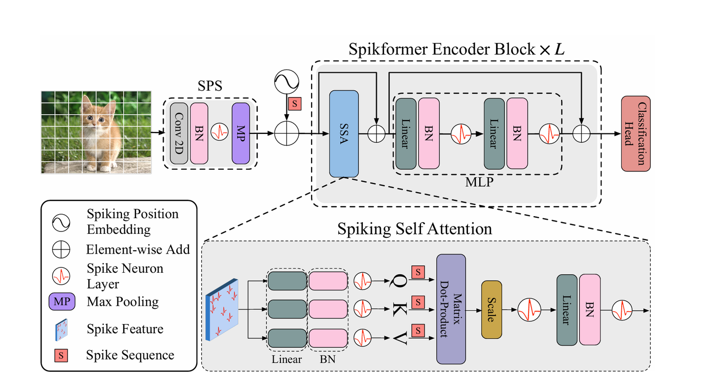
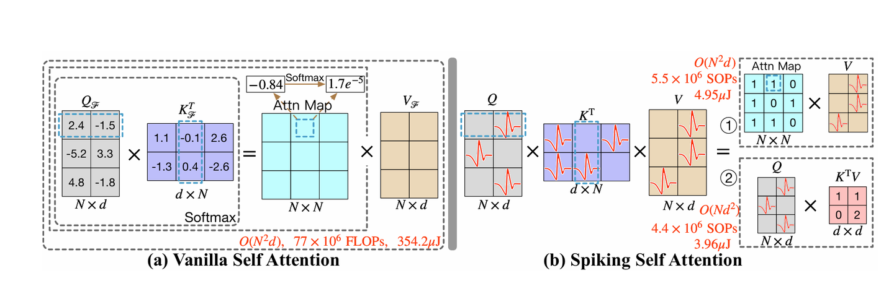
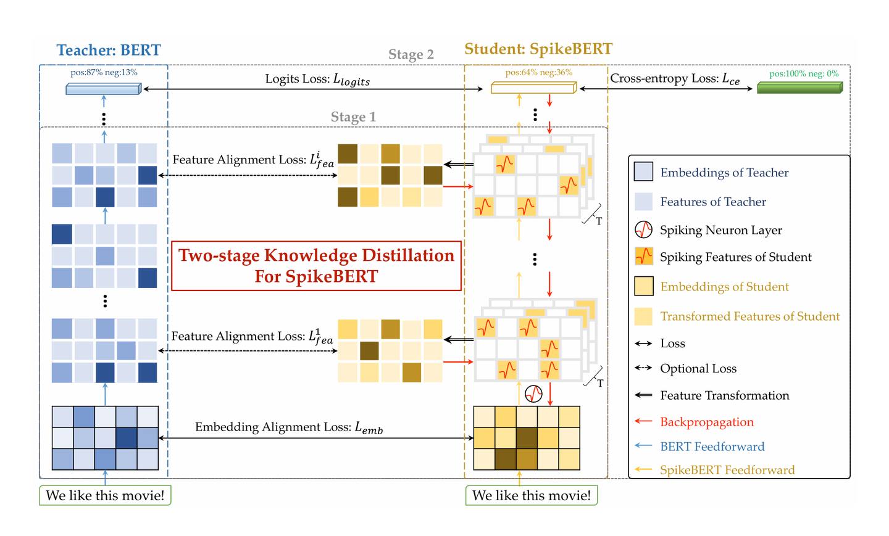
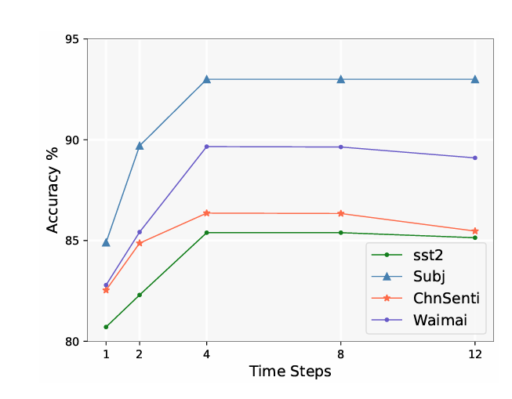
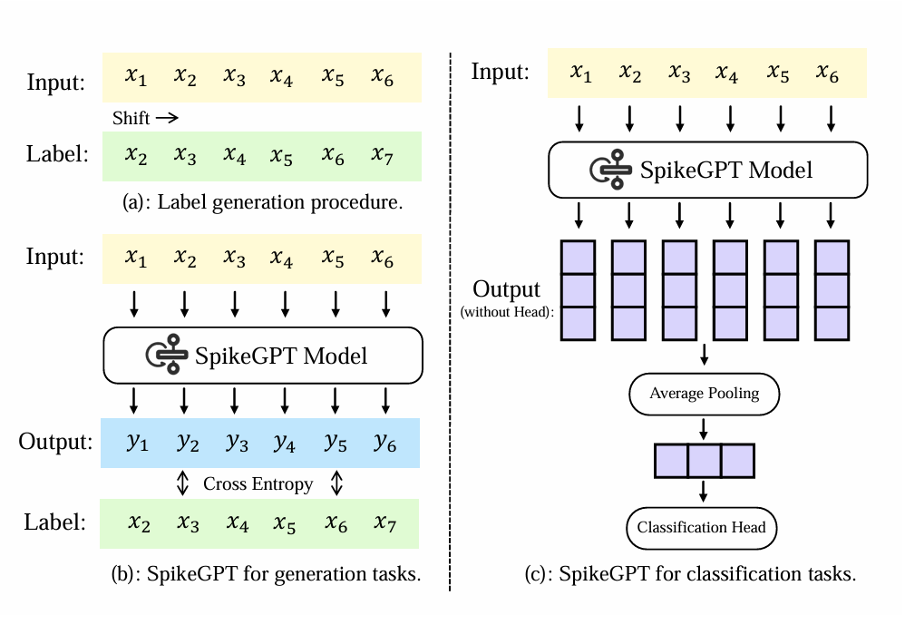
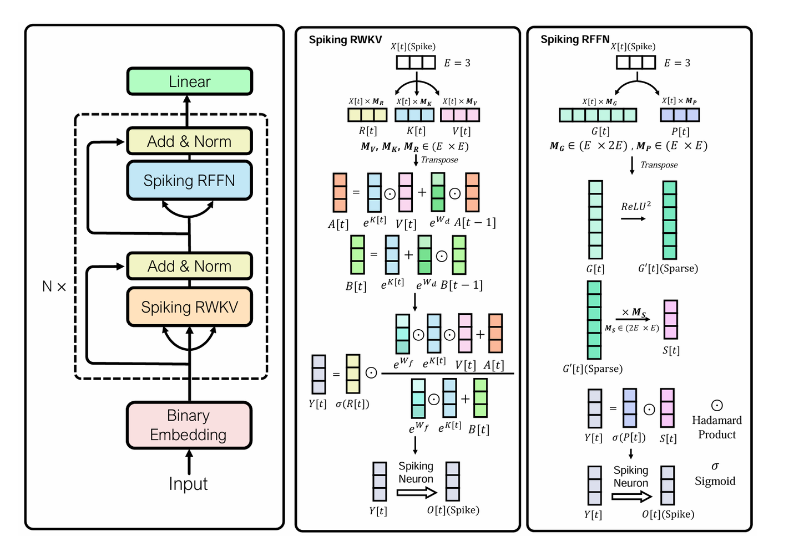
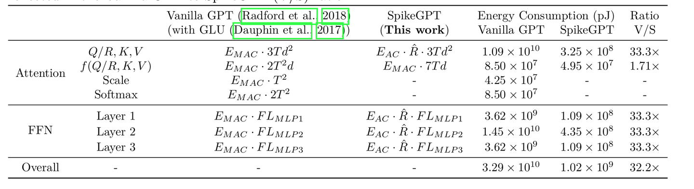

# فصل هفتم: مدل‌های اسپایکی مدرن

**فارسی** | [English](../en/07-modern-spiking-models.md)

[← فصل ششم](06-spiking-neural-networks.md) · [فهرست فصل‌ها](README.md) · [نسخهٔ PDF](../../releases/computational-cognitive-science-booklet-fa.pdf)

---

## *Spiking Transformer* و *SpikeFormer*

در آغاز این بخش، مسیر قبلی بحث جمع‌بندی می‌شود. بحث سیستم پاداش تا حد لازم پیش رفته بود و تمرکز بحث به شبکه‌های اسپایکی عمیق منتقل شد. تا اینجا چند نکته روشن شده بود: *SNN*ها از نظر ورودی رویدادمحور و مصرف انرژی به مغز نزدیک‌ترند، ورودی آن‌ها معمولاً به‌صورت اسپایک‌های صفر و یک است، داده در آن‌ها ماهیت زمانی دارد، و در مقایسه با شبکه‌های عمیق معمولی می‌توانند از نظر انرژی کم‌هزینه‌تر باشند.

در *Deep SNN* نیز اگر یادگیری نظارت‌شده داشته باشیم، شبکه برچسب را می‌بیند، خروجی خود را با هدف مقایسه می‌کند و بر اساس خطا وزن‌ها را به‌روزرسانی می‌کند. مسئلهٔ اصلی همان گسسته بودن خروجی‌های اسپایکی است؛ به همین دلیل برای آموزش، از ایدهٔ *surrogate gradient* استفاده می‌شود. اگر در یک *Deep SNN* از *linear layer* صحبت می‌کنیم، منظور این است که وزن‌ها در اسپایک‌ها ضرب می‌شوند و خروجی اسپایکی تازه‌ای برای لایهٔ بعدی ساخته می‌شود:
$$
W \times \text{spike}
$$

### چرا *Transformer* در *SNN*؟

وقتی بتوانیم معماری‌های عمیق اسپایکی بسازیم، پرسش طبیعی این است که آیا می‌توان ایدهٔ *Transformer* را نیز وارد *SNN* کرد. در شبکه‌های عمیق معمولی، *Transformer*ها در بسیاری از حوزه‌ها معماری‌های بسیار موفقی هستند. بنابراین اگر بخواهیم یک *SNN* قدرتمندتر داشته باشیم، یکی از مسیرها ترکیب *Transformer* و *Spiking Neural Network* است؛ مسیری که در مدل‌هایی مانند *SpikeFormer* دنبال می‌شود.

برای ساختن *Transformer* اسپایکی، سه بخش اصلی باید روشن شود:

1.  کدگذاری دادهٔ ورودی؛

2.  *Attention*؛

3.  بلوک *MLP*.

اگر این سه بخش مشخص شوند، می‌توان گفت معماری‌ای شبیه *Transformer* اما مبتنی بر *SNN* داریم.

### مسئلهٔ کدگذاری ورودی

در شبکه‌های معمولی، داده را می‌توان مستقیم به شبکه داد؛ اما در *SNN* داده باید به دنباله‌ای از اسپایک‌ها تبدیل شود. اگر دادهٔ اولیه شامل عددهای پیوسته یا *floating-point* باشد، باید این مقدارها به صفر و یک تبدیل شوند و این تبدیل در چند گام زمانی رخ دهد.

پس کدگذاری ورودی دو کار انجام می‌دهد: مقدارهای پیوسته را به اسپایک‌های صفر و یک تبدیل می‌کند، و آن‌ها را در چند گام زمانی پخش می‌کند. برای مثال، ممکن است داده را در چهار گام زمانی نمایش دهیم:
$$
T = 4
$$
در این حالت، هر مقدار عددی باید به یک دنبالهٔ اسپایکی در طول زمان تبدیل شود.

#### کدگذاری تصویر

فرض کنید ورودی یک تصویر است و مقدار پیکسل‌ها در بازهٔ ۰ تا ۲۵۵ قرار دارند. نخستین گام معمولاً نرمال‌سازی است:
$$
x_{\text{norm}} = \frac{x}{255}
$$
با این کار مقدار هر پیکسل به بازهٔ صفر تا یک می‌رود.

برای نمونه، اگر چند مقدار نرمال‌شده داشته باشیم:
$$
0.2,\quad 0.8,\quad 0.5,\quad 0.5
$$
و بخواهیم آن‌ها را در چهار گام زمانی پخش کنیم، هر مقدار را در ۴ ضرب می‌کنیم:
$$
0.2 \times 4 = 0.8,\qquad
0.8 \times 4 = 3.2,\qquad
0.5 \times 4 = 2,\qquad
0.5 \times 4 = 2
$$
سپس مقدارها را گرد می‌کنیم:
$$
1,\quad 3,\quad 2,\quad 2
$$
یعنی مقدار اول در کل زمان یک اسپایک تولید می‌کند، مقدار دوم سه اسپایک، مقدار سوم دو اسپایک و مقدار چهارم نیز دو اسپایک.

به این ترتیب، دادهٔ ثابت اولیه در طول چند گام زمانی پخش می‌شود و به دنباله‌ای اسپایکی تبدیل می‌گردد. این روند شبیه نوعی «برعکس *integration*» است: عدد پیوسته به جای اینکه مستقیم نگه داشته شود، در طول زمان باز می‌شود.

#### نکتهٔ محاسباتی در کدگذاری

پشت بسیاری از روش‌های کدگذاری، لزوماً معنای زیستی یا معنایی بسیار دقیقی وجود ندارد. این روش‌ها بیشتر مدل‌های محاسباتی‌اند. هدف اصلی این است که دادهٔ پیوسته به اسپایک تبدیل شود، نرخ اسپایک با مقدار عدد اولیه رابطهٔ معنادار داشته باشد، و مدل در نهایت از نظر دقت و مصرف انرژی عملکرد قابل قبولی پیدا کند.

در شبکه‌های اسپایکی معمولاً یک مبادله وجود دارد:
$$
\text{Energy / Cost} \quad \leftrightarrow \quad \text{Accuracy}
$$
اگر از *Transformer* معمولی استفاده کنیم، معمولاً دقت بیشتر است، اما مصرف انرژی و هزینهٔ محاسباتی نیز بیشتر می‌شود. اگر از *SNN* استفاده کنیم، مصرف انرژی کمتر است، اما ممکن است دقت کاهش یابد. به همین دلیل، در مقاله‌های مربوط به *SpikeFormer* معمولاً مدل را با *SNN*های دیگر مقایسه می‌کنند، نه لزوماً با *Transformer*های معمولی؛ چون از همان مرحلهٔ کدگذاری بخشی از اطلاعات پیوستهٔ داده از دست می‌رود.

#### کدگذاری متن

در متن نیز پس از ساخت *embedding*، با عددهای پیوسته سروکار داریم. برای نمونه، ممکن است یکی از ویژگی‌ها مقدار زیر را داشته باشد:
$$
x = 0.8
$$
این مقدار باید به دنباله‌ای اسپایکی تبدیل شود. یکی از ایده‌ها *Rate Encoding* است؛ یعنی مقدار عددی به نرخ اسپایک ربط داده می‌شود.

اگر:
$$
x = 0.8,\qquad T = 4
$$
باشد، انتظار داریم تقریباً سه اسپایک داشته باشیم، چون:
$$
0.8 \times 4 \approx 3
$$
پس یک نمایش ممکن چنین است:
$$
[1,1,1,0]
$$
یا هر چینش دیگری که سه اسپایک در چهار گام زمانی داشته باشد.

#### کدگذاری با ایدهٔ *Integration*

روش دیگر این است که عدد در هر گام زمانی به پتانسیل غشا وارد شود و بررسی کنیم چه زمانی از آستانه عبور می‌کند. فرض کنید:
$$
x = 0.8,\qquad \theta = 1
$$
در گام اول:
$$
0.8 < 1
$$
پس اسپایک نداریم. در گام دوم:
$$
0.8 + 0.8 = 1.6
$$
از آستانه عبور می‌کنیم، پس اسپایک داریم. پس از اسپایک، مقدار آستانه از پتانسیل کم می‌شود و باقی‌مانده $0.6$ می‌ماند.

در گام بعد:
$$
0.6 + 0.8 = 1.4
$$
دوباره اسپایک داریم و پس از کم کردن ۱، باقی‌مانده $0.4$ می‌شود. در گام بعد:
$$
0.4 + 0.8 = 1.2
$$
باز هم اسپایک داریم. پس خروجی می‌تواند چنین باشد:
$$
[0,1,1,1]
$$
در این روش نیز نرخ اسپایک معنای اصلی را حفظ می‌کند: عدد بزرگ‌تر، اسپایک بیشتری تولید می‌کند. حداقل معیار برای کدگذاری معنادار این است که نرخ اسپایک با مقدار عدد پیوسته رابطهٔ مستقیم داشته باشد.

### *Attention* در شبکهٔ اسپایکی

در *Transformer* معمولی، هدف *attention* این است که بخش‌های مرتبط با هم در یک *context* به هم نزدیک‌تر شوند. برای مثال، اگر جمله‌ای دربارهٔ «شیر» و «جنگل» داشته باشیم، *attention* باید کمک کند بازنمایی کلمهٔ «شیر» بیشتر به معنای حیوانی آن نزدیک شود، نه معنای نوشیدنی. در تصویر نیز *attention* باعث می‌شود بخش‌های مهم تصویر، با توجه به زمینه، وزن بیشتری بگیرند.

در *SNN* نیز همین هدف را داریم، اما ورودی‌ها دنباله‌های اسپایکی‌اند. بنابراین انتظار داریم در خروجی *attention*، نرخ اسپایک برای بخش‌هایی که به هم مرتبط‌ترند بیشتر شود.

#### *Query*، *Key* و *Value* اسپایکی

در *Transformer* معمولی، *embedding* ورودی به سه بردار تبدیل می‌شود:
$$
Q,\quad K,\quad V
$$
در *SNN* نیز همین ایده وجود دارد، اما ورودی یک دنبالهٔ اسپایکی است. برای این کار سه ماتریس وزن داریم:
$$
W_Q,\quad W_K,\quad W_V
$$
دنبالهٔ اسپایکی ورودی در این وزن‌ها ضرب می‌شود و سه دنبالهٔ جدید $Q$، $K$ و $V$ ساخته می‌شود. این وزن‌ها در طول آموزش، با همان ایدهٔ *surrogate gradient* به‌روزرسانی می‌شوند.

#### حذف *Softmax*

در *Transformer* معمولی، نمرهٔ توجه از ضرب زیر به دست می‌آید:
$$
QK^T
$$
سپس معمولاً نرمال‌سازی و *softmax* انجام می‌شود:
$$
\operatorname{softmax}\left(\frac{QK^T}{\sqrt{d}}\right)
$$
و نتیجه در $V$ ضرب می‌شود. هدف *softmax* این است که نمره‌های خام به نوعی توزیع وزن تبدیل شوند؛ یعنی وزن‌ها نرمال شوند و مجموعشان ۱ شود.

در *SNN*، داده‌ها پیوسته نیستند، بلکه اسپایک‌های صفر و یک‌اند. وقتی اسپایک‌ها در هم ضرب می‌شوند، خود این ضرب تا حدی نقش شباهت را بازی می‌کند: اگر هر دو اسپایک فعال باشند، خروجی ۱ می‌شود و اگر یکی یا هر دو فعال نباشند، خروجی ۰ می‌شود. بنابراین *softmax* همان معنای قبلی را ندارد، چون داده از فضای پیوسته وارد فضای زمانی اسپایک‌ها شده است.

در *Spiking Self-Attention* می‌توان ساختاری شبیه زیر داشت:
$$
QK^TV
$$
بدون اینکه الزاماً *softmax* اعمال شود. البته مقیاس‌گذاری مشابه *Transformer* معمولی، مانند تقسیم بر $\sqrt{d}$، می‌تواند همچنان در معماری وجود داشته باشد.

#### تغییر ترتیب ضرب‌ها و کاهش پیچیدگی

وقتی *softmax* حذف شود، می‌توان ترتیب ضرب‌ها را تغییر داد. در *Transformer* معمولی معمولاً ابتدا $QK^T$ محاسبه می‌شود. این کار ماتریسی با ابعاد وابسته به تعداد توکن‌ها می‌سازد و پیچیدگی بالایی دارد.

اما اگر *softmax* وجود نداشته باشد، می‌توان ابتدا $K^TV$ را محاسبه کرد و سپس نتیجه را در $Q$ ضرب کرد:
$$
Q(K^TV)
$$
این تغییر می‌تواند پیچیدگی محاسباتی را کاهش دهد. در مقاله‌های *SpikeFormer* نیز یکی از ادعاهای مهم همین کاهش مصرف انرژی و هزینهٔ محاسباتی است. چون مدل اسپایکی معمولاً از نظر دقت به *Transformer* معمولی نمی‌رسد، باید مزیت خود را در انرژی و پیچیدگی نشان دهد.

#### تفسیر *Attention* اسپایکی

در *attention* اسپایکی، وقتی توکنی مانند «شیر» به توکن دیگری مانند «جنگل» توجه می‌کند، معنایش این است که اسپایک‌های مربوط به «جنگل» اجازه پیدا می‌کنند روی پتانسیل یا بازنمایی مربوط به «شیر» اثر بگذارند. اگر نرخ اسپایک میان این دو بالا باشد، یعنی ارتباط بیشتری بین آن‌ها وجود دارد.

در نهایت، اگر وظیفه مثلاً *next-token generation* باشد، انتظار داریم *logit* مربوط به معنای درست افزایش پیدا کند. در زمینهٔ «جنگل»، *logit* مربوط به معنای حیوانی «شیر» باید از معنای نوشیدنی بیشتر شود.

### معماری کلی *SpikeFormer*

فرآیند کلی *SpikeFormer* چنین است: دادهٔ ورودی کدگذاری می‌شود، به دنبالهٔ اسپایکی تبدیل می‌شود، وارد *Spiking Self-Attention* یا *SSA* می‌شود، خروجی توجه وارد بلوک *MLP* می‌شود، و در اطراف بلوک‌های توجه و *MLP* اتصال‌های *residual* قرار می‌گیرند.

*شکل ۷ـ۱ — نمای کلی SpikeFormer: تصویر ورودی به توالی‌های اسپایکی تبدیل می‌شود، از بلوک‌های SSA و MLP عبور می‌کند و در انتها با سر طبقه‌بندی تصمیم گرفته می‌شود.*

در بخش توجه، ورودی اسپایکی از *linear layer* عبور می‌کند و معمولاً پس از آن یک نورون *LIF* قرار می‌گیرد. خروجی *LIF* دوباره یک دنبالهٔ اسپایکی است. برای ساختن $Q$، $K$ و $V$، سه وزن جداگانه داریم:
$$
W_Q,\quad W_K,\quad W_V
$$
و سپس دنباله‌های $Q$، $K$ و $V$ با ضرب‌های ماتریسی یا ضرب داخلی ترکیب می‌شوند.

### نقش *LIF*

در *SNN*، پس از بسیاری از *linear layer*ها یک نورون *LIF* یا *Leaky Integrate-and-Fire* قرار می‌گیرد. نقش *LIF* این است که پتانسیل غشا را در طول زمان جمع کند، نشتی داشته باشد، اگر پتانسیل از آستانه عبور کرد اسپایک تولید کند، پس از اسپایک ریست شود، مدتی در دورهٔ *refractory* بماند، و سپس دوباره شروع به جمع‌کردن ورودی کند. بنابراین خروجی *LIF* دوباره یک دنبالهٔ اسپایکی است.

### *MLP* در *Transformer* اسپایکی

در *Transformer* معمولی، *MLP* معمولاً شامل دو *linear layer* و یک تابع فعال‌سازی میان آن‌هاست:
$$
\text{Linear} \rightarrow \text{Activation} \rightarrow \text{Linear}
$$
تابع فعال‌سازی می‌تواند *ReLU*، *GELU*، *sigmoid* یا تابعی مشابه باشد. نقش آن ایجاد غیرخطی‌بودن میان دو لایهٔ خطی است تا مدل بتواند بازنمایی عمیق‌تر و انتزاعی‌تری از هر توکن بسازد.

در *SNN* نمی‌توان همان تابع‌های فعال‌سازی را به همان شکل روی اسپایک‌های صفر و یک استفاده کرد. در معماری اسپایکی، خود *LIF* نقش غیرخطی‌سازی را بازی می‌کند:
$$
\text{Linear} \rightarrow \text{LIF} \rightarrow
\text{Linear} \rightarrow \text{LIF}
$$
پس *LIF* معادل دقیق *activation function* معمولی نیست، اما نقش اصلی آن، یعنی ایجاد *non-linearity* و تبدیل خروجی به دنبالهٔ اسپایکی، را انجام می‌دهد.

### *Residual Connection*

در *SpikeFormer* نیز مانند *Transformer* معمولی، اطراف بلوک‌های مهم اتصال *residual* داریم؛ هم اطراف بلوک *attention* و هم اطراف بلوک *MLP*. دلیل استفاده از *residual connection* کمک به کاهش مشکل *vanishing gradient*، حفظ اطلاعات قبلی، و جلوگیری از نابودی بازنمایی پیشین است.

اگر یک بلوک چیز تازه‌ای یاد نگیرد، دست‌کم اطلاعات قبلی همچنان از مسیر *residual* باقی می‌ماند. این اتصال مانند یک پشتوانه عمل می‌کند: اگر مدل در یک بلوک موفق به ساخت بازنمایی بهتر نشود، بازنمایی قبلی کاملاً از دست نمی‌رود.

### جمع‌بندی *SpikeFormer*

در این بخش، سه بخش اصلی *Transformer* اسپایکی بررسی شد. نخست، کدگذاری: دادهٔ پیوسته باید به دنبالهٔ اسپایکی تبدیل شود و نرخ اسپایک با مقدار اولیهٔ داده رابطهٔ مستقیم داشته باشد. روش‌هایی مانند *Rate Encoding* و روش‌های مبتنی بر *integration* برای این هدف استفاده می‌شوند.

دوم، توجه: در *attention* اسپایکی همچنان ایدهٔ $Q$، $K$ و $V$ وجود دارد، اما به دلیل صفر و یکی بودن اسپایک‌ها و زمانی بودن داده، *softmax* ضرورت قبلی را ندارد. حذف *softmax* معماری را ساده‌تر می‌کند، پیچیدگی محاسباتی را کاهش می‌دهد، اجازهٔ تغییر ترتیب ضرب‌ها را می‌دهد و می‌تواند مصرف انرژی را کم کند.

*شکل ۷ـ۲ — مقایسهٔ توجه کلاسیک و توجه اسپایکی: حذف Softmax و استفاده از اسپایک‌ها هزینهٔ محاسباتی و انرژی Spiking Self-Attention را کاهش می‌دهد.*

سوم، *MLP*: در *MLP* معمولی از تابع‌هایی مانند *GELU* یا *ReLU* استفاده می‌شود. در *SNN*، *LIF* این نقش را بر عهده می‌گیرد، چون رفتار غیرخطی ایجاد می‌کند و خروجی را دوباره به دنباله‌ای اسپایکی تبدیل می‌کند.

## *SpikeBERT* و تقطیر دانش

بخش قبل نشان داد که پس از *Deep SNN* می‌توان ایدهٔ *Transformer* را نیز به فضای اسپایکی برد. *SpikeFormer* نمونه‌ای از همین مسیر بود و بیشتر در حوزهٔ بینایی ماشین مطرح شد. در این بخش پرسش اصلی این است که آیا می‌توان همین ایده را برای متن و پردازش زبان طبیعی نیز به کار برد یا نه.

این دسته از کارها، از جمله *SpikeFormer* و *SpikeBERT*، بیشتر نقش *Proof of Concept* دارند: نشان می‌دهند تبدیل معماری‌های *ANN* به *SNN* ممکن است، اما هنوز چالش‌های جدی باقی است. در *SpikeFormer* سه ایدهٔ اصلی دیده شد: در بخش *Attention*، ضرب ماتریسی و *softmax* تا حدی با عملیات ساده‌تر در فضای اسپایکی جایگزین می‌شود؛ در بخش *MLP*، نورون‌هایی مانند *LIF* نقش غیرخطی‌سازی را بر عهده می‌گیرند؛ و برای آموزش، از *Surrogate Gradient* استفاده می‌شود.

### چرا متن برای مدل اسپایکی دشوار است؟

وقتی ایدهٔ *SpikeFormer* از تصویر به متن منتقل می‌شود، مدل به‌سادگی همگرا نمی‌شود. دلیل اصلی این مشکل تفاوت ماهوی متن و تصویر است. متن هم از نظر تراکم اطلاعات، هم از نظر وابستگی‌های بلندمدت، و هم از نظر نمادین‌بودن، برای یک مدل اسپایکی دشوارتر از تصویر است.

#### تراکم اطلاعات در متن

در متن، تراکم اطلاعات بسیار بالاست. گاهی یک تغییر کوچک می‌تواند معنای کل جمله را عوض کند. برای نمونه:

- «من رفتم»

- «من نرفتم»

اضافه‌شدن یک نشانهٔ نفی، معنای جمله را تقریباً برعکس می‌کند. در تصویر معمولاً چنین نیست؛ چند پیکسل کوچک، در بسیاری از موقعیت‌ها، معنای کل تصویر را به‌طور کامل عوض نمی‌کنند، چون تصویر افزونگی بیشتری دارد.

در *SNN*، نمایش‌های پیوسته به دنباله‌هایی از صفر و یک تبدیل می‌شوند. اگر این تبدیل ظرافت‌های معنایی متن را از بین ببرد، شبکه نمی‌تواند به‌خوبی یاد بگیرد. به همین دلیل، اسپایکی‌کردن متن نسبت به اسپایکی‌کردن تصویر حساس‌تر است.

#### وابستگی‌های بلندمدت

در زبان، معنای یک عبارت ممکن است به جمله‌ها یا کلمه‌هایی وابسته باشد که خیلی زودتر آمده‌اند. گاهی برای فهم یک جمله باید کل *context* پاراگراف در نظر گرفته شود.

نورون *LIF* ذاتاً نشتی دارد. نشتی یعنی پتانسیل غشا به‌تدریج کم می‌شود و این رفتار نوعی فراموشی ایجاد می‌کند. بنابراین یک شبکهٔ اسپایکی ممکن است در نگهداری وابستگی‌های بلندمدت متن دچار مشکل شود. در تصویر، وابستگی‌های فضایی معمولاً چنین شکل زبانی و بلندمدتی ندارند و همین مسئله انتقال مستقیم ایدهٔ *SpikeFormer* به متن را دشوار می‌کند.

#### ماهیت نمادین و انتزاعی زبان

متن از نمادهای گسسته و انتزاعی ساخته شده است. همین که این نمادها به *embedding* پیوسته تبدیل شوند، خود یک مسئلهٔ اصلی در *NLP* است. اگر پس از آن بخواهیم همین *embedding*های پیوسته را نیز اسپایکی کنیم، مسیر یادگیری پیچیده‌تر می‌شود.

هدف از *SpikeBERT* این نیست که حتماً از همان ابتدا به دقت مدل‌های زبانی معمولی برسد. هدف این است که مدل اسپایکی بتواند از مزیت‌هایی مانند ماهیت زمانی، مصرف انرژی کمتر و سرعت بالقوهٔ بیشتر استفاده کند، در حالی که هنوز از پس وظایف اصلی *NLP* بربیاید.

### *Knowledge Distillation*

ایدهٔ اصلی *SpikeBERT* استفاده از *Knowledge Distillation* است. اگر *Student* فقط در انتهای شبکه و فقط بر اساس برچسب نهایی آموزش ببیند، روی متن به‌خوبی همگرا نمی‌شود. بنابراین باید در بخش‌های مختلف شبکه به آن کمک کرد.

در این روش، مدل معمولی *BERT* نقش *Teacher* را دارد و مدل اسپایکی *SpikeBERT* نقش *Student* را. *Student* نه‌تنها با برچسب نهایی، بلکه با خروجی‌های میانی *Teacher* نیز مقایسه می‌شود. به این ترتیب، یادگیری فقط به یک *loss* نهایی محدود نمی‌ماند.

در *SpikeBERT* چند نوع خطا در کنار هم استفاده می‌شود:

- *Embedding Loss*

- *Hidden Feature Loss*

- *Logit Loss*

- *Cross Entropy Loss* روی برچسب واقعی

پس *loss* نهایی ترکیبی از چند *loss* است و برای هر بخش می‌توان ضریب وزنی جداگانه در نظر گرفت.

### *Teacher* و *Student*

*Teacher* همان *BERT* معمولی است؛ مدلی که از قبل روی متن‌های خام آموزش دیده و نمایش‌های پیوستهٔ زبانی تولید می‌کند. این نمایش‌ها حامل رابطه‌های معنایی‌اند. برای مثال، در فضای برداری زبان، رابطهٔ «تهران» با «ایران» می‌تواند شبیه رابطهٔ «پاریس» با «فرانسه» باشد.

*Student* همان *SpikeBERT* است. ورودی اولیهٔ آن می‌تواند *embedding*های *BERT* باشد، اما این *embedding*ها باید به فضای اسپایکی برده شوند.

اگر ورودی *embedding* را به شکل زیر بنویسیم:

$$
X \in \mathbb{R}^{N \times D}
$$

در این رابطه، $N$ تعداد *token*ها و $D$ تعداد ویژگی‌های هر *token* است. برای نمونه، نمایش یک *token* می‌تواند چنین باشد:

$$
[0.3,\ 0.7,\ 0]
$$

این نمایش پیوسته باید به دنباله‌ای از اسپایک‌ها تبدیل شود تا بتواند وارد مدل اسپایکی شود.

### تبدیل *Embedding* پیوسته به اسپایک

برای اسپایکی‌کردن *embedding*، یک ابرپارامتر مهم وارد می‌شود:

$$
T = \text{Time Step}
$$

اگر $T=5$ باشد، هر مقدار پیوسته در طول پنج گام زمانی بازنمایی می‌شود. برای مثال، اگر مقدار ورودی $0.3$ باشد و آستانهٔ نورون *LIF* برابر $1$ در نظر گرفته شود، پتانسیل می‌تواند به این شکل جمع شود:

- گام اول: $0.3$

- گام دوم: $0.6$

- گام سوم: $0.9$

- گام چهارم: $1.2$، تولید اسپایک

پس از تولید اسپایک، پتانسیل reset یا کاهش داده می‌شود. به این ترتیب، مقدار پیوستهٔ $0.3$ در طول زمان به یک الگوی اسپایکی تبدیل می‌شود.

در نتیجه، شکل نمایش از حالت زیر:

$$
N \times D
$$

به حالت زیر تبدیل می‌شود:

$$
T \times N \times D
$$

یعنی همان نمایش زبانی در طول زمان کشیده می‌شود.

### بازگرداندن اسپایک‌ها به نمایش پیوسته

چون خروجی‌های *Teacher* پیوسته‌اند، برای مقایسهٔ *Student* با *Teacher* باید خروجی‌های اسپایکی دوباره به یک نمایش پیوسته تبدیل شوند. یک راه ساده این است که تعداد اسپایک‌ها یا نرخ اسپایک در چند گام زمانی به یک مقدار عددی پیوسته نگاشت شود.

جریان کلی چنین است:

1.  گرفتن *embedding* اولیه از *BERT*

2.  تبدیل *embedding* پیوسته به اسپایک

3.  پردازش در *SpikeBERT*

4.  تبدیل خروجی اسپایکی به مقدار پیوسته

5.  مقایسه با خروجی *Teacher*

با این حال، پیوسته‌کردن خروجی کافی نیست. فضای هندسی *Student* نیز باید با فضای *Teacher* قابل مقایسه شود.

### *Projection* و هم‌ترازسازی بازنمایی

پس از تبدیل خروجی اسپایکی به مقدار پیوسته، باید آن را به فضایی منتقل کنیم که با خروجی *Teacher* قابل مقایسه باشد. یک راه ساده استفاده از یک لایهٔ خطی است:

$$
H' = HW + b
$$

در *SpikeBERT* به‌جای یک لایهٔ خطی ساده، از *MLP* استفاده می‌شود تا *projection* قوی‌تری انجام شود:

$$
H' = MLP(H)
$$

پس از این تبدیل، خروجی *Student* و خروجی *Teacher* با هم مقایسه می‌شوند و خطا محاسبه می‌شود.

### *Feature Loss*

برای محاسبهٔ *Feature Loss* یا *Embedding Loss*، خروجی *Teacher* و *Student* را می‌توان خانه‌به‌خانه مقایسه کرد. اگر بخشی از خروجی‌ها چنین باشد:

$$
\text{Teacher} = [1,\ 2,\ 0]
$$

$$
\text{Student} = [0.5,\ 0.3,\ 1]
$$

یک شکل سادهٔ خطا چنین است:

$$
L = (1 - 0.5)^2 + (2 - 0.3)^2 + (0 - 1)^2
$$

همین منطق می‌تواند برای *embedding loss* و *feature loss* در لایه‌های مختلف استفاده شود. البته لازم نیست همهٔ لایه‌ها با *Teacher* مقایسه شوند. انتخاب لایه‌هایی که در آن‌ها هم‌ترازسازی انجام می‌شود، می‌تواند بخشی از طراحی مدل باشد.

### دو مرحلهٔ آموزش در *SpikeBERT*

آموزش *SpikeBERT* را می‌توان در دو مرحله توضیح داد. مرحلهٔ اول انتقال دانش عمومی از *Teacher* به *Student* است و مرحلهٔ دوم آموزش مخصوص یک وظیفهٔ مشخص.

#### انتقال دانش عمومی

در مرحلهٔ اول، هدف این است که *Student* دانش عمومی *Teacher* را یاد بگیرد. این دانش شامل *embedding*ها و ویژگی‌های میانی شبکه است. در این بخش، *embedding loss* و *hidden feature loss* اهمیت بیشتری دارند، چون مدل اسپایکی باید یاد بگیرد نمایش‌های داخلی خود را به نمایش‌های *BERT* معمولی نزدیک کند.

#### آموزش مخصوص وظیفه

در مرحلهٔ دوم، مدل برای یک وظیفهٔ مشخص، مانند *Sentiment Analysis*، تنظیم می‌شود. در اینجا خروجی‌های نهایی یا *logit*های *Teacher* و *Student* نیز با هم مقایسه می‌شوند.

برای مثال، اگر *Teacher* برای دو کلاس خروجی زیر را بدهد:

$$
[0.2,\ 0.1]
$$

و *Student* چنین خروجی‌ای تولید کند:

$$
[0.5,\ 0]
$$

*Logit Loss* می‌تواند به شکل زیر محاسبه شود:

$$
L_{\text{logit}} = (0.2 - 0.5)^2 + (0.1 - 0)^2
$$

### *Cross Entropy Loss*

در کنار مقایسه با *Teacher*، خروجی *Student* با برچسب واقعی یا *Ground Truth* نیز مقایسه می‌شود. اگر برچسب واقعی کلاس مثبت باشد، می‌توان آن را به شکل زیر نمایش داد:

$$
[1,\ 0]
$$

اگر خروجی *Student* مثلاً چنین باشد:

$$
[0.6,\ 0.3]
$$

برای خطای طبقه‌بندی از *Cross Entropy Loss* استفاده می‌شود. فرم کلی آن برای کلاس درست چنین است:

$$
L_{\text{CE}} =
-\log\left(
\frac{e^{z_y}}{\sum_j e^{z_j}}
\right)
$$

در این رابطه، $z_y$ *logit* مربوط به کلاس درست است.

در نهایت، همهٔ خطاها با ضرایب مشخص جمع می‌شوند:

$$
\begin{aligned}
L_{\text{total}} ={}&
\lambda_1 L_{\text{embedding}}
+ \lambda_2 L_{\text{feature}} \\
&+ \lambda_3 L_{\text{logit}}
+ \lambda_4 L_{\text{CE}}
\end{aligned}
$$

سپس بر اساس این خطای نهایی، *backpropagation* انجام می‌شود. چون شبکه اسپایکی است، برای عبور گرادیان از اسپایک‌ها از *Surrogate Gradient* استفاده می‌شود. نکتهٔ مهم این است که حتی *embedding* اولیهٔ *SpikeBERT* نیز در طول آموزش *fine-tune* می‌شود.

*شکل ۷ـ۳ — تقطیر دو مرحله‌ای از BERT به SpikeBERT: هم‌ترازسازی امبدینگ‌ها و ویژگی‌های میانی در کنار زیان لاجیت و زیان طبقه‌بندی.*

### نقش *Time Step*

*Time Step* ابرپارامتری است که در شبکه‌های معمولی وجود ندارد، اما در شبکه‌های اسپایکی نقش اصلی دارد:

$$
T = \text{Time Step}
$$

پرسش این است که زیاد یا کم کردن $T$ چه اثری روی دقت، همگرایی، زمان آموزش و مصرف حافظه دارد. در این بحث گفته شد که هرچه $T$ بزرگ‌تر شود، همگرایی معمولاً دیرتر می‌شود، چون مدل باید گام‌های زمانی بیشتری را پردازش کند.

#### رابطهٔ *Time Step* و دقت

برای توضیح رابطهٔ *Time Step* و دقت، می‌توان از مثال تصمیم‌گیری انسانی استفاده کرد. فرض کنید در خانه نشسته‌ایم و صدایی از پارکینگ می‌آید. بعد صدای آسانسور شنیده می‌شود، آسانسور به طبقهٔ ما نزدیک می‌شود و سپس صدای قفل در می‌آید. در هر مرحله شواهد بیشتری جمع می‌شود و بهتر می‌توانیم حدس بزنیم چه کسی وارد خانه شده است.

این روند شبیه *Evidence Accumulation* در نورون‌های اسپایکی است: شواهد در طول زمان جمع می‌شوند تا از آستانه عبور کنند و تصمیم ساخته شود. بنابراین افزایش $T$ می‌تواند تا حدی دقت را بیشتر کند، چون اطلاعات زمانی بیشتری در اختیار مدل قرار می‌گیرد.

#### محدودیت‌های *Time Step* زیاد

افزایش *Time Step* همیشه مفید نیست. رابطهٔ کلی $T$ و دقت معمولاً ابتدا صعودی است، اما از یک نقطه به بعد به حالت اشباع می‌رسد. یعنی ابتدا با افزایش $T$، دقت بهتر می‌شود؛ سپس مقدار بهبود کم می‌شود؛ ممکن است دقت ثابت بماند؛ و حتی ممکن است به دلیل توجه به نویز افت کند.

پس هدف این است که کمترین *Time Step*ای پیدا شود که بیشترین دقت عملی را می‌دهد. این نقطه همان دقت زمانی مناسب یا *temporal resolution* مناسب مدل است.

*شکل ۷ـ۴ — اثر تعداد گام‌های زمانی بر دقت: افزایش Time Step ابتدا به تجمع شواهد و بهبود دقت کمک می‌کند، اما پس از چند گام به اشباع می‌رسد.*

چند دلیل باعث می‌شود $T$ خیلی بزرگ مشکل‌ساز شود:

- از یک حد به بعد، اطلاعات مفید تمام می‌شود و مدل ممکن است به نویز حساس شود.

- با افزایش $T$، بار حافظه‌ای مدل بیشتر می‌شود. این نکته با بحث ظرفیت *Working Memory* در جلسات قبل نیز ارتباط دارد.

- هرچه $T$ بزرگ‌تر باشد، آموزش و *inference* کندتر و سنگین‌تر می‌شوند.

خلاصهٔ بحث چنین است:

$$
T \uparrow \Rightarrow \text{Accuracy} \uparrow
\quad \text{تا نقطهٔ اشباع}
$$

اما پس از آن:

$$
T \uparrow \Rightarrow
\text{هزینهٔ بیشتر، نویز بیشتر، و بهبود کمتر یا حتی افت دقت}
$$

### بازگشت کوتاه به آزمون *Spiking Attention*

در ادامه، به آزمون *Attention* اسپایکی برگشت. هدف این آزمون این بود که اگر ورودی پیوسته با *Rate Encoding* به اسپایک تبدیل شود و سپس *Attention* محاسبه شود، همچنان بتوان تغییر معنادار در *embedding* را مشاهده کرد.

مثال مربوط به کلمهٔ «شیر» بود که دو معنا دارد: شیر به‌معنای حیوان و شیر به‌معنای مایع. اگر این کلمه کنار «جنگل» بیاید، انتظار داریم نمایش آن به معنای حیوانی نزدیک‌تر شود.

برای ساده‌سازی، وزن‌های $\ W_Q$، $\ W_K$ و $\ W_V$ همانی فرض شدند:

$$
Q = K = V = X
$$

مراحل آزمون چنین بود: ابتدا *embedding* پیوسته به اسپایک تبدیل می‌شود؛ سپس امتیازهای توجه محاسبه می‌شوند؛ خروجی دوباره پیوسته می‌شود؛ و در نهایت باید نشان داد که بعد حیوانی کلمهٔ «شیر» افزایش و بعد مایع‌بودن آن کاهش می‌یابد.

اگر *embedding* کلمهٔ «شیر» چنین باشد:

$$
[0.5,\ 0.8]
$$

با *Rate Encoding* و $T=4$، مقدار $0.5$ تقریباً دو اسپایک و مقدار $0.8$ تقریباً سه اسپایک تولید می‌کند. در مثال، امتیاز توجه «شیر به شیر» برابر $4$ و امتیاز توجه «شیر به جنگل» برابر $2$ در نظر گرفته شد. پس:

$$
4 + 2 = 6
$$

$$
\text{Attention}(\text{شیر به شیر}) =
\frac{4}{6} = \frac{2}{3}
$$

$$
\text{Attention}(\text{شیر به جنگل}) =
\frac{2}{6} = \frac{1}{3}
$$

بنابراین نمایش جدید «شیر» از ترکیب *value*های «شیر» و «جنگل» ساخته می‌شود:

$$
V'_{\text{شیر}} =
\frac{2}{3}V_{\text{شیر}}
+ \frac{1}{3}V_{\text{جنگل}}
$$

نتیجهٔ مورد انتظار این است که زمینهٔ «جنگل» بعد حیوانی «شیر» را تقویت کند و بعد مایع‌بودن آن کاهش یابد.

## *SpikeGPT*، *RWKV* و تولید متن اسپایکی

پس از *SpikeFormer* و *SpikeBERT*، آخرین معماری مهمی که در ادامهٔ بحث شبکه‌های اسپایکی بررسی شد *SpikeGPT* است. ایدهٔ کلی این است که برای بیشتر معماری‌های رایج یادگیری عمیق، دست‌کم یک طرح اولیه برای پیاده‌سازی اسپایکی مطرح شده است. *SpikeGPT* اهمیت ویژه دارد، چون نشان می‌دهد چگونه می‌توان مدل‌های زبانی خودرگرسیو مانند *GPT* را به سمت معماری‌های اسپایکی برد.

### تفاوت طبقه‌بندی و تولید

برای فهم *SpikeGPT*، ابتدا باید تفاوت دو نوع وظیفهٔ اصلی را روشن کرد: *classification* و *generation*.

در *classification*، مدل باید کل ورودی را بفهمد و در نهایت یک برچسب به آن اختصاص دهد. برای نمونه، در *BERT*، چون مدل باید هم به کلمه‌های قبل و هم به کلمه‌های بعد توجه کند، معماری معمولاً *bidirectional* است. *BERT* یک معماری *encoder-only* است: کل دنباله را *encode* می‌کند و سپس از خروجی آن برای طبقه‌بندی استفاده می‌شود. به همین دلیل، در *SpikeBERT* نمی‌شد به‌سادگی از *attention* صرف‌نظر کرد، چون طبقه‌بندی به فهم کامل متن از دو جهت وابسته است.

در *generation*، هدف تولید *token* بعدی است. مدل در زمان تولید فقط به گذشته دسترسی دارد، نه آینده. اگر یک *prompt* داده شود، مدل کلمه‌ها را یکی‌یکی تولید می‌کند: کلمه‌های قبلی را می‌بیند، کلمهٔ بعدی را تولید می‌کند، همان کلمه به *context* اضافه می‌شود، و سپس *token* بعدی تولید می‌شود.

پس *GPT* یک مدل علّی و خودرگرسیو است. معمولاً با *masked self-attention* کار می‌کند؛ یعنی *attention* فقط اجازه دارد به گذشته نگاه کند.

در آموزش تولید متن، یک دنبالهٔ ورودی داریم:

$$
x_1,\ x_2,\ x_3,\ \ldots,\ x_s
$$

برچسب مطلوب هر موقعیت، *token* بعدی است. اگر جملهٔ نمونه «آسمان آبی است.» باشد، ورودی «آسمان» باید به برچسب «آبی» برسد، ورودی «آبی» باید به «است» برسد، و ورودی «است» باید نقطه را پیش‌بینی کند. در *SpikeGPT* نیز خروجی مدل با برچسب‌های جابه‌جا شده مقایسه می‌شود و معمولاً از *cross entropy loss* استفاده می‌شود. برای آموزش بخش‌های اسپایکی نیز مانند قبل از *surrogate gradient* کمک گرفته می‌شود.

تفاوت استفاده از *SpikeGPT* در تولید و طبقه‌بندی نیز مهم است. در تولید، خروجی نهایی باید به *vocabulary* وصل شود تا مدل بتواند *logit* مربوط به *token*های مختلف را بسازد و *token* بعدی را انتخاب کند. اما در طبقه‌بندی، الزاماً نیازی به *head* تولید *token* نیست. ورودی از بدنهٔ مدل عبور می‌کند، *hidden state*های میانی گرفته می‌شوند، مثلاً روی آن‌ها *average pooling* انجام می‌شود، و سپس کلاس نهایی پیش‌بینی می‌شود.

*شکل ۷ـ۵ — دو حالت استفاده از SpikeGPT: آموزش تولیدی با برچسب‌های شیفت‌یافته و استفادهٔ طبقه‌بندی با میانگین‌گیری و سر طبقه‌بندی.*

### چرا تبدیل مستقیم *Transformer* کافی نیست؟

فرض پیش‌فرض در این بحث این بود که اگر خود *Transformer* را مستقیم برداریم و فقط آن را اسپایکی کنیم، معمولاً نتیجهٔ خوبی نمی‌گیریم. در *SpikeBERT* هم دیده شد که حتی برای *BERT*، که از نظر تولید متن ساده‌تر از *GPT* است، تبدیل مستقیم کافی نبود و به *Teacher* و *Distillation* نیاز داشت.

بنابراین برای *GPT*، که باید *generation* انجام دهد، مسئله سخت‌تر است. نمی‌توان فقط با کارهایی مانند گذاشتن *encoder* یا *decoder* اسپایکی، تبدیل نمایش پیوسته به اسپایک و اسپایک به نمایش پیوسته، یا حذف و تغییر تابع‌های فعال‌سازی انتظار داشت مدل به‌خوبی کار کند. *SpikeGPT* به همین دلیل مسیر دیگری را انتخاب می‌کند و به‌جای اتکا به *attention* معمولی، از ایدهٔ *RWKV* استفاده می‌کند.

### شباهت *GPT* و *RNN*

*GPT* ذاتاً *decoder-only* است و فقط به گذشته نگاه می‌کند. این ویژگی آن را از یک جهت به *RNN* نزدیک می‌کند. *RNN* نیز ترتیبی است و اطلاعات گذشته را در یک *state* نگه می‌دارد.

در *RNN*، مدل در هر لحظه *token* فعلی و *state* قبلی را می‌گیرد، اطلاعات جدید را وارد *state* می‌کند، *state* را به‌روزرسانی می‌کند و خروجی جدید می‌دهد. به‌جای اینکه مانند *attention* همهٔ *token*ها دوبه‌دو با هم مقایسه شوند، یک *state* وجود دارد که خلاصه‌ای از گذشته را نگه می‌دارد.

برای مثال، اگر ابتدا کلمهٔ «شیر» دیده شود، *state* ممکن است هم معنای حیوانی و هم معنای مایع را در خود نگه دارد. اگر بعداً کلمهٔ «جنگل» بیاید، *state* به‌روزرسانی می‌شود و معنای حیوانی تقویت می‌شود.

### مشکل *RNN*های کلاسیک

مشکل اصلی *RNN*های کلاسیک *vanishing gradient* و فراموشی اطلاعات بلندمدت است. علت آن تا حدی به استفاده از تابع‌های غیرخطی مانند $\tanh$ روی *state* برمی‌گردد. وقتی دنباله طولانی می‌شود، گرادیان به‌تدریج کوچک می‌شود و مدل نمی‌تواند وابستگی‌های بلندمدت را خوب حفظ کند.

*Attention* این مشکل را به همان شکل ندارد، چون بخش عمدهٔ آن بر ضرب و جمع خطی متکی است. اما هزینهٔ محاسباتی بالایی دارد. برای $n$ *token*، ماتریس *attention* معمولاً با پیچیدگی حدودی $O(n^2)$ ساخته می‌شود. بنابراین برای مدل اسپایکی، بهتر است راهی پیدا شود که هم خاصیت ترتیبی و نگهداری گذشته را داشته باشد و هم هزینهٔ *attention* کامل را تحمیل نکند.

### معماری *RWKV*

*RWKV* ترکیبی از ایده‌های *RNN* و *Transformer* است. از یک طرف، مانند *RNN* یک *state* دارد؛ از طرف دیگر، تلاش می‌کند وابستگی‌های بلندمدت را بهتر از *RNN* کلاسیک حفظ کند. *state* بازگشتی آن خطی‌تر است و تابع غیرخطی سنگین مستقیماً روی *state* اعمال نمی‌شود. بنابراین مشکل *vanishing gradient* نسبت به *RNN* کلاسیک کمتر می‌شود.

در *SpikeGPT*، به‌جای استفادهٔ مستقیم از *attention*، از *RWKV* استفاده می‌شود. هدف این است که معماری سبک‌تر و برای اسپایکی‌شدن مناسب‌تر باشد.

#### *Receptance*

*Receptance* یا $R$ نقش *gate* را دارد و مشخص می‌کند چه مقدار از اطلاعات از *state* عبور کند و وارد خروجی شود.

#### *Weight* یا عامل فراموشی

*Weight* یا $W$ در این بحث نقش عامل فراموشی را دارد. این مقدار تعیین می‌کند چه بخشی از اطلاعات قبلی در *state* حفظ شود و چه مقدار کاهش پیدا کند.

#### *Key*

*Key* یا $K$ مشابه *key* در *attention* است و اهمیت *token* فعلی را نشان می‌دهد.

#### *Value*

*Value* یا $V$ مقدار یا نمایش محتوایی مربوط به *token* فعلی است. در *RWKV* دیگر *query* نداریم، چون قرار نیست برای هر *token* همهٔ *token*های دیگر را جداگانه *query* کنیم. به‌جای آن، یک *state* وجود دارد که گذشته را نگه می‌دارد.

### ایدهٔ *State* در *RWKV*

در هر لحظه، مدل یک *state* دارد که خلاصه‌ای از چیزهایی است که تا آن زمان دیده است. برای *token* فعلی، $K$ اهمیت *token* را مشخص می‌کند، $V$ محتوای آن را نشان می‌دهد، $W$ تعیین می‌کند از گذشته چقدر فراموش شود، و $R$ تعیین می‌کند چه مقدار از *state* فعلی وارد خروجی شود.

برای ساده‌سازی، یک مثال یک‌بعدی در نظر می‌گیریم. فرض کنیم برای *token* اول:

$$
K_1 = 2
$$

$$
V_1 = 10
$$

در نتیجه صورت اولیه چنین می‌شود:

$$
K_1V_1 = 2 \times 10 = 20
$$

و مخرج برابر است با:

$$
K_1 = 2
$$

پس *state* یا مخزن اولیه:

$$
\frac{20}{2} = 10
$$

اکنون *token* دوم دیده می‌شود:

$$
K_2 = 3,\qquad V_2 = 4,\qquad R_2 = 0.9
$$

و عامل فراموشی:

$$
W = 0.5
$$

اطلاعات قبلی با عامل فراموشی کم می‌شود و اطلاعات جدید اضافه می‌شود. صورت جدید:

$$
0.5 \times 20 + 3 \times 4 = 10 + 12 = 22
$$

مخرج جدید:

$$
0.5 \times 2 + 3 = 1 + 3 = 4
$$

پس *state* جدید:

$$
\frac{22}{4} = 5.5
$$

خروجی با *gate* یا همان $R$ ساخته می‌شود:

$$
\text{Output} = R \times \text{State}
$$

$$
\text{Output} = 0.9 \times 5.5 = 4.95
$$

این خروجی همان نمایش جدیدی است که به لایهٔ بعدی داده می‌شود.

### تفاوت *Time Step* در *RWKV* و *SNN*

در فرمول‌های *RWKV*، $t$ همان گام زمانی دنبالهٔ *token*هاست؛ یعنی مثلاً *token* قبلی و *token* فعلی. این $t$ نباید با بعد زمانی در شبکه‌های اسپایکی اشتباه گرفته شود.

در شبکهٔ اسپایکی، خود *embedding* ممکن است در چند *time step* اسپایکی کدگذاری شود. اما در *RWKV*، منظور از $t$، موقعیت *token* در *sequence* است. بنابراین *SpikeGPT* هم با زمان زبانی یا ترتیبی سروکار دارد و هم با زمان اسپایکی.

### معماری کلی *SpikeGPT*

روند کلی در *SpikeGPT* چنین است:

1.  ابتدا *embedding* ورودی به حالت باینری یا اسپایکی تبدیل می‌شود.

2.  این تبدیل معمولاً با نورون‌هایی مانند *LIF* انجام می‌شود.

3.  ورودی اسپایکی وارد بلوک *RWKV* می‌شود.

4.  خروجی *RWKV* دوباره از یک لایهٔ اسپایکی عبور می‌کند.

5.  سپس خروجی وارد بخش *feed-forward* اصلاح‌شده، یعنی *R-FFN*، می‌شود.

6.  خروجی *R-FFN* نیز دوباره اسپایکی می‌شود.

7.  بسته به وظیفه، خروجی برای تولید متن یا طبقه‌بندی استفاده می‌شود.

بنابراین در ابتدا و انتهای هر بلوک تلاش می‌شود نمایش دوباره به حالت اسپایکی برگردد.

*شکل ۷ـ۶ — ساختار SpikeGPT: بلوک‌های Spiking RWKV و Spiking RFFN جایگزین توجه پرهزینه می‌شوند و محاسبات را رویدادمحور و تنک‌تر می‌کنند.*

#### *Time-Mix*

در *Transformer* کلاسیک، بخش *attention* مسئول فهم *context* است؛ یعنی مدل می‌فهمد *token* فعلی در کنار *token*های قبلی چه معنایی دارد. در *SpikeGPT* این نقش با *RWKV* جایگزین می‌شود.

به بلوک *RWKV* معمولاً *Time-Mix* گفته می‌شود، چون اطلاعات زمانی و *token*های قبلی را با *token* فعلی ترکیب می‌کند.

#### *Channel-Mix*

در *Transformer* کلاسیک، بخش *feed-forward* یا *MLP* روی خود *token* فعلی عمیق‌تر می‌شود و ویژگی‌های پیچیده‌تر استخراج می‌کند. در *SpikeGPT* این بخش با *R-FFN* جایگزین می‌شود.

به این بخش *Channel-Mix* گفته می‌شود، چون تمرکز اصلی آن دیگر روی زمان نیست، بلکه روی ویژگی‌ها و کانال‌های خود *token* فعلی است.

#### *R-FFN*

*R-FFN* از نظر نقش کلی شبیه *feed-forward* در *Transformer* است. در *Transformer* کلاسیک، معمولاً ابتدا بُعد نمایش بزرگ‌تر می‌شود، سپس یک تابع فعال‌سازی مانند *ReLU* اعمال می‌شود، بعد بُعد دوباره فشرده می‌شود و نمایش بهتر ساخته می‌شود.

در *R-FFN* نیز همین ایده وجود دارد. ورودی ابتدا *expand* می‌شود تا مدل بتواند الگوهای پیچیده‌تری استخراج کند، سپس از تابع فعال‌سازی عبور می‌کند و دوباره *compress* می‌شود. در این بخش سه ماتریس مطرح می‌شود: یک ماتریس برای *gate* یا $G$، یک ماتریس برای مقدار اصلی یا $P$، و یک ماتریس برای *projection* نهایی.

بخشی از مسیر بزرگ‌تر می‌شود، از *ReLU* عبور می‌کند و دوباره فشرده می‌شود. سپس با مقدار اولیه به‌صورت ضرب عنصر‌به‌عنصر یا *Hadamard product* ترکیب می‌شود:

$$
[a_1,\ a_2,\ a_3] \odot [b_1,\ b_2,\ b_3]
=
[a_1b_1,\ a_2b_2,\ a_3b_3]
$$

هدف این است که به ویژگی‌های مختلف وزن داده شود.

### پیوستگی محاسبات میانی و اسپایکی بودن مدل

یک پرسش مهم این است: اگر پس از اسپایک دوباره ضرب ماتریسی انجام می‌شود و خروجی پیوسته می‌شود، چه تفاوتی با یک شبکهٔ کاملاً غیر اسپایکی دارد؟

پاسخ این است که در شبکه‌های اسپایکی لازم نیست همهٔ نقاط معماری همیشه صفر و یک باشند. در بسیاری از بخش‌ها مقدارهای پیوسته دیده می‌شوند، اما این پیوستگی با پیوستگی در شبکه‌های معمولی یکسان نیست.

نخست، خروجی لایه‌های اسپایکی بسیار *sparse* است. بسیاری از مقدارها صفرند و فقط وقتی اسپایک رخ می‌دهد، محاسبه فعال می‌شود. همین *sparsity* می‌تواند محاسبات و مصرف انرژی را کاهش دهد.

دوم، مقدارهای پیوستهٔ میانی در اینجا بیشتر به پتانسیل غشایی یا *membrane potential* مربوط‌اند، نه به همان معنای معمول ویژگی‌های پیوسته در *ANN*. اطلاعات روی زمان کدگذاری شده است. بنابراین اگرچه از نظر ظاهری عدد پیوسته دیده می‌شود، ماهیت آن با مقدار پیوسته در شبکهٔ غیر اسپایکی تفاوت دارد.

### مصرف انرژی و محدودیت اجرای *SNN* روی *GPU*

*SNN*ها ذاتاً برای سخت‌افزارهای نورومورفیک طراحی شده‌اند، در حالی که *ANN*ها معمولاً روی *GPU* یا *TPU* اجرا می‌شوند. اگر *SNN* روی *GPU* اجرا شود، ممکن است بخشی از مزیت اصلی آن دیده نشود؛ چون *GPU* برای محاسبات متراکم و موازی طراحی شده است، نه برای محاسبات *sparse* و *event-driven*.

شبکهٔ اسپایکی را می‌توان شبیه یک گراف *sparse* دید: گره‌های زیادی وجود دارد، اما فقط بعضی ارتباط‌ها در زمان‌های خاص فعال می‌شوند. شبکهٔ غیر اسپایکی بیشتر شبیه یک گراف متراکم است که ارتباط‌های زیادی همیشه فعال‌اند. بنابراین اجرای *SNN* روی *GPU* الزاماً مزیت واقعی آن را نشان نمی‌دهد؛ مزیت اصلی زمانی روشن‌تر می‌شود که مدل روی سخت‌افزار نورومورفیک اجرا شود.

برای مقایسهٔ منصفانهٔ مصرف انرژی، معمولاً به‌جای اجرای مستقیم روی دو سخت‌افزار متفاوت، تعداد عملیات‌ها شمرده می‌شود. در شبکهٔ غیر اسپایکی، عملیات اصلی معمولاً *MAC* است:

$$
\text{MAC} = \text{Multiply} + \text{Accumulate}
$$

اما در شبکهٔ اسپایکی، چون ورودی‌ها صفر و یکی هستند، بسیاری از عملیات‌ها به جمع کاهش پیدا می‌کنند:

$$
\text{AC} = \text{Accumulate}
$$

*شکل ۷ـ۷ — مقایسهٔ مصرف انرژی Vanilla GPT و SpikeGPT: تبدیل عملیات MAC به AC در بخش‌های اصلی مدل، کاهش انرژی کلی در این برآورد را نشان می‌دهد.*

انرژی *MAC* از *AC* بیشتر است. بنابراین اگر تعداد *MAC*ها در *Vanilla GPT* و تعداد *AC*ها در *SpikeGPT* شمرده شود، می‌توان مصرف انرژی تقریبی دو مدل را مقایسه کرد. طبق گزارش مقاله، مقالهٔ *SpikeGPT* کاهش انرژی حدوداً ۳۲ برابری را گزارش می‌کند.

جمع‌بندی این بخش چنین است: *GPT* مدلی *decoder-only* و خودرگرسیو است؛ برای تولید متن فقط به گذشته نیاز دارد؛ *masked self-attention* کامل می‌تواند برای نسخهٔ اسپایکی ناکارآمد باشد؛ تبدیل مستقیم *Transformer* به *SNN* معمولاً کافی نیست؛ و *SpikeGPT* به همین دلیل از *RWKV* استفاده می‌کند. در این معماری، *Time-Mix* نقش فهم زمینه را دارد، *Channel-Mix* یا *R-FFN* ویژگی‌های عمیق‌تر را از *token* فعلی استخراج می‌کند، و خروجی بلوک‌ها با *LIF* یا لایه‌های مشابه دوباره اسپایکی می‌شود.

---

[← فصل ششم](06-spiking-neural-networks.md) · [فهرست فصل‌ها](README.md) · [فصل بعد: هم‌ترازی مغز، کدگذاری عصبی و استدلال →](08-brain-alignment-reasoning.md)
